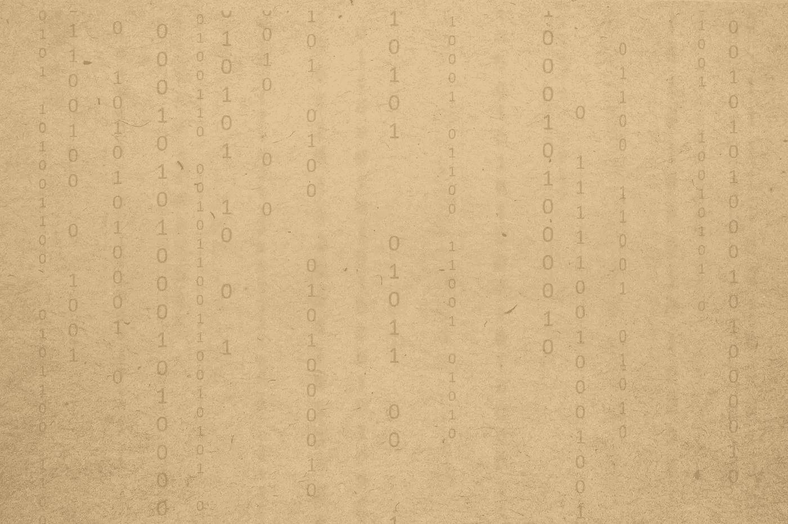

# 比特币归零又如何

> 原文：<https://medium.com/coinmonks/so-what-if-bitcoin-goes-to-zero-7858c2b970aa?source=collection_archive---------40----------------------->

source: [Roberto Sorin](https://unsplash.com/@roberto_sorin)

## 二元世界

我们生活在一个创造性地混合了乌托邦和反乌托邦的世界里，这个世界是由人类的思想和野心组成的。谁挥舞魔杖，谁就有能力左右大众，谁就成为领导者。我们今天生活在我们创造的原始数据、信息、结构和算法的系统集合中。这种信息被用在很多方面，但它都源于…