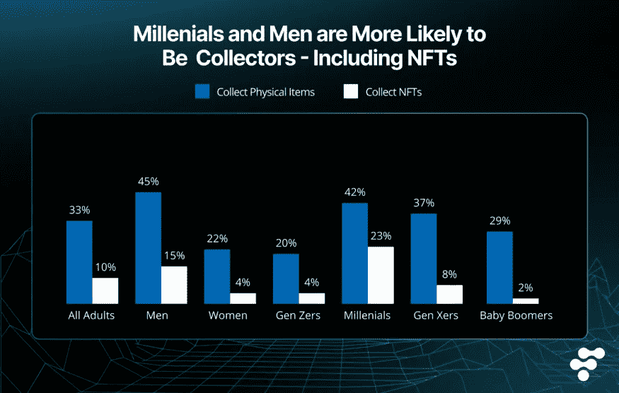

# Web3 中的社交销售:有卖无卖的演变

> 原文：<https://medium.com/coinmonks/social-selling-in-web3-evolution-of-selling-without-selling-a9bdc3a1de3d?source=collection_archive---------27----------------------->

Social Selling is evolving from Web2 to Web3 in a compelling fashion

## 通过社交媒体，网上销售正在快速变革，社交商务的未来正在 Web3 的世界中获得新的阵地。

我们销售和与客户互动的方式正在发生变化。

在传统商业中，营销和销售过程完全是线性的。营销人员会创建一个活动，将它推向潜在客户，然后等待他们访问商店或网站并进行购买。

然而，现在情况不同了。有了社交媒体，我们可以在更私人的层面上与潜在客户联系。我们可以建立关系，直接与他们接触。

这种新的销售方式被称为社交销售，它正迅速成为许多企业的首选方法。事实上，根据 T2 的调查，“84%的 B2B 决策者从推荐开始他们的购买过程。”

对于**的网络 3 业务来说，**社交销售提供了一个独特的机会。有了与客户更加个性化地联系的能力，他们可以更快地建立信任和信誉。此外，Web3 企业可以使用社交令牌来货币化他们与客户建立的关系。

社交销售是一种通过亲自接触潜在客户来建立信任和信誉的方式。这是一种有效的方式，可以让更多的人感到自然和有机。

社交销售最大的好处在于，它为各种规模的企业提供了公平的竞争环境。不管你是大公司还是小公司，如果你知道如何进行社交销售，你就能成功。

社交销售不是用推销来轰炸潜在客户。那叫垃圾邮件，没用。相反，社交销售是关于提供价值和建立关系。重要的是乐于助人，而不是咄咄逼人。

分散的社交媒体正在改变在线社交商务的格局

# 什么是社交商务？

社交商务是一个术语，指的是企业使用脸书、Web2 中的 Instagram 和 Web3 中的 Steemit、Lens Protocol 等平台，不仅做广告，还销售产品或服务。然后，客户可以在不离开当前应用程序的情况下完成购买。

社交商务允许购物者:

1.寻找新品牌

2.获取他们感兴趣的产品的更多信息

3.与客户服务代表交谈

4.购买物品

到 2026 年，社交商务的全球价值预计将达到 2.9 万亿美元，这可能是因为与传统方式相比，它提供了更方便、更互动的购物体验。

如果你想让你的社交商务或 Web3 项目成功，你需要改变你的思维方式。尽管越来越多的组织在谈论失败如何导致创新，但大多数组织仍需要将其付诸实践。社交商务和 Web3 允许我们尝试快速失败并从错误中学习的想法。Web3 正在通过使用以下技术革新社交商务:

**加密货币:**接受加密货币可以让新买家对你的电子商务商店更有信心。使用加密货币的[买家](https://www2.deloitte.com/us/en/pages/audit/articles/corporates-using-crypto.html)中有 40%表示他们是第一次从公司购买。这也反映在平均订单价值上，加密买家订单往往是信用卡订单的两倍。

**NFT:**NFT 就像现代的客户头像。就像护照把一个人和他的国家联系在一起一样，当消费者与特定品牌接触时，非功能性品牌就建立了投资和身份。Web3 正在改变传统的消费者品牌关系，让消费者对他们购买的东西有更多的控制权:实物和数字。

现实生活中一个很好的例子就是西铁城 M 的虚拟酒店[提供了](https://www.prnewswire.com/news-releases/citizenm-announces-new-venture-into-the-metaverse-301518959.html)2000 NFT，这些 NFT 与西铁城 M 现实世界住宿的可兑换奖励直接相关。这种 NFTs x 社交商务趋势将从这里向上发展，主要是因为千禧一代热爱 NFTs 胜过任何数字资产。

NFT 在千禧一代中越来越受欢迎

**元宇宙:**元宇宙的商店已经遍布互联网，包括国际品牌[耐克、三星、可口可乐和许多其他品牌。完全身临其境的购物体验让购物者体验到在 Web 2.0 中不可能实现的事情。虽然最初购买虚拟古驰包是一件令人欣慰的新鲜事，但这些元宇宙买家变成忠实的现实顾客只是时间问题。](https://influencermarketinghub.com/metaverse-brands/)

据《福布斯》报道，元宇宙将永远改变“社会证明”的游戏。根据他们的说法，*“在元宇宙，品牌将能够通过建立吸引人的社区，让顾客与品牌本身和品牌的其他粉丝互动，从而获得不仅仅是星级评价的社会证明。”*

**dApps:** 分散式应用正在缓慢但稳定地获得主流采用。凭借更快的支付速度、更高的安全性(使用区块链钱包)和易用性，像 [Origin](https://blog.originprotocol.com/built-on-origin-a-decentralized-shopify-alternative-888adc4198b0) 这样的 dApps 和许多其他公司与 Shopify 这样的电子商务巨头竞争，Shopify 是一个 Web 2.0 电子商务平台，[以 13.66 亿美元的价格](https://www.macrotrends.net/stocks/charts/SHOP/shopify/revenue)，同比增长 21.58%。

社交销售正从 Web2 过渡到 Web3

# 网络社交销售 3

社交销售一直是密码社区的热门话题。Web3 专家对当前的社交媒体前景表示怀疑——保守派称自由派科技领袖正在审查他们。相比之下，自由主义者担心社交媒体传播仇恨和阴谋(最近埃隆·马斯克收购推特就是这一理论的生动例子)。每个人都受够了脸书变成一个数字沃尔玛，推特上满是试图超越他人的人。

因此，去中心化的社交媒体，抵制审查，将权力和控制权交还给用户，具有很大的吸引力。这是 Web 3.0 社交销售背后的基本理念。

在 Web 3.0 中，社交销售的概念仍然很新，有几种不同的方式。最常见的是通过使用社交令牌或开发新的分散式社交媒体平台。

社交令牌以两种方式帮助内容创作者:建立和奖励他们的粉丝社区，并为他们的创造性工作支付报酬。大多数情况下，粉丝购买代币，但一些艺术家将代币作为礼物赠送给忠实粉丝。作为社区的一部分，粉丝的利益可能包括访问独特的视频内容，群聊，甚至独家商品。一般来说，拥有不同所有权级别的人会获得额外的好处。

社交标志很重要，因为它们提供了一种新的方式来补偿内容改变人们情绪的创作者。他们使粉丝关系更具协作性:明星可以改变他们与粉丝的互动方式，粉丝可以为他们的粉丝世界赋予价值。假设著名足球运动员罗纳尔多分发了他的加密货币“GOATCoin”(一语双关，意为梅西球迷)。在这种情况下，他可以利用区块链技术轻松识别出哪些粉丝从 1992 年就开始支持他了。这使得他们可以奖励这些超级粉丝虚拟利益，如缩放聊天或面对面的会议。此外，其他创作者可以利用与令牌相关的反馈来创建更好的定制内容，与他们的粉丝产生共鸣，并建立社区参与。

雷克斯·伍德伯里在《大西洋月刊》上写了一篇文章，对“社会资本如何成为经济资本”有着深刻的见解，她认为一切的金融化是不可避免的。“社会资本”等无形资产日益货币化的趋势是经济持续金融化的结果。*雷克斯认为，“这个文化流动性的新时代重新定位了获取资本的途径。过去十年是关于转移社会资本:喜欢、分享和转发。我们的社会资本推动了脸书、谷歌和推特的利润引擎。我们现在正转向网络经济时代，在这个时代，每个人都是投资者。”*

[社会资本](https://bitfans.medium.com/tokenizing-social-capital-creator-tokens-for-organizations-7c090e42e0a7)的符号化正在各个方面发生；一个很好的例子是[联合国儿童基金会加密货币基金](https://www.unicef.org/innovation/stories/unicef-cryptofund)，这是一个比特币和以太的集合基金。与 CryptoFund 相关的一切都是公开的，以便为捐赠者和公众创造可见性，为捐赠和投资流程增加一层透明会计。联合国儿童基金会正在探索使用数字货币及其加密基金原型，这将有助于为未来的数字努力提供资金，并在 Web3 中推广社会资本的理念。

# Web3 解决方案如何提高社交商务的资本效率？

社交商务的挑战一直围绕着信任和协调。在传统的电子商务交易中，单个实体管理产品，收取付款，并运送产品。但在社交商务中，每笔交易往往涉及多个实体。有销售产品的人，购买产品的人，通常还有促进交易的第三方(如市场)。

挑战在于每个实体都有不同的动机。销售产品的人希望获得尽可能好的价格，购买产品的人希望支付尽可能低的价格，而促成交易的第三方(如市场)希望从交易中提成。这往往会导致交易中出现很多摩擦，需要明确谁应该对什么负责。

Web3 解决方案可以通过提供一种方式来协调这些不同的实体并调整它们的激励措施，从而帮助提高社交商务的资本效率。

# 智能合同

智能合同可用于托管买方的付款，直到产品交付。这将确保卖方得到付款，买方收到他们支付的产品。它还将允许市场从交易中提成，而不必相信卖方会交付产品。

# 分散交易所

dex 是不受单一实体集中控制的加密货币交易所。这意味着不存在单点故障，它们被黑客攻击的可能性也小得多。dex 还可以用于交易任何可以在区块链上表现的资产，而不仅仅是加密货币。

dex 还可以通过允许买家和卖家直接交易而不需要第三方市场来提高社交商务的资本效率。这将消除市场从每笔交易中抽取佣金的需要，也将降低欺诈风险。

# 降低成本

对于大多数商业企业来说，省钱是一个关键问题。有了区块链技术，就不需要付钱给中介或第三方供应商来确认贸易伙伴。此外，你不必在众多的文件中寻找最终的交易——每个人都有一份相同的文件，而且是永久性的。

# 提高可追溯性

传统电子商务很难跟踪库存，导致潜在的复杂性，如盗窃、伪造和丢失。区块链允许所有供应链参与者跟踪产品旅程，并验证它们没有丢失或被盗。

Kindeck 是一个分散的社交销售应用程序

# 金德克如何帮助社交销售？

Kindeck 是一个分散的社交销售应用程序，无需许可，点对点的奖励分配直接将奖励流向你的网络。我们建立在[多边形](https://polygon.technology/)之上，拥有由[超流](https://www.superfluid.finance/)驱动的实时分发系统和由[镜头协议](https://www.lens.xyz/)驱动的社交结构。

我们的愿景是“让第一批十亿电子商务用户登陆 web3，并在区块链驱动的点对点联盟营销中引领潮流。”

我们的目标是迎合 B2C 电子商务市场，据[预测，到 2026 年这个市场将超过 8 万亿美元。与 Lens 和](https://www.globenewswire.com/en/news-release/2021/11/02/2325466/0/en/Business-to-Business-B2B-E-commerce-Market-Size-to-Grow-Over-18-70-CAGR-to-Reach-USD-18-57-Trillion-by-2026-Globally-Facts-Factors.html) [DeSo](https://www.deso.com/) 等顶级社交网络协议不同，我们提供社交商务和其他未来功能，旨在主宰 Web3 商务世界。

我们计划通过提供以下功能来促进社交销售:

- **分散奖励系统:**我们将奖励直接发送到您的网络中，不收取任何费用。

- **点对点反馈循环:**激励每个网络成员促进、赚取和成长。我们将社会基础设施的特权、权力和利润交还给你们。

**-奖励:** Kindeck 通过奖励每个人来激励平台增长，从而解决了 Web2 社交媒体平台缺乏网络效应的问题。

**- Genesis NFTs:** 拥有一台 Genesis 可以确保你作为早期用户的地位，并且它允许那些追随你的人帮助支持你走向成功。Genesis 持有者可以将其他人列入白名单，并让他们需要的人自动注册成功。

有关 Kindeck 的更多信息，请阅读这篇深入的[文章](/kindeck-social-app/announcing-kindeck-a-blockchain-powered-business-solution-2c19c9ff5688)。

金德克是为个人和专业水平的大量国际观众设计的。我们的目标是创造一种可以轻松扩展的东西，让世界各地的人们都能从拥有和控制他们的社交网络、数据、联系和价值流中受益。

> 交易新手？在[最佳加密交易](/coinmonks/crypto-exchange-dd2f9d6f3769)上尝试[加密交易机器人](/coinmonks/crypto-trading-bot-c2ffce8acb2a)或[副本交易](/coinmonks/top-10-crypto-copy-trading-platforms-for-beginners-d0c37c7d698c)