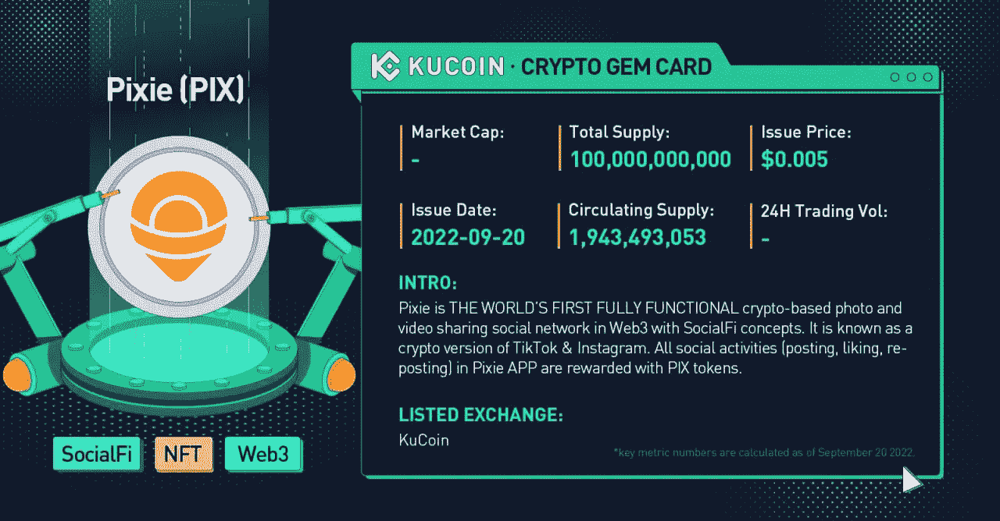
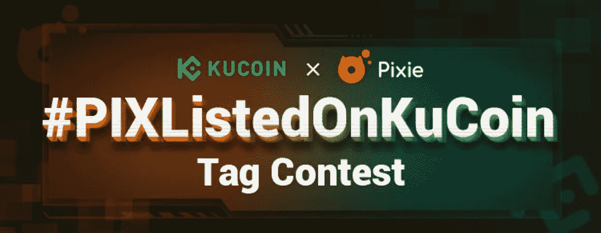

# 社交令牌$PIX 在 KuCoin 上市

> 原文：<https://medium.com/coinmonks/social-token-pix-gets-listed-on-kucoin-29f448b73dd8?source=collection_archive---------27----------------------->

9 月 20 日， [KuCoin 上市了$PIX](https://www.kucoin.com/news/en-pixie-pix-gets-listed-on-kucoin-world-premiere) ,在一次成功的燃烧掉落事件后，它在 KuCoin 上开始交易，这使它进入了 KuCoin 宝石阵容。

# PIXIE 是什么，它是如何工作的？

Pixie 是世界上第一个区块链社交媒体平台，旨在加速 web3 和推进加密技术。Pixie 基本上是 Web3 的 Instagram，用户可以在这里发布帖子并进行互动。

在 pixie 上，你可以分享视频和照片，喜欢和评论其他人的帖子。平台上的所有互动都被记录在区块链的精灵网络上

pixie 平台的亮点是用户在使用它时可以获得奖励。是啊！你没听错。

你在 Pixie 上免费做你在 instagram 上做的事情赚钱！

无论是喜欢一个帖子，评论一个帖子，还是创建一个自己的帖子，甚至在 Pixie 上的互动都可以以 PIX 代币的形式为你赚钱。PIX 令牌支持 pixie 平台，可用于升级和增强帐户功能，奖励平台用户，等等。

有 1000 亿 pix 代币在流通，其中超过 60%的代币将分发给 pixie 社交平台的用户。如果你还没有上 pixie，[加入这里](https://www.pixie.xyz/mobile/index.html?id=p67013714&utm_source=VOEW&token=f00568da-64a3-4264-bbde-2731fb262822)参加这个社交互动的新阶段，赢取奖励。

作为第一个全功能的 web3 驱动的社交项目，从长远来看，可以对$PIX 寄予厚望，它的前景对投资者很有吸引力。随着越来越多的总供应量进入流通领域，以及越来越多的持有人出现，我预计这种资产将出现强劲需求和价格反弹。

$PIX 已在 KuCoin 上列出，可供那些希望在 web3 驱动的社交空间中占有一席之地但不愿意付出艰辛努力的用户使用。只需点击几下鼠标，你就可以在 KuCoin 上购买或交易精灵代币。

# 为什么 KuCoin 是交易和投资 Pixie token 的首选平台？

KuCoin 目前在最佳加密货币交易所中排名前 5，被称为“人民交易所”，是加密货币领域的行业领导者。作为第一个提供 NFT ETF 对的集中交易所，KuCoin 是为来自世界各地的各类投资者而建立的。

凭借强大的加密市场产品，KuCoin 被公认为最佳的 altcoin 交易所，为平台用户提供 700 多种可交易资产和 1，200 多种交易对。

Kucoin 是许多加密宝石的家园，如 BLOK、CHMB、VR、KMA 和 XCAD，他们通过 BurningDrop 或 spotlight 上市活动在 KuCoin 上进行初级上市。

KuCoin 目前为顶级 NFTs、web3 和 meterverse 项目提供 NFT ETF 交易，如 BAYC、Cryptopunks、SAND、ENS 和 Doodle。

KuCoin 为包括美国在内的全球 207 个国家和地区的 2000 多万用户提供现货交易、保证金交易、P2P 菲亚特交易、期货交易、赌注和借贷服务。

再加上最先进的交易机器人策略，使新手和老手都能在加密货币交易中获得丰厚利润。

# 如何通过 3 个简单的步骤在 KuCoin 上购买$PIX？

1.  创建一个 KuCoin 帐户并登录。如果你注册了我的链接，就有机会赢得高达 500 美元的比特币，并获得交易费用 20%的折扣。[符号 U](https://www.kucoin.com/r/rf/r395ZQJ) P
2.  在 KuCoin 登录页面，找到并选择顶部菜单中的“[加密市场](https://www.kucoin.com/markets)”选项

3.选择 [PIX/USDT](https://www.kucoin.com/trade/spot/PIX-USDT?spm=kcWeb.B5markets.tradeList.1) 交易对，按限价或市价下单。

就这么简单！

> 交易新手？尝试[加密交易机器人](/coinmonks/crypto-trading-bot-c2ffce8acb2a)或[复制交易](/coinmonks/top-10-crypto-copy-trading-platforms-for-beginners-d0c37c7d698c)