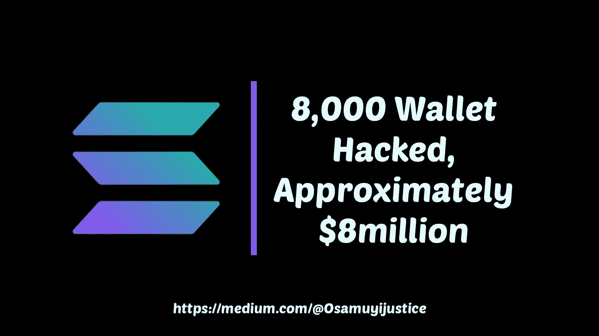
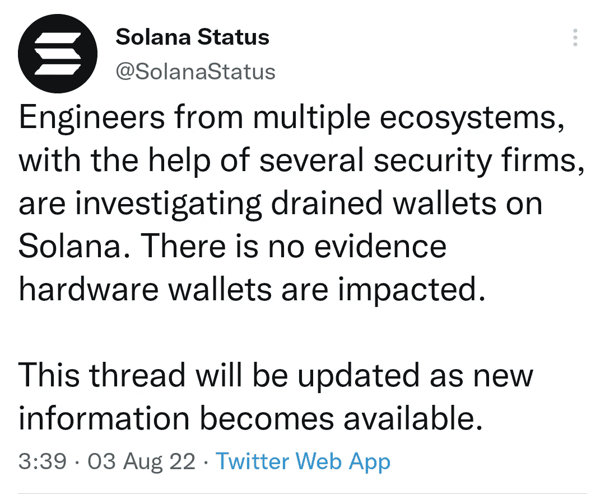
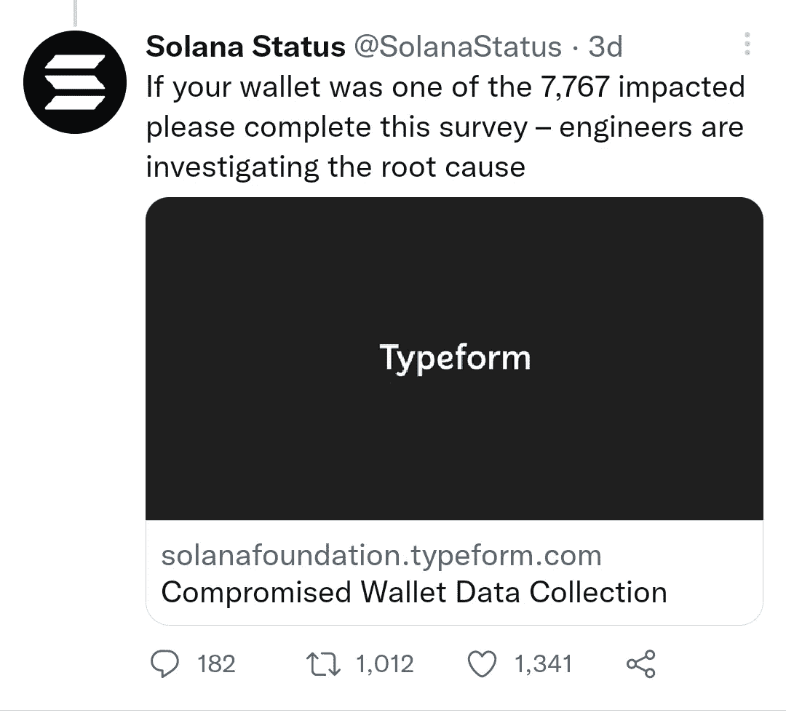
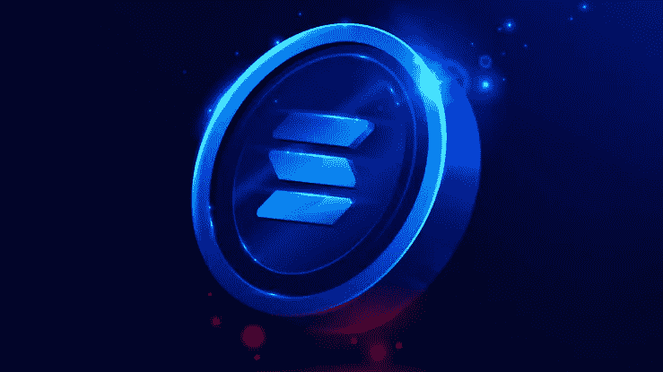

# Solana Hack—8000 个钱包被黑，大约 800 万美元

> 原文：<https://medium.com/coinmonks/solana-hack-8-000-wallet-hacked-approximately-8millions-45eafb734f60?source=collection_archive---------3----------------------->

Solana hack

最近，来自 solana Twitter 的一份报告称，2022 年 8 月 2 日星期二早上，大约有 8000 个钱包被黑客入侵，价值 800 万美元。

索拉纳硬币是拥有强大社区的顶级硬币之一，现在它是加密黑客的最新目标，因为用户承认钱从钱包中被盗。

Solana status tweeted

索拉纳状态周三在推特上称，大约 7767 个钱包被黑客破坏，移动和扩展钱包都被黑客攻击。

他们还让受害用户知道创建另一个种子短语，而不是出于安全目的使用他们已经存在的种子短语。

A survey by Solana status

受害者可以填写一份调查，这样工程师就可以找到黑客攻击的根本原因。

**也可阅读:** [*加密赏金——你需要知道的一切以及加密赏金的来源*](https://link.medium.com/eoYKqvE2hsb)

# 索拉纳被黑了吗

Solana hacked

一个未知用户黑了 Solana 钱包，大约 8000 个 Solana 钱包。黑客在索拉纳窃取了大约 800 万美元，这是因为受害者的钱包与互联网相连，这使得黑客可以访问他们的钱包，并取走他们的血汗钱。

据说，黑客能够通过他们的私钥访问他们的钱包，加密货币行业的领导者“Emin Gün Sirer”表示，这笔交易是签署的，这表明黑客使用了一种工具“供应链攻击”。这个工具窃取用户的私钥。

查看: [*立即获得 2 美元的马拉空投，每推荐一个朋友获得 1 美元！*](/@Osamuyijustice/get-instant-2-mara-airdrop-and-1-for-each-friend-referred-7e7f4e9fbd8e)

[**加入我们的社区&了解更多关于加密货币的信息**](https://t.me/cryptoportalgroupchat)

> 加入 Coinmonks [电报频道](https://t.me/coincodecap)和 [Youtube 频道](https://www.youtube.com/c/coinmonks/videos)了解加密交易和投资

# 另外，阅读

*   [OKEx vs KuCoin](https://coincodecap.com/okex-kucoin) | [摄氏替代品](https://coincodecap.com/celsius-alternatives) | [如何购买 VeChain](https://coincodecap.com/buy-vechain)
*   [ProfitFarmers 回顾](https://coincodecap.com/profitfarmers-review) | [如何使用 Cornix 交易机器人](https://coincodecap.com/cornix-trading-bot)
*   [如何匿名购买比特币](https://coincodecap.com/buy-bitcoin-anonymously) | [比特币现金钱包](https://coincodecap.com/bitcoin-cash-wallets)
*   [瓦济克斯 NFT 评论](https://coincodecap.com/wazirx-nft-review)|[Bitsgap vs Pionex](https://coincodecap.com/bitsgap-vs-pionex)|[Tangem 评论](https://coincodecap.com/tangem-wallet-review)
*   [如何使用 Solidity 在以太坊上创建 DApp？](https://coincodecap.com/create-a-dapp-on-ethereum-using-solidity)