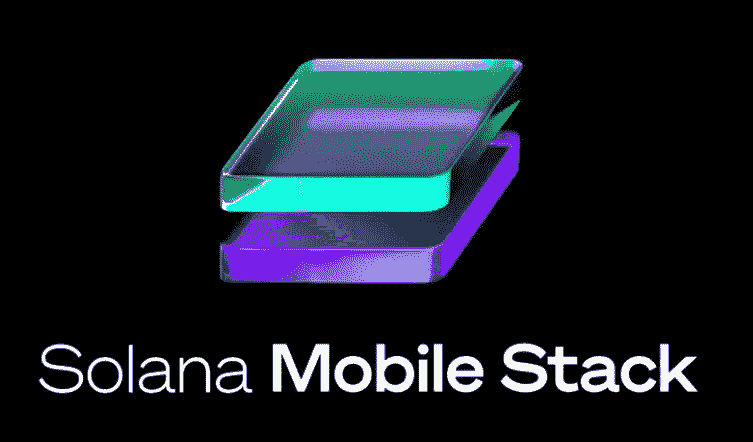

# 索拉纳手机“传奇”Web3 的未来？索拉纳·区块链和“传奇”概述

> 原文：<https://medium.com/coinmonks/solana-phone-saga-the-future-of-web3-solana-blockchain-and-saga-overview-7d3c0818315d?source=collection_archive---------10----------------------->

## 索拉纳宣布他们将推出自己的手机“Saga ”,为 Web 3 在现代社会的应用铺平道路。


Solana “Saga” Launch

```
**Solana Blockchain & "Saga" Overview****·** [**What is Solana?**](#bdb9)
  ∘ [Why Proof of History (PoH) is fast](#d0cf)
**·** [**Solana DApps and Ecosystem**](#289e)
**·** [**Solana’s First Android Flagship Phone — Saga**](#2832)
**·** [**Solana Mobile Stack (SMS)**](#ef35) **·** [**Why SMS is better than Apple / Google**](#68c9)
**·** [**What it means for Crypto and Solana**](#e507)
**·** [**Why I am Opting out**](#b5c2)
  ∘ [1\. Frequent breakdown of Solana Network](#6219)
  ∘ [2\. Under-development of DApps & Solana Ecosystem](#6316)
· [Resources](#10d1)
```

# 索拉纳是什么？

索拉纳是一位区块链，被称为“以太坊黑仔”。它的目标是在加密领域提供更快的交易速度、更低的费用和更具可扩展性的解决方案。它使用**利益证明(PoS)** 并集成**历史证明(PoH)** ，试图提高现有区块链的整体性能。它是由阿纳托利·亚科文科在 2017 年与其本土加密货币 SOL 一起创建的。SOL price 在 2021 年实现了 12，000%的增长，在 Solana 区块链整合了 DApps 和 NFT 平台。SOL 是索拉纳区块链的本地加密货币和公用事业令牌，主要用于支付网络上的燃气费和赌注(7–8% APY ),考虑到 PoS 结构。凭借 PoH 创新，他们拥有 400 毫秒的阻塞时间和每秒 710，000 个上限事务(TPS)。这与以太坊的 10 秒封锁时间和 Visa 的 23，666 TPS 相比是巨大的。


Solana Blockchain $SOL

## 为什么历史证明(PoH)很快

PoH 本质上是 PoS 与“时间”的整合。Solana 要求验证器反复求解**可验证延迟函数(VDF)** ，并用各自出现的时间散列块。将时间戳添加到块中，以指示区块链上发生的事件的顺序，以便验证器可以识别块顺序，而无需与其他节点通信。在以太坊上，节点在提交块之前必须就块的顺序达成一致，这很耗时。而 Solana 使用 PoH 在“时间”上减少节点间的通信，因此具有比以太坊更高的 TPS。

> 在 Solana 的白皮书中，点击这里可以找到关于 PoH [的深入描述](https://grayscale.com/wp-content/uploads/2021/12/grayscale-building-blocks-solana-1.pdf)

# 茄果类植物与生态系统

Solana 的生态系统是多样而完整的，从 DeFi 借贷平台和 DEXes 到 NFT 市场和游戏赚钱 GameFi。包括 *Serum，Orca，Solend，Raydium，StepN* 这些在太空中众所周知的。你可以在创建一个[虚拟钱包](https://phantom.app/)并购买一些$SOL 作为交易费后访问这些 DApps。


Solana Ecosystem (by Solana Daily)

索拉纳的 TVL 为 25 亿美元[2022 年 4 月 7 日]，由于最近的风险资产抛售，这一数字已经大幅下降。你可以在我的其他媒体报道中读到崩溃背后的[](/coinmonks/celsius-network-crash-what-happened-to-celsius-network-adc363387c21)**和 [**对 2022 年**](/coinmonks/best-bitcoin-fundamental-technical-analysis-in-2022-bear-and-bull-case-for-cryptocurrency-c72cdfbecddc) 价格的预测。**

****

**Solana TVL overview (by Solana Daily)**

********

> **注意: **SPL 代币**代表索拉纳区块链上的资产，类似于以太坊上的 ERC-20 或 ERC-721 代币**

**索拉纳的主要 TVL 和交易来自 DeFi 和 NFTs，自 Opensea 宣布整合索拉纳区块链以来，交易一直在增长。随着更多 DApps 继续在区块链上建立，他们的 TVL 和交易继续增长，他们的生态系统正在 Web 3 的不同领域大规模扩展。**

> **交易新手？尝试[加密交易机器人](/coinmonks/crypto-trading-bot-c2ffce8acb2a)或[复制交易](/coinmonks/top-10-crypto-copy-trading-platforms-for-beginners-d0c37c7d698c)**

# **索拉纳首款安卓旗舰手机——Saga**

**Saga(以前称为 Osom OV1)和 Solana Mobile Stacks (SMS)于 6 月 23 日宣布，计划帮助 Crypto**“Go Mobile”**。这款手机将集成 Solana Mobile 堆栈，以支持 Web 3 应用程序和钱包，从而支持 DeFi 和 GameFi 中 Web 3 项目的真实使用案例。从本质上来说，Saga 是一款集成了 Web 3 的普通智能手机。**

********

**Solana Saga Phone**

## **Solana Saga 规格:**

*   ****显示屏:** 6.67 寸有机发光二极管**
*   ****处理器:**高通骁龙 8+第 1 代(4 纳米)**
*   ****内存:** 12GB 内存，512GB 存储**
*   ****后置摄像头:**双摄像头(50MP IMX766 主摄像头，12MP IMX373 超宽摄像头)**
*   ****前置摄像头:** 16MP**
*   ****电池:** 4100mAh，无线充电**

# **Solana 移动堆栈(SMS)**

**SMS 是 Web 3 应用程序的移动软件平台，它支持访问**原生 Android Web 3 应用程序**，便于将私钥和 Web 3 钱包集成到智能手机中。它是一个 Android 框架，为开发人员提供了一个围绕钱包和分散应用(DApps)构建移动体验的环境，以及私钥管理的解决方案。**

****SMS SDK** 的初始特性包括以下内容**

*   ****手机钱包适配器** —用于连接钱包应用**
*   ****种子库** —在安全环境中存储私钥&种子短语**
*   ****Solana Pay** —分散支付系统**
*   ****索拉纳 DApp 店** —为 DApps 增加配送系统**

****

**Solana Mobile Stack**

# **为什么短信比苹果/谷歌好**

**苹果和谷歌是移动电话领域的主要玩家，英国 97%的移动网络浏览来自苹果和谷歌。他们的“双头垄断”在我们的世界里是疯狂的，允许他们收取 15-30%的市场费用。苹果的应用商店在 2020 年的总收入超过了**640 亿美元****(**基于 30%的佣金率)，而 Google Play 在 2021 年增长了 24%，达到了**479 亿美元**(注册时每年第一个 100 万美元收入的 15%和随后的 30%)。**

****

**Solana 现在为分散式应用程序提供 0%的费率，这对开发移动应用程序的开发者来说是一个巨大的进步。鉴于 Web3 移动市场是新生事物，开发者可以通过获得该领域的市场份额来获取巨额利润。除此之外，索拉纳还拨出了 5 亿美元的种子基金和 1000 万美元的生态系统赠款基金，以激励移动建筑商和开发商。**

**用户通常会根据价格、用户体验和功能来更换操作系统。鉴于苹果的粘性客户群，我们可以预计从普通安卓用户到短信的转变会比从苹果到短信的转变更大。**

# **这对 Crypto 和 Solana 意味着什么**

**移动电话和设备占世界网络流量的 68%,如果索拉纳将这些流量中的一部分吸引到 Web 3，这对 Crypto 来说将是一件大事。这可能有利于其他 Web 3 基础设施，如 Arweave、Filecoin、Livepeer、Helium、Audius 等。**

**随着 USV 提出的加密应用基础设施周期，Solana Mobile Stack 和“Crypto go mobile”的想法可能会成为下一轮牛市的主旋律。**

****

**Crypto Infrastructure Cycle**

**2021 年，全球移动游戏内容市场价值 1312 亿美元，预计 2026 年将达到 1734 亿美元。根据 Messari 的报告，2021 年，超过 170 款手机游戏的年收入为 1 亿美元，其中一部分可通过 Solana“Saga”和短信转换为 Web 3 GameFi。SMS 将为 Solana 用户和开发人员的收购和 SOL 价格创造巨大的商机。**

**如果我们看到索拉纳的传奇获得通过，我们将朝着我们的分权目标前进一步。**

# **为什么我选择退出**

**乍一看，佐贺是一个密码爱好者和索拉纳球迷的必备项目，我应该马上购买它。但这次我会通过，原因如下…**

## **1.索拉纳网络频繁故障**

**Solana 自创建以来经历了多次系统停机。凭借其低廉的费用和快速的交易费用，僵尸网络的拒绝服务攻击很容易使系统瘫痪。上次这种情况持续了 17 个小时，锁定了 110 亿美元的用户资金。对我来说，把我的毕生积蓄/花费与索拉纳·区块链相提并论不是一个舒适的地方。我会等到索拉纳团队真的解决了这个问题，然后我可能会开始重新考虑使用“传奇”。**

## **2.DApps & Solana 生态系统开发不足**

**鉴于缺乏 DApps 以及 DeFi 和加密支付系统的日常实施，我看不出用户在这个时候使用短信有任何好处。您将无法在 99%的商店使用您的 SOL 或 USDC，那么，如果没有商店接受加密支付，让索拉纳支付有什么意义？很高兴看到我们离权力下放又近了一步，但佐贺是一个更长期的角色。随着我们看到 Crypto/Web3 越来越多的采用和增长，Solana 和 Saga 很可能会以**对数比例增长。****

**#**

**#**

**#**

****在推特上关注我:[https://twitter.com/tvstsang](https://twitter.com/tvstsang)****

****在培养基上跟随**me:[https://medium.com/@tvstsang](/@tvstsang)**

**去看看我在**比特币价格预测** : [上的最新故事 https://media . com/@ tvstrsang/best-bit 币-basic-technical-analysis-in-2022-bear-bull-case-for-cryptocurrency-c72 cdfbecddc](/@tvstsang/best-bitcoin-fundamental-technical-analysis-in-2022-bear-and-bull-case-for-cryptocurrency-c72cdfbecddc)**

**去看看我关于**摄氏度**发生了什么以及**阿拉米达研究如何在其中发挥作用的故事。:[https://media . com/@ TVs tsang/摄氏度-网络-崩溃-摄氏度-网络发生什么事-adc363387c21](/@tvstsang/celsius-network-crash-what-happened-to-celsius-network-adc363387c21)****

**#**

**#**

**#**

# **资源**

***sol scan*:[https://analytics . sol scan . io/public/dashboard/8d 888828-baae-47b 9-948 B- d 087 e 5d 1411](https://analytics.solscan.io/public/dashboard/8d888828-baae-47b9-948b-d087e5de1411)**

***超空间*:[https://hyperspace.xyz/leaderboard](https://hyperspace.xyz/leaderboard)**

***灰度报告*:[https://grade . com/WP-content/uploads/2021/12/grade-building-blocks-Solana-1 . pdf](https://grayscale.com/wp-content/uploads/2021/12/grayscale-building-blocks-solana-1.pdf)**

***索拉纳白皮书*:【https://solana.com/solana-whitepaper.pdf **