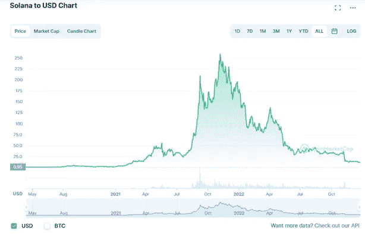
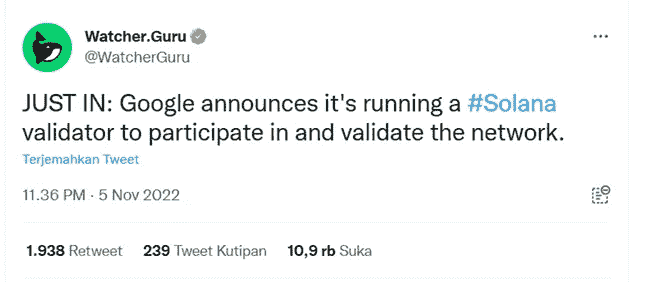
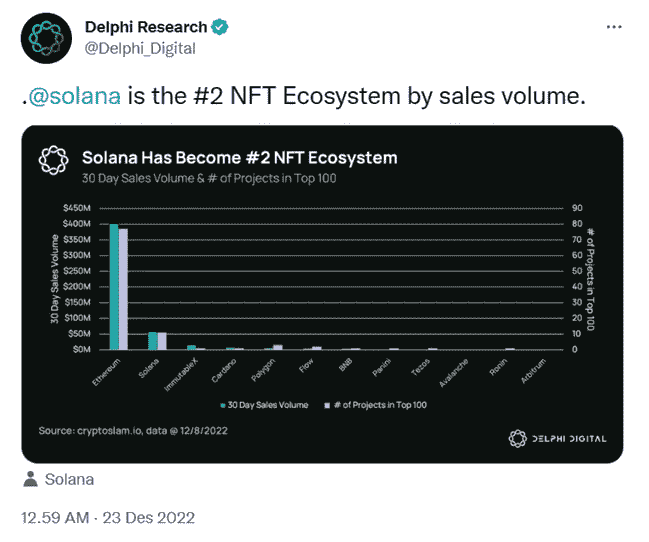
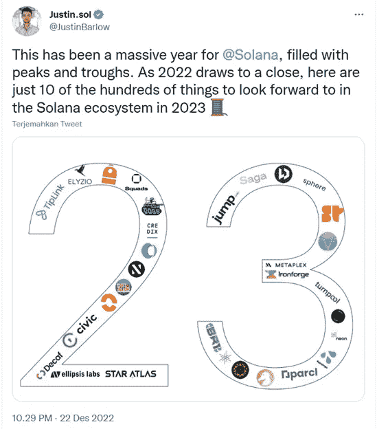

# 索拉纳 2023 年索尔币潜力

> 原文：<https://medium.com/coinmonks/solana-sol-coin-potential-in-2023-2c16e7abd243?source=collection_archive---------17----------------------->

Solana $SOL 是 Solana 基金会(瑞士日内瓦)于 2020 年 3 月正式启动的项目。索拉纳的创始人阿纳托利·亚科文科是索拉纳背后最重要的人物。

> 从顶级交易者那里复制交易机器人。免费试用。

索拉纳提供设施，如 Defi 和 NFT 市场。Solana 的独特技术能够提供高达 50，000 TPS(每秒交易)的交易速度，并具有高安全性和可扩展性。索拉纳也被称为德克斯，费用很低。

[Solana price today, SOL to USD live, marketcap and chart | CoinMarketCap](https://coinmarketcap.com/currencies/solana/)

**在索拉纳触及 11.46 美元的当前低点之前，它曾触及 257 美元的历史高点。这种茄属植物溶胶的倾倒是由几个事件引起的，即**

1.  索拉纳作为陆地露娜(LUNC)的储备之一正在被大规模出售
2.  索拉纳被黑了，而不是停止
3.  索拉纳的 TVL 值下降了 90%以上

然后前一段时间，Google 和 Solana 合作做验证器

[Watcher.Guru di Twitter: “JUST IN: Google announces it’s running a #Solana validator to participate in and validate the network.” / Twitter](https://twitter.com/WatcherGuru/status/1588933168123457536)

索拉纳经历的大幅降价让一些人看到索拉纳没有希望回到历史高点。但是从 [@Delphi_Digital](https://twitter.com/Delphi_Digital) 的分析来看，Solana 是 Etherium 之后排名第二的区块链 NFT 生态系统

[Delphi Research di Twitter: “.@solana is the #2 NFT Ecosystem by sales volume. https://t.co/GqXqEGwIwF" / Twitter](https://twitter.com/Delphi_Digital/status/1605986467473260545?ref_src=twsrc%5Etfw%7Ctwcamp%5Etweetembed%7Ctwterm%5E1605986467473260545%7Ctwgr%5Ee4f14e8c567e74cc544c26244dd9cba7e06f932d%7Ctwcon%5Es1_&ref_url=https%3A%2F%2Fcoinvestasi.com%2Fberita%2Fsolana-jadi-ekosistem-nft-terbesar-kedua)

索拉纳 30 天的销售额已经达到 6000 万美元。这个价值比区块链多边形、BNB、卡尔达诺都要大。尽管 Etherium 仍然占据着第一的位置，销售额约为 4 亿美元。即使硬币的价格已经大幅下降，索拉纳仍然能够占据第二的位置。

[Justin.sol di Twitter: “This has been a massive year for @Solana, filled with peaks and troughs. As 2022 draws to a close, here are just 10 of the hundreds of things to look forward to in the Solana ecosystem in 2023 🧵 https://t.co/JMaJFk92mH" / Twitter](https://twitter.com/JustinBarlow/status/1605948707462991872?ref_src=twsrc%5Etfw%7Ctwcamp%5Etweetembed%7Ctwterm%5E1605948707462991872%7Ctwgr%5Ee4f14e8c567e74cc544c26244dd9cba7e06f932d%7Ctwcon%5Es1_&ref_url=https%3A%2F%2Fcoinvestasi.com%2Fberita%2Fsolana-jadi-ekosistem-nft-terbesar-kedua)

Solana 的投资者之一贾斯汀·巴洛(Justin Barlow)给出了一个线索，即计划在 2023 年在 Solana 链上发布一些游戏。基于 Solana 的手机的推出也将支持这一重要势头。

如果 SOL 的价格回到历史最高水平，你会买 SOL 赚一大笔吗？还是更喜欢以太币、比特币之类的某些币？

> 加入 Coinmonks [电报频道](https://t.me/coincodecap)和 [Youtube 频道](https://www.youtube.com/c/coinmonks/videos)了解加密交易和投资

# 另外，阅读

*   [加拿大最佳加密交易机器人](https://coincodecap.com/5-best-crypto-trading-bots-in-canada) | [库币评论](https://coincodecap.com/kucoin-review)
*   [火币加密交易信号](https://coincodecap.com/huobi-crypto-trading-signals) | [HitBTC 审核](/coinmonks/hitbtc-review-c5143c5d53c2)
*   [TraderWagon 回顾](https://coincodecap.com/traderwagon-review) | [北海巨妖 vs 双子星 vs BitYard](https://coincodecap.com/kraken-vs-gemini-vs-bityard)
*   [如何在 FTX 交易所交易期货](https://coincodecap.com/ftx-futures-trading)
*   [OKEx vs KuCoin](https://coincodecap.com/okex-kucoin) | [摄氏替代品](https://coincodecap.com/celsius-alternatives) | [如何购买 VeChain](https://coincodecap.com/buy-vechain)