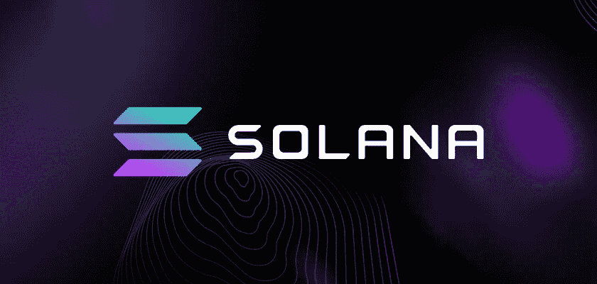

# 索拉纳(索尔):呜咽着死去？

> 原文：<https://medium.com/coinmonks/solana-sol-dying-out-with-a-whimper-ea911ee0e68b?source=collection_archive---------7----------------------->

索拉纳(SOL)曾是以太坊广受赞誉的竞争者，现在的支持率比 ATH 低 96%。也许，索拉纳是一个受欢迎的孩子，他在高中达到顶峰，并以每小时 8 美元的工资安定下来。因为，在写这篇文章的时候，它就在那里徘徊。这里有一个令人惊讶的事实，索拉纳在 2021 年 11 月达到 260 美元的历史高点，现在交易低于其最初的第一天 ICO。可以公平地说，索拉纳仅仅是一个概念，就像特斯拉跑车或沙特阿拉伯的 Line City 一样。在这个时代，概念比功能产品卖得更好，它们的价值越来越高，就像意大利面条一样崩溃。尽管如此，这并不是对现代生活的本质以及推动经济发展的后续产品的哲学思考。这就是为什么我在标题的末尾加了一个问号，这些问号是记者的救命稻草，以防他们犯了严重的错误。

> 交易新手？在[最佳密码交易所](/coinmonks/crypto-exchange-dd2f9d6f3769)上尝试[密码交易机器人](/coinmonks/crypto-trading-bot-c2ffce8acb2a)或[复制交易](/coinmonks/top-10-crypto-copy-trading-platforms-for-beginners-d0c37c7d698c)

第一次，一家加密交易所将索拉纳(SOL)及其产品从他们的平台上除名。这对于曾经与 FTX 关系密切的数字资产来说是个坏消息。

了解[如何将加密货币兑换成 PayPal](https://hi.exchange/blog/exchange-cryptocurrency-to-paypal/)

## **索拉纳(SOL)，快而松**

据 crypto 记者 [Colin Wu](https://twitter.com/WuBlockchain/status/1608309183685840899) 称，crypto exchange Matrixport 将于 12 月 30 日将索拉纳及其合伙人除名。虽然没人听说过 Matrixport，但这一消息让 SOL 股价再次大幅下跌 13%。除此之外，该交易所还表示，他们未来不会推出任何产品。

“由吴创办的资产管理平台 Matrixport 宣布，将于 12 月 30 日退市 SOL 和 SOL-U 双币投资产品，未来不会推出新的 Solana 产品。”

与此同时，Vitalik Buterin 在 Twitter 上给了 Solana 团队一些鼓励的话。布特林认为,“可怕的机会主义资金”现在已经从 SOL 中清除，未来是令人敬畏的！

[https://Twitter . com/VitalikButerin/status/1608591727316684804](https://twitter.com/VitalikButerin/status/1608591727316684804)

最近，评论家们一直在嘲笑 [Solana Phone](https://hi.exchange/blog/solana-phone-saga/) 是一款噱头十足的品牌重塑手机，漫无目的地强调 web3。公平地说，索拉纳(索尔)没有在 2021 年做出最明智的决定，他们确实在他们的死亡中扮演了重要的角色。

然而，令人恐惧的是，他们如何能够吸引像 gray 这样的投资巨头的大笔投资。

## **多米诺骨牌效应？**

你可以从问号看出，我不确定索拉纳从交易所退市是否会成为一种趋势。然而，索拉纳的暴跌是发生在加密市场的多米诺骨牌式的下跌的一部分。索拉纳与 FTX 关系密切，但这并不是他们所要付出的全部。本质上，SOL 借助 NFTs 的兴起获得了快速、廉价的区块链来完成 NFT 交易的动力。在 NFT 繁荣时期，索拉纳区块链获得了巨大的牵引力，因为其他网络有更高的交易费。于是，索尔的强劲反弹接踵而至。

然而，持续的网络中断开始使索拉纳股价下跌，并在投资者中制造恐慌。最重要的是，在过去的几个月里，Web3 和 NFTs 的受欢迎程度都大幅下降。这两个是索拉纳投资的大类。

尽管如此，SOL 似乎不太可能在短期内迅速复苏，因为它现在与柴犬等高风险资产联系在一起。

阿瑟·海斯认为，尽管索拉纳是个“狗屎硬币”，但他仍有机会东山再起。但他的推理并不是每个人都能认同的。

> 加入 Coinmonks [电报频道](https://t.me/coincodecap)和 [Youtube 频道](https://www.youtube.com/c/coinmonks/videos)了解加密交易和投资

# 另外，阅读

*   [Bookmap 评论](https://coincodecap.com/bookmap-review-2021-best-trading-software) | [美国 5 大最佳加密交易所](https://coincodecap.com/crypto-exchange-usa)
*   [加密交易机器人](/coinmonks/crypto-trading-bot-c2ffce8acb2a) | [造币评论](https://coincodecap.com/coingate-review)
*   最佳加密[硬件钱包](/coinmonks/hardware-wallets-dfa1211730c6) | [Bitbns 评论](/coinmonks/bitbns-review-38256a07e161)
*   [新加坡十大最佳加密交易所](https://coincodecap.com/crypto-exchange-in-singapore) | [收购 AXS](https://coincodecap.com/buy-axs-token)
*   [红狗赌场评论](https://coincodecap.com/red-dog-casino-review) | [Swyftx 评论](https://coincodecap.com/swyftx-review)