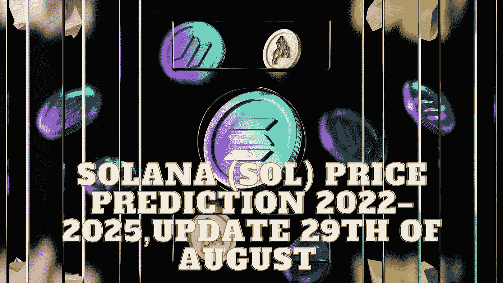

# 索拉纳(SOL)价格预测 2022–2025，8 月 29 日更新

> 原文：<https://medium.com/coinmonks/solana-sol-price-prediction-2022-2025-update-29th-of-august-4b43fbe1a79e?source=collection_archive---------19----------------------->

Source photo Unsplash.com

# 索拉纳(SOL)到底是什么？

2017 年，网络首次推出。阿纳托利·亚科文科和格雷戈·菲茨杰拉德都是这个网络的创建者，格雷戈也是创始人之一。Solana 开发的最初目标是提高可伸缩性和事务速度。