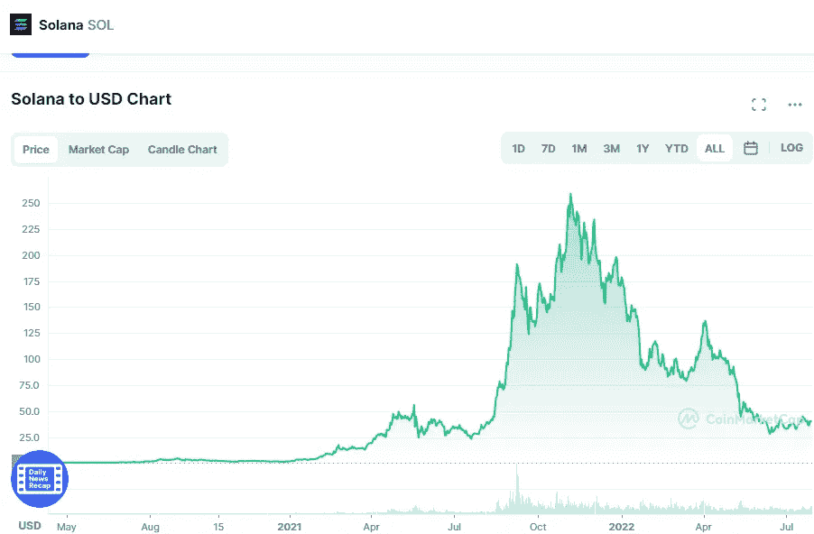

# 索拉纳(SOL)2022 年价格预测，7 月 28 日更新

> 原文：<https://medium.com/coinmonks/solana-sol-price-prediction-2022-update-28th-of-july-53b2e7bd99ce?source=collection_archive---------32----------------------->

Source photo [Solana price today, SOL to USD live, marketcap and chart | CoinMarketCap](https://coinmarketcap.com/currencies/solana/)

# 索拉纳(SOL)是什么？

自 2017 年构想以来，该网络稳步增长。阿纳托利·亚科文科和他的共同创始人格雷格·菲茨杰拉德提出了这个网络的概念。Solana 的设计考虑了可伸缩性和事务速度。

从 2018 年 Solana 第一张测试网上线至今，路漫漫其修远兮。在…