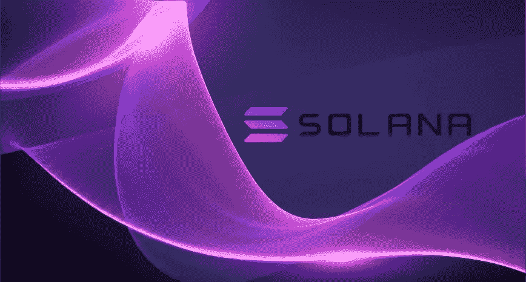

# 索拉纳:仍然是长期购买

> 原文：<https://medium.com/coinmonks/solana-still-a-long-term-buy-37b3adf61ad2?source=collection_archive---------11----------------------->

# 飞得太高又掉回地球的硬币还有价值吗？

索拉纳以 1.85 美元的价格开始了 2021 年，并在 11 月份创下了 260 美元的历史新高。不到 2000 美元的 SOL 投资在不到一年的时间内将价值 260，000 美元。