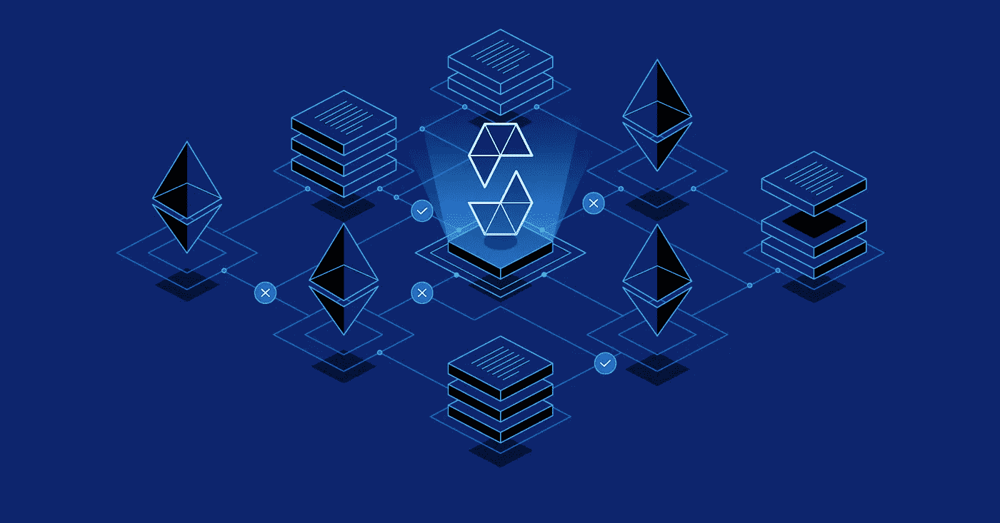

# 坚固性— 101(第一部分)

> 原文：<https://medium.com/coinmonks/solidity-101-part-1-f47a8778add3?source=collection_archive---------15----------------------->



Solidity

# 我们开始吧

💜**变量**

*   变量是为程序运行时存储不同值而定义的数据项。
*   我们有不同类型的值存储在程序中，比如它可以是整数，字符串，字符，布尔值等。
*   坚实度的变量有:

# **整数**

*   数字可以是正数也可以是负数，但不是小数

`**int -> This is to tell solidity that we will store integer in this variable.**`

# **无符号整数**

*   数字只能是正数，不能是负数或小数

`**uint -> This is to tell solidity that we will store only positive integer in this variable.**`

# 布尔代数学体系的

*   对还是错

`**bool -> This is to tell solidity that we will store true or false in this variable.**`

# 线

*   字符组合。它可以是一个单词，一个句子等等。

`**string -> This is to tell solidity that we will store combination of characters in this variable.**`

# 地址

*   它是智能合约中使用的一种特殊类型的数据。因为 EVM 对每个帐户或智能合约都有一个十六进制的唯一值。我们称它们为地址，因为 EVM 将使用该地址与账户/合同进行交互。

```
**address-> This is to tell solidity that we will store Address in this variable.**
```

💜**访问标识符**

*   访问标识符意味着我们可以决定谁可以访问智能合约中的变量/函数或任何内容。
*   出于安全考虑，我们需要限制访问。我们使用访问标识符来做到这一点。

```
**PUBLIC -> This means that it can be accessed from anywhere, anyone can access it. No Restrictions.****PRIVATE -> This means that it can only be accessed from the contract in which its present. No contract/account from outside the contract can access it. Although they can see it but can not be accessed.****INTERNAL -> This means that no outside contract/accounts can access it. It can be accessed from within and contract's children i.e. Contracts inherited from this contract can access it. This is the default identifier i.e. If no access identifier is provided, EVM assumes this access identifier.****EXTERNAL -> This means that only external contracts/accounts can access it. if we need to use it internally then we have to use "this" keyword.**
```

💜**定义变量**

*   我们将实度变量定义为这种模式。

```
**<DATA_TYPE> <ACCESS IDENTIFIER> <VARIABLE NAME>****int private fav_num = -8;
uint public fav_num = 8;
bool internal is_fav_num = true;
string external word = "Hello";
address private contractAddress = 0x70997970C.......;**
```

👉记住，我们也可以省略访问标识符，默认情况下，EVM 将把内部作为访问标识符。👉请记住，总是尽量使用变量名作为自我解释。👉记住，我们用“”来定义字符串和；结束任何语法。

> 交易新手？尝试[加密交易机器人](/coinmonks/crypto-trading-bot-c2ffce8acb2a)或[复制交易](/coinmonks/top-10-crypto-copy-trading-platforms-for-beginners-d0c37c7d698c)

💜**功能的特殊访问标识符**

*   这些访问标识符只是告诉 EVM 函数将如何与存储交互。

```
**PURE -> This means that it will not even access the storage.****VIEW-> This means that it will only access the storage but wont change anything.**
```

💜**定义功能**

*   我们把实性中的函数定义为这种模式。

```
**function <FUNCTION_NAME> <ACCESS IDENTIFIER> <SPECIAL ACCESS IDENTIFIER(OPTIONAL)> returns(<DATA_TYPE>){}****function func_name public pure returns(uint){}
function func_name2 private view returns(string){}**
```

👉记住，我们也可以省略特殊的访问标识符。

👉请记住，总是尽量使用函数名作为自我解释。

💜**示例**

```
**address private i_owner;
uint256 public minimumUsd;****function getOwner() public view returns (address) {
        return i_owner;
}****function getAddressToAmountFunded(address funder) public view returns (uint256) {
        return s_addressToAmountFunded[funder];
}**
```

仅此而已。

在下一篇文章中，我们将研究为什么我们需要特殊的访问标识符，我们如何添加这些变量并更有效地使用它。

> 加入 Coinmonks [电报频道](https://t.me/coincodecap)和 [Youtube 频道](https://www.youtube.com/c/coinmonks/videos)了解加密交易和投资

# 另外，阅读

*   [Bitget 评论](https://coincodecap.com/bitget-review) | [双子星 vs BlockFi](https://coincodecap.com/gemini-vs-blockfi) cmd| [OKEx 期货交易](https://coincodecap.com/okex-futures-trading)
*   [AscendEx Staking](https://coincodecap.com/ascendex-staking)|[Bot Ocean Review](https://coincodecap.com/bot-ocean-review)|[最佳比特币钱包](https://coincodecap.com/bitcoin-wallets-india)
*   [霍比评论](https://coincodecap.com/huobi-review) | [OKEx 保证金交易](https://coincodecap.com/okex-margin-trading) | [期货交易](https://coincodecap.com/futures-trading)
*   [网格交易机器人](https://coincodecap.com/grid-trading) | [Cryptohopper 审查](/coinmonks/cryptohopper-review-a388ff5bae88) | [Bexplus 审查](https://coincodecap.com/bexplus-review)
*   [7 个最佳零费用加密交易平台](https://coincodecap.com/zero-fee-crypto-exchanges)