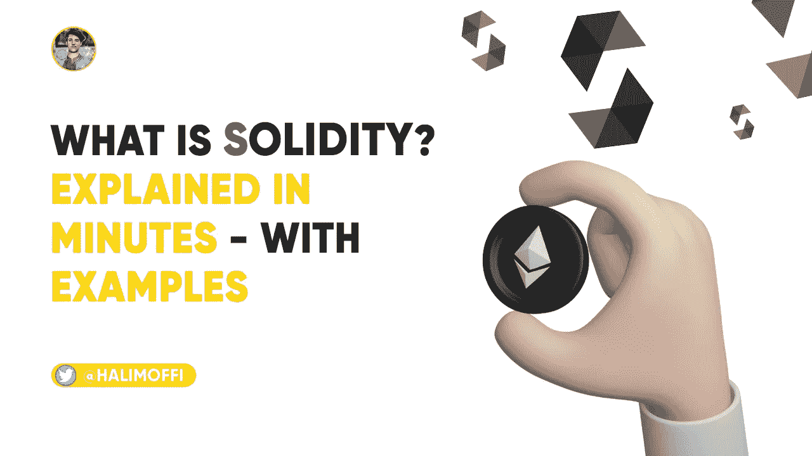
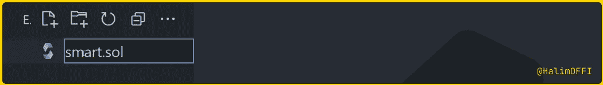
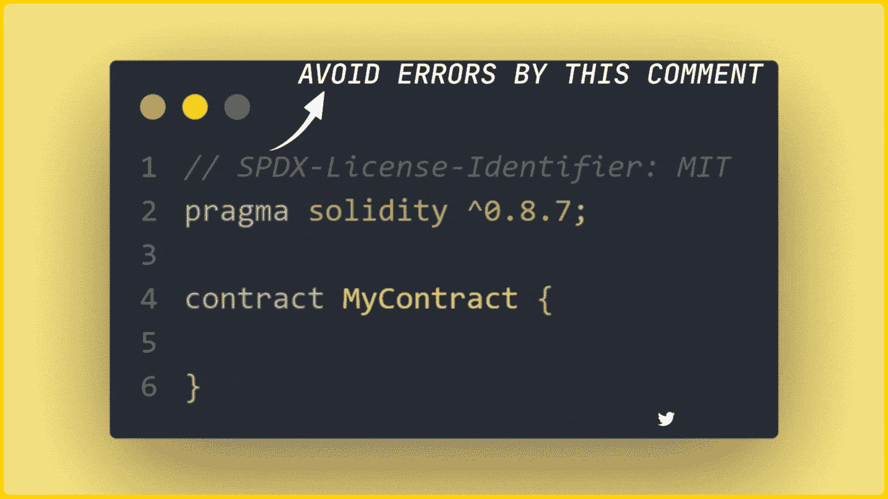
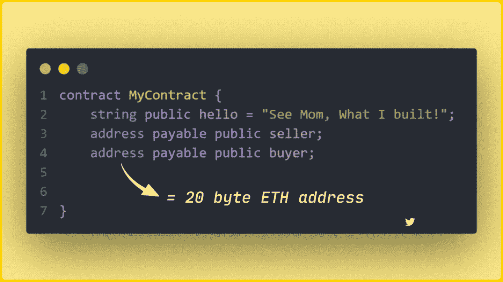
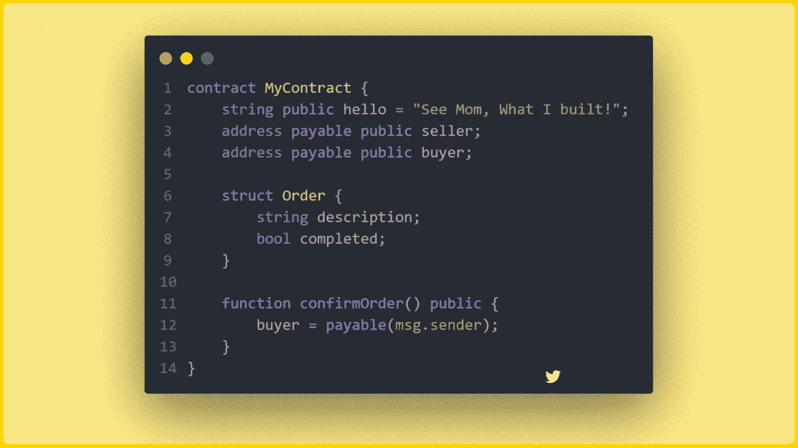
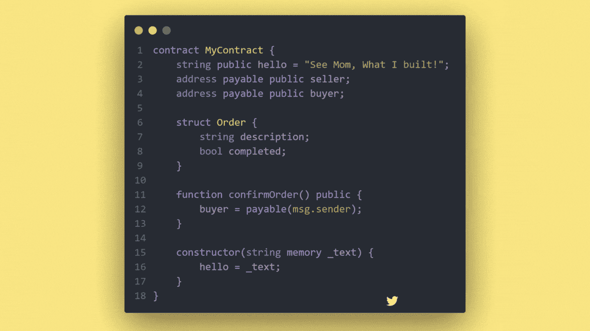

# 用编码例子解释了可靠性

> 原文：<https://medium.com/coinmonks/solidity-explained-with-coding-examples-e40ac3e784fb?source=collection_archive---------2----------------------->

What is Solidity — by [Halim Shams](https://twitter.com/HalimOFFI)

*在本文中，* ***了解如何在以太坊区块链上构建您的第一个智能合约程序，以开始使用 Web3 去中心化应用程序。***

My short content on [Twitter](https://twitter.com/HalimOFFI)

Solidity 是一种静态类型的编译编程语言，用于实现智能合约。智能合约的概念从 1994 年就有了，当时 Nick Szabo 将其描述为一台数字自动售货机。

它只是控制区块链账户行为的代码和数据。例如:Bob 可能同意向 Alice 支付服务费用，因此他们向区块链部署了一个智能合同，它自己独立计数，**该合同不是由人控制的，而是它自己的内部代码**；所以不能被操纵，也不需要律师来解读。向 Bob 提供服务后，合同将执行并将资金转移给 Alice。

还有许多其他潜在的用例，如 Web3 去中心化应用程序(DAPP)、去中心化金融产品(DEFI)或以不可替代的代币形式交易数字资产(NFT)。

**Solidity 是一种用于编写智能合同的高级编程语言**，其语法类似于许多花括号语言，如 C++或 TypeScript。它是静态类型的，并且**支持面向对象的模式，比如继承**。

**Solidity 于 2014 年诞生**，通常与以太坊联系在一起**，但它支持多个区块链平台，如:TRON、KIN、tender mint……**

现在你知道什么是可靠了，所以让我们写下我们的第一份智能合同……

My short content on [Twitter](https://twitter.com/HalimOFFI)

要编写智能合同代码，创建一个文件，使用您想要的任何名称**，扩展名为**`**.sol**`**，因为我创建的文件名称为`smart.sol`。如果您使用 VS 代码，您的文件将在自身上获得 Solidity 品牌图标。**

****

**现在已经创建了 Solidity 文件，**在顶部使用** `**pragma**` **关键字来告诉编译器使用哪个版本的 Solidity**，然后**使用** `**contract {}**` **关键字来定义智能合约**的细节，这大约**相当于其他编程语言**中的一个类。**

****

**Add Keywords**

**在大括号内，我们可以定义变量的状态，变量的值可能会在合同的整个生命周期中发生变化。**

****

**Contract Keyword**

**该语言也有特殊的数据类型，如`**address**` **来保存一个 20 字节的 ETH(以太坊)地址。****

**`**struct**` **关键字允许您创建更复杂的数据类型**，通常用来表示契约上的不同实体。**

****

**The struct Keyword**

****使用** `**function**` **关键字定义代码**的可执行块，这些代码可能在某个时候被调用来修改契约的状态。**

****

**The function Keyword**

**您还可以定义一个`**constructor**` **，它只在契约第一次创建**时被调用一次。当`constructor`执行完毕后，您的代码将被部署到区块链上。**

****

**The constructor Keyword**

**在定义了`contract`之后，你就可以编译它了，所以**你可以通过你选择的 API 像** [**Web3 来编程使用它。JS**](https://web3js.readthedocs.io/en/v1.7.5/) 用 JavaScript 实例化和管理你的智能合约。**

** [## 掌握 Web3 和区块链的顶级资源

### Web3 是全新的！与 JavaScript 和 Python 不同，网上没有数以千计的资源可供学习 Web3…

halimshams.medium.com](https://halimshams.medium.com/top-resources-to-master-web3-and-blockchain-f23ed57d5b8e) 

这已经是分分钟内的事情了。

**Following Costs Nothing!**** ****

**My short content on [Twitter](https://twitter.com/HalimOFFI)**

**这就是我为你收集的全部，希望这篇文章对你有所帮助。通过**关注我，**支持我，**鼓掌**为了这篇文章激励我多多写作，所以别忘了鼓掌为了文章而关注我🥰.**

**—你也可以在 [**Twitter**](https://mobile.twitter.com/halimoffi) 上关注我，我会在那里分享一些简短而不可思议的东西，所以不要错过它们。😊**

**[***给我买杯咖啡***](https://www.buymeacoffee.com/halimshams) ☕**

> **交易新手？尝试[加密交易机器人](/coinmonks/crypto-trading-bot-c2ffce8acb2a)或[复制交易](/coinmonks/top-10-crypto-copy-trading-platforms-for-beginners-d0c37c7d698c)**