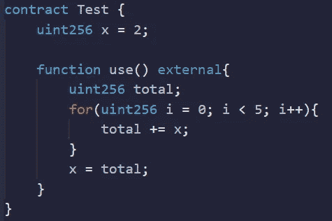
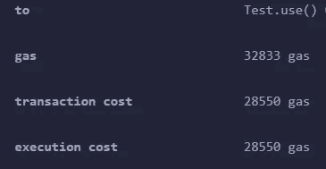
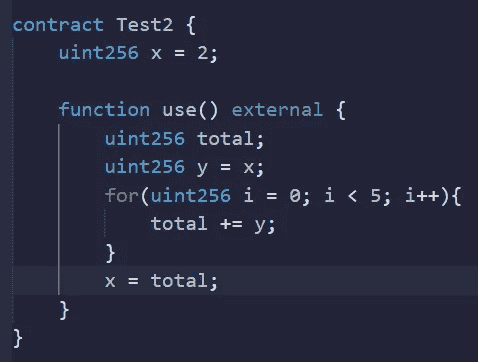
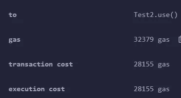
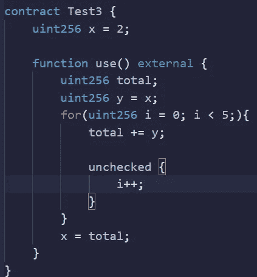
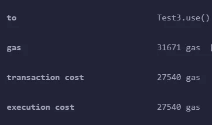

# 坚固性—气体优化

> 原文：<https://medium.com/coinmonks/solidity-gas-optimization-e23ce8ce19a4?source=collection_archive---------7----------------------->

今天，我们将讨论几个不同的场景，这些场景都适用于节约汽油。

在当今时代，我们需要确保尽可能节约汽油！

低效代码

这里最大的错误是我们不断地访问存储变量。SLOAD 汇编函数是仅次于 CREATE 的最昂贵的汇编函数之一。

让我们做些改变。

通过在函数中声明变量，我们在内存中定义了一个变量&然后调用 storage 将 x 中的值拉入 y 中，我们多次使用 y，然后将 x 设为总和。

Neat! A gas saving of 395 gas!

好的，但是我们如何进一步改进这个？

一个 uint256 可以容纳(2 ⁵⁶)-1 作为最大可能数。这保证了我们不会遇到上溢或下溢的问题，因为我们的计数器只会增加 5 次。

因为我们知道我们不会遇到这些问题，我们可以删除安全数学包装，以确保我们没有花费不必要的气体。

又省了 615 的汽油！

更多即将到来 xD

如果你觉得这很有趣，为什么不看看这个呢！
[https://medium.com/p/28a8bb064e86](/p/28a8bb064e86)

坚实发展研究小组—[https://discord.gg/KzbcGmrnfN](https://discord.gg/KzbcGmrnfN)

-多边形联盟—[https://www.polygonalliance.com/](https://www.polygonalliance.com/)

——多边形联盟不和—[https://discord.gg/kJKPCGQu66](https://discord.gg/kJKPCGQu66)

你喜欢这篇文章吗？想请我喝杯咖啡吗？
Polygon/Eth/Bsc—0x4a 581 E0 EAF 6b 71d 05905 e8e 6014 DC 0277 a1 b 10 ad

> *交易新手？试试* [*加密交易机器人*](/coinmonks/crypto-trading-bot-c2ffce8acb2a) *或* [*复制交易*](/coinmonks/top-10-crypto-copy-trading-platforms-for-beginners-d0c37c7d698c) *上* [*最好的加密交易*](/coinmonks/crypto-exchange-dd2f9d6f3769)

> 加入 Coinmonks [电报频道](https://t.me/coincodecap)和 [Youtube 频道](https://www.youtube.com/c/coinmonks/videos)获取每日[加密新闻](http://coincodecap.com/)

# 另外，阅读

*   [免费加密信号](/coinmonks/free-crypto-signals-48b25e61a8da) | [加密交易机器人](/coinmonks/crypto-trading-bot-c2ffce8acb2a)
*   [杠杆代币](/coinmonks/leveraged-token-3f5257808b22)终极指南
*   [16 款最佳折叠电动自行车](/coinmonks/top-17-folding-electric-bikes-5e296f0918cb)
*   [28 款最佳电动自行车点评](/coinmonks/the-28-best-electric-bikes-review-and-buying-guide-in-2023-7bb3146cb403)
*   前三名[币安期货交易机器人](/coinmonks/top-3-binance-futures-trading-bots-e6031f84b3f9)