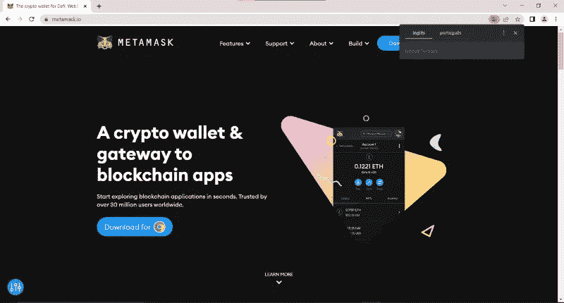

# 学习第 10 课坚固性。元掩码和帐户。

> 原文：<https://medium.com/coinmonks/solidity-lesson-10-metamask-and-accounts-49a889be45df?source=collection_archive---------8----------------------->

提醒一下，发送到区块链的交易有一个发送者，发送者需要签署交易。使用与账户相关联的私钥来完成签名。这是通过一种称为非对称加密(或公钥加密)的加密技术来实现的。

该事务采用的路径如下。 **1。**写交易。 **2。**签署交易。 **3。**将交易发送到网络上的一个节点。

到目前为止，Remix 已经为我们照顾到了这三点，但当我们想要与皇家区块链互动时，我们需要超越 Remix。

使用 web3 库，如 JavaScript 库 **ethers.js** 或 **web3.js** ，我们可以执行上述所有步骤。但是，我们将使用一个名为 MetaMask 的钱包来实现这一点。如前所述，钱包管理账户和密钥，因此能够签署交易。

我们将继续使用 Remix 来编写事务，但 MetaMask 将负责签署事务并将其发送到一个节点。除了 MetaMask，还有其他钱包选项，但目前 MetaMask 是使用最多的数字钱包。

# 安装元掩码

要安装 MetaMask，只需访问其网站 [metamask.io](http://metamask.io) 。目前看起来如下图。

To install MetaMask, visit metamask.io

当我使用 Chrome 时，会显示一个按钮，指示下载 Chrome。也可以使用其他浏览器，如 Edge、Firefox、Brave 等。

这个链接会把你带到 Chrome 商店，因为 MetaMask 是一个浏览器扩展。按照说明安装扩展。当你看到一只狐狸的图像时，你就在正确的道路上，如下图所示。

The fox indicates that the extension has been installed in the browser.

单击“开始”后，选择创建新钱包的选项并同意使用条款。您将被要求输入密码，然后您将收到您的秘密恢复短语。这个短语由 12 个单词组成，应该保存在安全的地方。你必须在下一个屏幕上按顺序重复这些单词。

完成这些步骤后，MetaMask 将创建您的第一个帐户，如下图所示。很遗憾，您的帐户目前有 0 个乙醚。

MetaMask has been set up and created your first account.

在使用钱包之前，我们先了解一下它的工作原理。

# 分层确定性钱包

MetaMask 是一个层次确定性钱包(HD wallet)，这个词很大，但并不太难理解。要解释这意味着什么，有些东西必须很好理解。**以太坊上的账户是一个公钥/私钥对。**或私钥/地址对。这没有什么区别，因为地址可以从公钥中导出。

> **以太坊上的账户是一个公钥/私钥对。**

以太坊上的账户是一个公钥/私钥对。或者私钥/地址对。这没有什么区别，因为地址可以从公钥中导出。

要生成一个帐户，既不需要密码，也不需要 12 个字。只需要私钥，它是一个 32 字节的随机数。根据私钥，加密函数生成公钥和地址。

理论上，要生成私钥，只需在 1 和 2 ⁵⁶ -1 之间选择一个数字。然而，人类在挑选真正的随机数方面很糟糕，所以最好让钱包为你做这件事，因为它将使用密码安全的随机数生成器。

钱包可以生成多个不相关的账户，这也是钱包曾经做过的事情。但这不是最佳策略，因为它迫使用户记住(保存在安全的地方)几个私钥，每个帐户一个。

确定性钱包是那些从一个**种子**中生成新账户的钱包，最常用的模式是从一组 12 个单词中生成种子，这正是您在安装 MetaMask 时得到的。

从种子开始，可以生成(几乎)无限数量的帐户(密钥对)。默认情况下，MetaMask 只生成一个账户，但是可以通过点击右上角的账户符号，然后点击 *'+创建账户'*，来创建新账户，如下图所示。

From the seed it is possible to create several accounts.

新帐户将拥有自己的私钥，但是由于私钥是从种子中生成的，因此没有必要将其保存在安全的地方。仅使用种子就有可能恢复第一和第二账户。

这就是确定性钱包的工作原理，术语“层次结构”反映了这样一个事实，即可以创建一个包含父帐户和子帐户的帐户层次结构，但我们在本课中不会详细讨论这些细节。

# 网络

默认情况下，MetaMask 配置了以太坊主网和一些测试网络。要显示测试网，您必须通过选择右上角的网络选项卡并点击*显示/隐藏测试网*来明确指出这一点。我们可以在下图中看到这一点。

How to show/hide test networks.

启用测试网络后，MetaMask 将显示所有网络。选择 Goerli 或 Rinkeby 选项，如下图所示。

Select a test network such as Goerli or Rinkeby.

Goerli 和 Rinkeby 都是以太坊测试网络。然而，要在这些区块链上部署智能合约，需要测试网络中的以太网。我们通过访问所谓的水龙头来获得这些硬币。

# 龙头

每笔交易都必须支付一笔使用费，称为汽油费，必须以网络的基础货币支付。我将使用 Goerli 网络，但您可以选择任何测试网络。

一个**龙头**是一个网站或其他地方，你可以从测试区块链获得基础货币。由于这种硬币是免费的，所以必须从水龙头中获得，而不能购买。

我想让测试网络保持开放，因为有些网络很快就会被淘汰。另一个问题是水龙头。如果找不到一个网络的水龙头，可以尝试找另一个网络的水龙头。

因为我们要在格利网络上进行交易，我们需要一些格利硬币。由于 Goerli 是一个以太坊测试网，它的硬币也被称为以太，或 GoerliEther。应该清楚的是，它与 mainnet 使用的以太网(以及在交易所出售的以太网)并不相同。测试网以太没有固定值。

要在测试网络上获得以太网，只需访问水龙头网站。找到水龙头网站的最好方法是谷歌一下。目前，一个活跃的歌尔利水龙头网站是[goerlifaucet.com/](http://goerlifaucet.com/)，但是它要求用户有一个炼金术账户。如果你找不到 Goerli 的水龙头，你可以在 rinkebyfaucet.com/的[试试 Rinkeby 的水龙头。](http://rinkebyfaucet.com/)

要从水龙头中获取测试以太网，只需粘贴账户地址，点击*发送以太网*按钮，如下图所示。

Getting GoerliEther to use on Goerli.

在 MetaMask 中，对于所选帐户，现在应该显示总计 0.25 GoerliETH。因此，现在可以支付向 Goerli 发送交易的燃气费。

**感谢阅读！**

以后希望写一本关于固体和以太坊的书。欢迎对本文提出意见和建议。

欢迎任何投稿。[www.buymeacoffee.com/jpmorais](http://www.buymeacoffee.com/jpmorais)

> 交易新手？尝试[加密交易机器人](/coinmonks/crypto-trading-bot-c2ffce8acb2a)或[复制交易](/coinmonks/top-10-crypto-copy-trading-platforms-for-beginners-d0c37c7d698c)