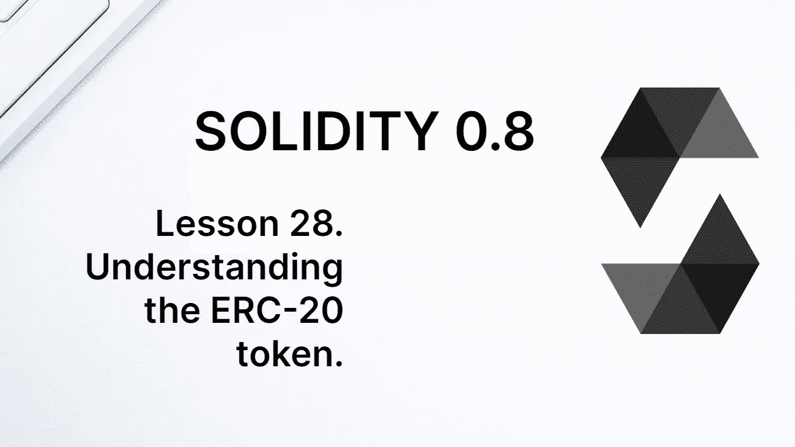
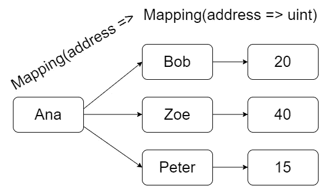

# 学习第 28 课固体。了解 ERC-20 令牌。

> 原文：<https://medium.com/coinmonks/solidity-lesson-28-understanding-the-erc-20-token-928758f053e1?source=collection_archive---------6----------------------->



ERC-20 令牌是可替换令牌的最低标准模板。Fabian Vogelsteller 和 Vitalik Buterin 在 2015 年底的以太坊第 20 期征求意见中提出了这样一个模型，它是当前资产令牌化的基础。

可替代代币是一种可以自由兑换成等价代币的代币，就像法定货币一样。还有一种不可替代的令牌(NFT)，其中每种资产都与其他资产不同，就像收藏中可收集的项目一样。

ERC-20 标准是当今交易的大多数加密货币的基础。许多外行人仍然困惑的一个问题是他们所拥有的资产的来源。例如，当某人拥有一定数量的代币时，这些代币存储在哪里？答案是，令牌不过是区块链上的一个变量值。

不知何故，这不应该是一个惊喜。我们在银行拥有的资产也在一个数据库中被总结为价值，最大的区别是这种数据库是不公开的。以太坊数据库可以被网络上的任何节点查看，甚至更改。共识机制确保即使有人更改了数据库中的余额，该更改也会被阻止，不会在网络上传播。

区块链给金融业带来的最大新奇之处在于，资产所有权不再由银行等中央实体决定。它是由网络中所有节点一致决定的。

现在让我们看看 ERC 20 标准的状态变量和函数，并创建我们自己的令牌。

# 令牌的基本信息

ERC-20 标准有 3 个可选函数，它们返回令牌的名称、符号和小数位数。尽管是可选的，但标准做法是包含所有这些信息。例如，钱包和块浏览器使用小数位数来正确列出帐户拥有的令牌数量。

ERC-20 标准告诉我们，这三个函数必须如下:

```
function name() public view returns (string)
function symbol() public view returns (string)
function decimals() public view returns (uint8)
```

实现这些功能最简单的方法是通过公共状态变量。我们可以在构造函数中给这样的变量赋值，但是在上面的例子中，我们将在声明的时候赋值。

```
string public name = "My Token";
string public symbol = "MTK";
uint8 public decimals = 18;
```

另一个基本函数是返回契约创建的令牌总数的函数。该函数不是可选的，应该如下所示:

```
function totalSupply() public view returns (uint256)
```

同样，实现这个函数最简单的方法是通过一个公共状态变量。应该注意的是，这个总的令牌供应是一个无符号整数，它也必须包括小数位。见下文。

```
uint public totalSupply = 1_000_000 * 10 ** decimals;
```

在 Solidity 中，可以包含符号`_`，以便更好地显示整数值。为了包含小数位数，我们将初始报价(100 万代币)乘以小数位数的 10 倍。

# 平衡和转移

ERC-20 标准中最重要的状态变量是将地址(账户)与其余额联系起来的映射。变量的名字是任意的，但是有必要实现一个函数来返回某个账户的余额，如下所示。

```
function balanceOf(address _owner) public view returns (uint256 balance)
```

实现上述函数的最简单方法是给存储帐户余额的状态变量命名为`balanceOf` ，并将其声明为 public。

```
mapping(address => uint256) public balanceOf;
```

ERC-20 标准要求实现两个传递函数。其中一个必须由想要转移一定数量代币的帐户调用。这样的功能必须实现为下面的接口。

```
function transfer(address _to, uint256 _value) public returns (bool success)
```

其实现的基础非常简单。发送令牌的账户的余额必须扣除该金额，而接收账户的余额必须加上该金额。下面是上述函数最简单的实现。

```
function transfer(address _to, uint256 _value) public returns (bool success) {
    balanceOf[msg.sender] = balanceOf[msg.sender] - _value;
    balanceOf[_to] = balanceOf[_to] + _value;
    emit Transfer(msg.sender, _to, _value); 
    return true;
}
```

在返回`true`之前，我们发出了一个`Transfer` 事件。我们这样做是因为这是 ERC-20 标准的另一个要求。有必要定义一个名为`Transfer`的事件，如下所示。

```
event Transfer(address indexed _from, address indexed _to, uint256 _value)
```

因为发送令牌的帐户是调用函数的帐户，所以余额减少的地址必须是`msg.sender`。将接收令牌的地址以及要传输的令牌的值作为函数的参数接收。

我们可以在`transfer`函数体中做一些其他的检查。可能的检查是检查将发送令牌的账户的余额是否大于或等于要转移的金额，否则指示错误。这种检查的一个例子是:

```
require(balanceOf[msg.sender] >= _value, "ERC20: transfer amount exceeds balance");
```

这种验证不是完全必要的，因为如果账户余额不足，其最终余额将是负的。然而`balanceOf`是一个变量，它的值必须是正整数。试图在此变量中保存负值将会引发错误。

另一种常见的验证是验证接收令牌的地址不是地址零。地址零用于创建新合同，因此通常会阻止令牌发送到该地址。这种验证的实现如下。

```
require(to != address(0), "ERC20: transfer to the zero address");
```

# 批准和允许

ERC-20 标准的最后一个强制性特征是，令牌持有者可以允许另一个帐户代表他们发送令牌。例如，分散式交换机就使用这种方法。

令牌所有者必须做的第一件事是批准另一个帐户转移他们的令牌。这是由`approve`函数完成的，其接口如下。

```
function approve(address _spender, uint256 _value) public returns (bool success)
```

`_spender`参数是被授权转移代币的账户的地址。授权帐户的地址就是调用该函数的地址，即`msg.sender`。`_value`参数是`msg.sender`授权`_spender`代为转账的金额。

关于某个帐户授权另一个帐户代表它转移多少令牌的信息存储在一个状态变量中。同样，这个状态变量的名称是任意的，但是必须实现下面的函数。

```
function allowance(address _owner, address _spender) public view returns (uint256 remaining)
```

上面的函数应该返回关于`_owner`账户允许`_spender`账户代表其转账多少的信息。实现上述功能的最简单方法是将状态变量命名为`allowance`，如下所示。

```
mapping(address => mapping(address => uint)) public allowance;
```

`allowance`状态变量是 ERC-20 标准中最难理解的，因为它是嵌套映射。然而，这个想法很简单。某个账户，比如说 Ana，允许 Bob 代他转 20 个代币，允许 Zoe 转 40 个代币，允许 Peter 转 15 个代币。它是将地址(Ana)链接到地址(Bob、Zoe、Peter……)和值之间的映射的映射。下图是一个示意图。



The allowance variable is a map of a map.

`approve` 功能的最小实现如下。

```
function approve(address _spender, uint256 _value) public returns (bool success) { allowance[msg.sender][_spender] = _value;
   emit Approval(msg.sender, _spender, _value);
   return true;
}
```

该函数至少应该改变变量`allowance`并发出一个事件。除了`Transfer`事件，`Approval`事件也是强制的，它有如下接口。

```
event Approval(address indexed _owner, address indexed _spender, uint256 _value)
```

事件`Transfer` 和`Approval`是 ERC-20 标准中仅有的两个强制事件。第一个必须在每次转账时发出，而第二个必须在一个账户批准另一个账户代表他们转移代币时发出。

最后，一旦`_owner`账户批准`_spender`账户代表其转移代币，必须使用`transferFrom`功能完成此类转移。这是我们需要实现的最后一个功能，它的接口如下。

```
function transferFrom(address _from, address _to, uint256 _value) public returns (bool success)
```

上面的函数应该减少`_from`的账户余额，增加`_to`的账户余额，两者都增加变量`_value`的值。但是，请注意，任何人都可以调用该函数。因此，有必要验证调用交易(`msg.sender`)的人是否被允许代表账户`_from`转移代币。

`transferFrom` 功能的最小实现如下。

```
function transferFrom(address _from, address _to, uint256 _value) public returns (bool success) {

    require(allowance[_from][msg.sender] >= _value);
    balanceOf[_from] -= _value;
    balanceOf[_to] += _value;  
    emit Transfer(_from, _to, _value);
    allowance[_from][msg.sender] -= value;  
    return true;
}
```

注意，这次我使用了操作符`+=`和`-=`。它们与将值添加到变量中具有相同的效果。

在函数体的第一行，检查账户`_from`是否允许账户`msg.sender`代表它至少传输变量`_value`的值。接下来的两行改变了账户余额`_from`和`_to`。有必要发出传输事件，就像我们在`transfer`函数中所做的那样。

随后，`allowance`变量的值被改变，因为`msg.sender`账户已经使用了允许转移的部分，这一点必须考虑在内。最后，它返回 true。

# 一份完整的 ERC-20 代币合同

在这一节中，我们将基于我们所做的一切，向您展示 ERC-20 标准的一个非常简单的实现。在接下来的课程中，我们将看到如何扩展这个模型。

```
pragma solidity ^0.8.7;

contract MyToken {string public name = "My Token";
string public symbol = "MTK";
uint8 public decimals = 18;
uint public totalSupply = 100_000 * 10 ** decimals;

mapping(address => uint) public balanceOf;
mapping(address => mapping(address => uint)) public allowance;event Transfer(address indexed _from, address indexed _to, uint256 _value);event Approval(address indexed _owner, address indexed _spender, uint256 _value);function transfer(address _to, uint256 _value) public returns (bool success) {

   balanceOf[msg.sender] -= _value;
   balanceOf[_to] += _value;
   emit Transfer(msg.sender, _to, _value); 
   return true;
}function approve(address _spender, uint256 _value) public returns (bool success) { allowance[msg.sender][_spender] = _value;
   emit Approval(msg.sender, _spender, _value);
   return true;
}

function transferFrom(address _from, address _to, uint256 _value) public returns (bool success) {

   require(allowance[_from][msg.sender] >= _value);
   balanceOf[_from] += _value;
   balanceOf[_to] -= _value;  
   emit Transfer(_from, _to, _value);
   allowance[_from][msg.sender] -= _value;  
   return true;
}

}
```

**感谢阅读**！

欢迎对本文提出意见和建议。

欢迎任何投稿。[www.buymeacoffee.com/jpmorais](http://www.buymeacoffee.com/jpmorais)。

> 交易新手？试试[加密交易机器人](/coinmonks/crypto-trading-bot-c2ffce8acb2a)或者[复制交易](/coinmonks/top-10-crypto-copy-trading-platforms-for-beginners-d0c37c7d698c)