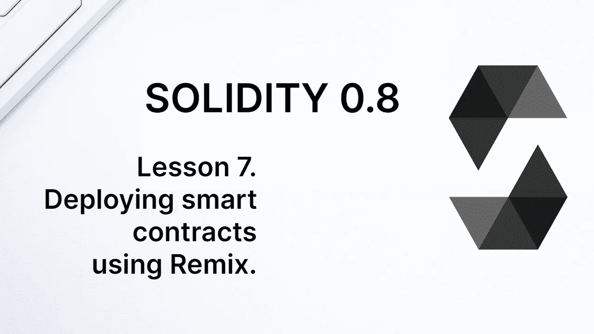
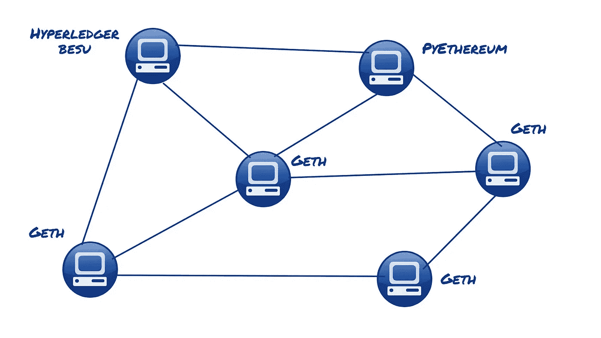
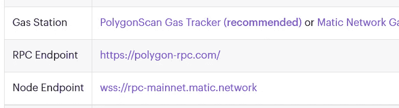
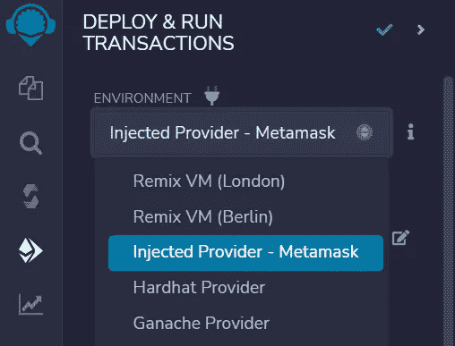
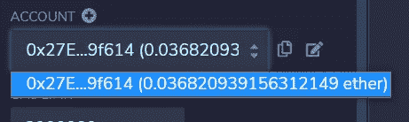

# 学习第 7 课“坚实”。使用 Remix 部署智能合约。

> 原文：<https://medium.com/coinmonks/solidity-lesson-7-deploying-smart-contracts-using-remix-8396ead642a6?source=collection_archive---------4----------------------->

在本节中，我们将进一步解释智能合约的路径，从其创建到在区块链上的部署。

要在 Solidity 中编写合同，只需要一个纯文本编辑器。我们使用了 Remix，但是也可以使用像记事本一样简单的编辑器。然而，通常使用具有更多资源的 IDE，例如 Visual Studio 代码。

Remix 编译合同，生成字节码，即需要发送到区块链的合同的二进制表示。Remix 用的编译器是 *Solc* 。其他广泛用于智能合约开发的框架有**松露**和**安全帽**。

字节码通过事务发送到区块链。部署时，创建一个新的契约帐户，保存契约代码，并初始化契约中定义的所有状态变量(为它们分配一个专用空间)。

到目前为止，我们只部署到由 Remix 本身管理的虚拟机上。因为 Remix 也管理这个模拟区块链的账户，我们不需要担心这些。我们只需单击“部署和运行事务”选项卡上的“部署”按钮。

在真实的区块链中，我们需要将事务发送到一个节点。让我们记住，节点是计算机组成的 *p2p* 网络中的一台计算机，它保存着账本的一个完全相同的副本，即区块链。

任何节点都可以接收事务。它将验证该事务，验证其格式是否正确，然后将该事务转发到其他节点，直到它到达网络上的所有计算机。

The blockchain structure is made up of several nodes, which can run clients with different implementations.

每个节点都必须运行以太坊客户端实现。以太坊有几个客户端实现，用几种编程语言编写。用的最多的客户端是 **Get** (Go 以太坊)，用 Go 写的。节点无非就是一台运行 Geth 之类软件的电脑。任何人都可以下载其中的一个实现，成为网络上的一个节点。

然而要做一个以太坊节点，需要下载差不多 1 TB 的数据，这让大部分开发者都没有运行自己的节点。

如果智能合同程序员也是网络的一个节点，他/她可以将事务发送到他/她自己的节点，并且它将被传播到所有其他节点。否则，事务必须发送到一个节点。节点有两种选择:公共节点和付费节点。

# 公共节点和付费节点

以太坊网络是公共的，是去中心化的，但不是那么去中心化。每个区块链都有一个负责维护和改进的基金会，该基金会通常提供允许连接到区块链的公共节点。

这样的公共节点通过 **JSON-RPC** 协议接收请求，这是以太坊和兼容区块链接收调用和事务的标准协议。对于那些在传统网络上编程的人来说，它相当于一个提供公共 API 的服务器。

在下图中，我们可以看到一个多边形主网络的公共节点的例子。您可以通过 http(s)或 webSocket 连接。每个区块链通常都有自己的公共节点地址。

Polygon mainnet public node. You can connect via http or webSocket.

因为它们是公共的，所以不能保证这些节点是稳定的。另一种可能性是使用付费节点的服务，这是一些运行完整节点并提供端点服务的公司，因此用户可以通过它们发送呼叫和交易。

为此，您需要注册并使用访问密钥。一些提供这种服务的公司有**因富拉**、**炼金术**、**快速节点**和**道德家**等等。这些公司中的大多数都有免费计划，最多可以有一定数量的互动。

要将一个契约部署到一个真实的区块链，需要向其中一个节点发送一个事务。但这笔交易需要签字，这就是我们现在要看到的。

# 签名交易和钱包

交易不能匿名，必须指定发送者。帐户必须在交易上签名，以证明汇款人对帐户拥有控制权。要签署交易，必须拥有账户的**私钥**。

以太坊上的外部账户由一对公钥/私钥组成。公钥生成帐户地址，而私钥用于签署交易。只有拥有私钥的人才能使用这样的帐户，因此私钥必须保存在安全的地方。

管理账户的软件叫做**钱包**。基本上，它们是创建/管理密钥对并能够签署交易的软件。浏览器最著名的钱包之一是 **MetaMask** 。它是 Chrome 和 Firefox 等浏览器的插件。

要安装 MetaMask，请访问 [metamask.io](http://metamask.io) 并下载。我们将很快谈论更多关于元蒙版和钱包的内容，现在我们将向你展示如何在 Remix 中使用元蒙版。

要连接 Remix 到 MetaMask，在'*Deploy&Run Transactions*选项卡中，不要在环境选项中选择 Remix VM(以前的 JavaScript VM)，而是选择'*Injected Provider—meta mask '*(以前的' *Injected Web3'* )，如下图所示。

Conecting Remix to MetaMask.

这样，选择账户输入框将显示当前连接到 Remix 的 MetaMask 管理的账户，如下图所示。

Remix will show the account managed by MetaMask.

现在，当您单击 Deploy 按钮时，Remix 将编写事务并将其发送到 MetaMask，进行签名并转发到一个节点。

# 元掩码是节点吗？

它不是。MetaMask 只是一个钱包，也就是说，它是管理账户和签署交易的软件。当连接到 Remix 时，它从 Remix 接收未签名的事务，对其进行签名，然后将其转发到一个节点。这意味着我们需要在元掩码中配置事务应该发送到哪个节点。

MetaMask 预配置了一些以太坊网络的端点，由 Infura 提供，包括主网络和一些测试网络。要在其他区块链上部署协定，您需要手动配置端点。

在接下来的课程中，我们将开始在以太坊测试网络上部署合同，为此我们将使用 MetaMask。

**感谢阅读**

欢迎任何投稿。www.buymeacoffee.com/jpmorais

> 交易新手？试试[密码交易机器人](/coinmonks/crypto-trading-bot-c2ffce8acb2a)或[复制交易](/coinmonks/top-10-crypto-copy-trading-platforms-for-beginners-d0c37c7d698c)