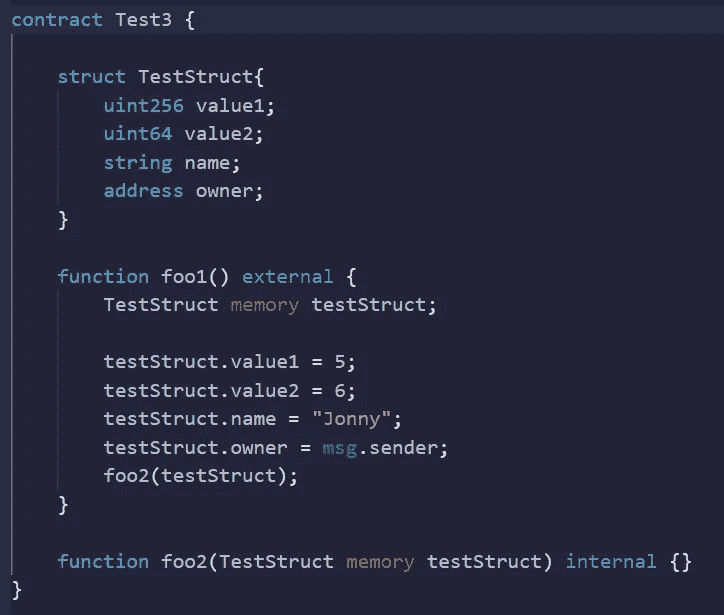

# 可靠性—测试假设第 2 集

> 原文：<https://medium.com/coinmonks/solidity-testing-assumptions-episode-2-e861504693b8?source=collection_archive---------30----------------------->

假设—在结构中从一个函数到另一个函数传递变量比单独传递要便宜。

结果

也许这就是我正在做的结构生成的类型。

好吧，也许不是。作为个人价值观传递更便宜。那么，当在函数之间传递信息时，我们什么时候/为什么要使用结构呢？

让我们看看这个例子。

这会抛出这个错误。

这是因为我们最多只能将 16 个变量传递给一个函数。这是因为 EVM 有严格的限制，因为它是使用汇编语言构建的。

使用这种方法，我们可以在允许超过通常限制的函数之间传递信息。

觉得这个有意思？试试这个！[https://medium.com/p/28a8bb064e86](/p/28a8bb064e86)

团结发展不和谐研究小组
【https://discord.gg/KzbcGmrnfN 

-多边形联盟—[https://www.polygonalliance.com/](https://www.polygonalliance.com/)

——多边形联盟不和—[https://discord.gg/kJKPCGQu66](https://discord.gg/kJKPCGQu66)

你喜欢这篇文章吗？想请我喝杯咖啡吗？
Polygon/Eth/Bsc—0x4a 581 E0 EAF 6b 71d 05905 e8e 6014 DC 0277 a1 b 10 ad

> *交易新手？试试* [*密码交易机器人*](/coinmonks/crypto-trading-bot-c2ffce8acb2a) *或* [*复制交易*](/coinmonks/top-10-crypto-copy-trading-platforms-for-beginners-d0c37c7d698c) *上* [*最好的密码交易*](/coinmonks/crypto-exchange-dd2f9d6f3769)

> 加入 Coinmonks [电报频道](https://t.me/coincodecap)和 [Youtube 频道](https://www.youtube.com/c/coinmonks/videos)获取每日[加密新闻](http://coincodecap.com/)

# 另外，阅读

*   [免费加密信号](/coinmonks/free-crypto-signals-48b25e61a8da) | [加密交易机器人](/coinmonks/crypto-trading-bot-c2ffce8acb2a)
*   [杠杆代币](/coinmonks/leveraged-token-3f5257808b22)终极指南
*   [16 款最佳折叠电动自行车](/coinmonks/top-17-folding-electric-bikes-5e296f0918cb)
*   [28 款最佳电动自行车点评](/coinmonks/the-28-best-electric-bikes-review-and-buying-guide-in-2023-7bb3146cb403)
*   前三名[币安期货交易机器人](/coinmonks/top-3-binance-futures-trading-bots-e6031f84b3f9)