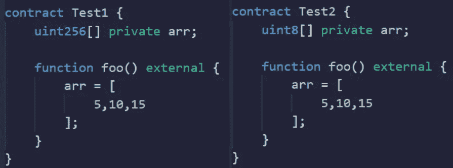
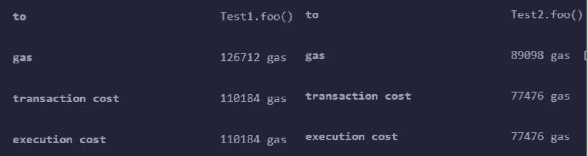
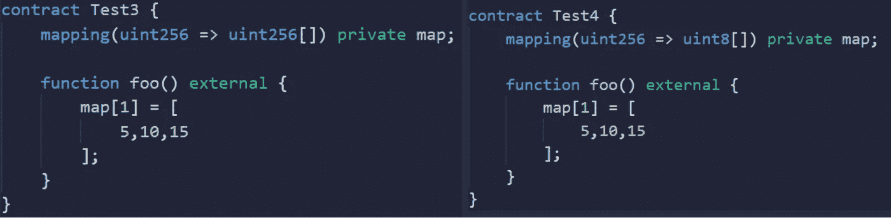
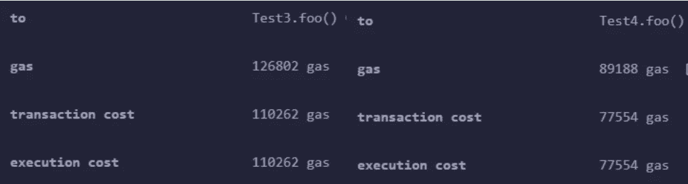
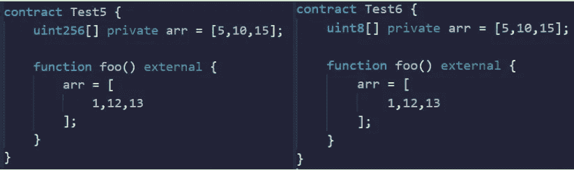
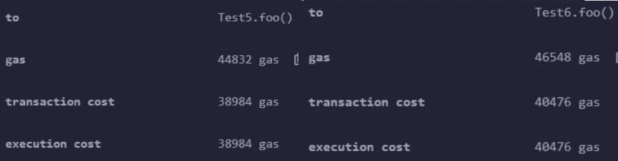

# 可靠性—测试假设第 3 集

> 原文：<https://medium.com/coinmonks/solidity-testing-assumptions-episode-3-971f2136e978?source=collection_archive---------16----------------------->

假设—存储 uint8 的数组比存储 uint256 的数组成本低

因此，我们可以肯定地说，在处理普通的旧数组时，使用较小的单元大小要便宜得多。

好的，让我们试试映射。

好吧，那就看谁赢了。

假设 2 —更新 uint8[]中的变量比更新 uint256[]中的值更便宜

所以设置更小的 uint 花费更少，但是更新 uint256 比更新更小的 uint 花费更少，至少在数组中。这可能是因为 uint256 占用了一个完整的 mem 插槽(32 字节),因此它使组装工作更容易。

觉得这个有趣吗？看看这个。
[https://medium.com/p/a069b267c6e0](/p/a069b267c6e0)

坚实发展研究小组—[https://discord.gg/KzbcGmrnfN](https://discord.gg/KzbcGmrnfN)

-多边形联盟—[https://www.polygonalliance.com/](https://www.polygonalliance.com/)

——多边形联盟不和—[https://discord.gg/kJKPCGQu66](https://discord.gg/kJKPCGQu66)

你喜欢这篇文章吗？想请我喝杯咖啡吗？
Polygon/Eth/Bsc—0x4a 581 E0 EAF 6b 71d 05905 e8e 6014 DC 0277 a1 b 10 ad

> *交易新手？试试* [*加密交易机器人*](/coinmonks/crypto-trading-bot-c2ffce8acb2a) *或* [*复制交易*](/coinmonks/top-10-crypto-copy-trading-platforms-for-beginners-d0c37c7d698c) *上* [*最好的加密交易*](/coinmonks/crypto-exchange-dd2f9d6f3769)

> 加入 Coinmonks [电报频道](https://t.me/coincodecap)和 [Youtube 频道](https://www.youtube.com/c/coinmonks/videos)获取每日[加密新闻](http://coincodecap.com/)

# 另外，阅读

*   [免费加密信号](/coinmonks/free-crypto-signals-48b25e61a8da) | [加密交易机器人](/coinmonks/crypto-trading-bot-c2ffce8acb2a)
*   [杠杆代币](/coinmonks/leveraged-token-3f5257808b22)终极指南
*   [16 款最佳折叠电动自行车](/coinmonks/top-17-folding-electric-bikes-5e296f0918cb)
*   [28 款最佳电动自行车点评](/coinmonks/the-28-best-electric-bikes-review-and-buying-guide-in-2023-7bb3146cb403)
*   前三名[币安期货交易机器人](/coinmonks/top-3-binance-futures-trading-bots-e6031f84b3f9)