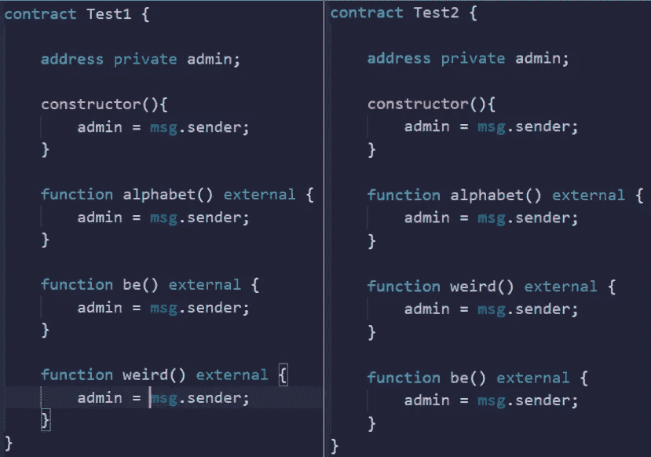
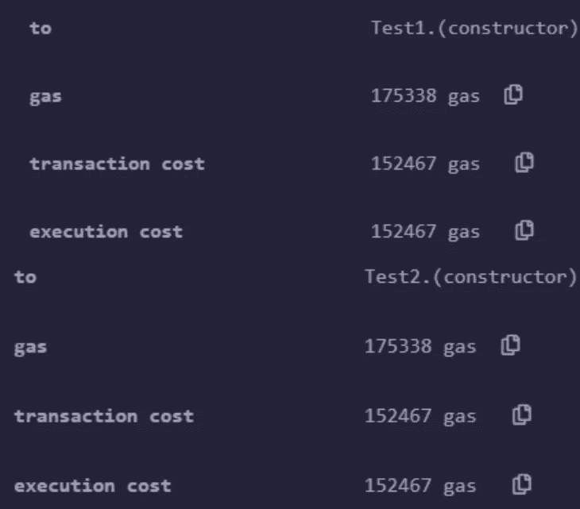

# 可靠性测试假设第 8 部分

> 原文：<https://medium.com/coinmonks/solidity-testing-assumptions-part-8-1e5ceb3f35de?source=collection_archive---------22----------------------->

首先，我想说这不是我的假设。

假设:按字母顺序排列合同中的功能可以降低合同的部署成本。

期望:没有区别。

现在是真相大白的时候了…

是的，没什么区别。

…nexxtttt

好的，回想一下以前文章中的两个不同的测试。

在第一个测试中，我们存储数据&检查每种方式消耗多少汽油&将数据存储为一种结构比大多数其他方法消耗更多汽油。
在第二个测试中，我们正在存储数据&寻找最佳存储效率解决方案。在这个测试中，我们了解到在公共结构中存储数据是存储上最轻的解决方案。

那么，为什么这很重要呢？

在开发合同时，您会经常遇到智能合同大小限制，因此在某些情况下需要节省空间。你应该尽可能高效地存储信息，但是如果你需要考虑存储，因为你已经达到了契约的大小限制，那么就相应地修改你的代码来满足你的需求。

如果你觉得这很有趣，看看这个！https://medium.com/p/dd6fcafc8a13
T2

坚实发展研究小组—【https://discord.gg/KzbcGmrnfN 

-多边形联盟—[https://www.polygonalliance.com/](https://www.polygonalliance.com/)

——多边形联盟不和—[https://discord.gg/kJKPCGQu66](https://discord.gg/kJKPCGQu66)

你喜欢这篇文章吗？想请我喝杯咖啡吗？
Polygon/Eth/Bsc—0x4a 581 E0 EAF 6b 71d 05905 e8e 6014 DC 0277 a1 b 10 ad

> *交易新手？试试* [*密码交易机器人*](/coinmonks/crypto-trading-bot-c2ffce8acb2a) *或* [*复制交易*](/coinmonks/top-10-crypto-copy-trading-platforms-for-beginners-d0c37c7d698c) *上* [*最好的密码交易*](/coinmonks/crypto-exchange-dd2f9d6f3769)

> 加入 Coinmonks [电报频道](https://t.me/coincodecap)和 [Youtube 频道](https://www.youtube.com/c/coinmonks/videos)获取每日[加密新闻](http://coincodecap.com/)

# 另外，阅读

*   [免费加密信号](/coinmonks/free-crypto-signals-48b25e61a8da) | [加密交易机器人](/coinmonks/crypto-trading-bot-c2ffce8acb2a)
*   杠杆代币的终极指南
*   [16 款最佳折叠电动自行车](/coinmonks/top-17-folding-electric-bikes-5e296f0918cb)
*   [28 款最佳电动自行车评选](/coinmonks/the-28-best-electric-bikes-review-and-buying-guide-in-2023-7bb3146cb403)
*   前三名[币安期货交易机器人](/coinmonks/top-3-binance-futures-trading-bots-e6031f84b3f9)