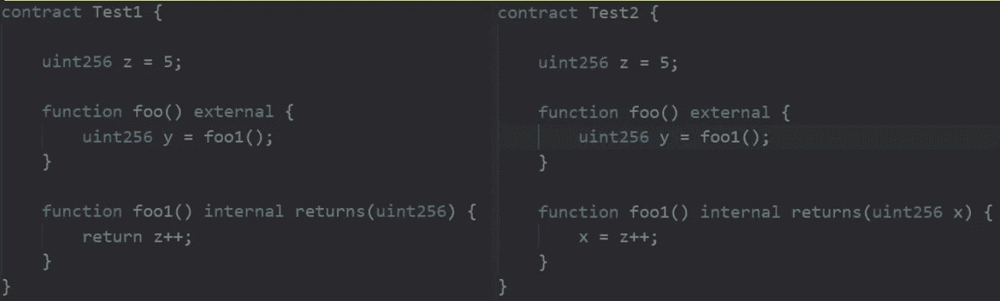

# 可靠性测试假设第 9 部分

> 原文：<https://medium.com/coinmonks/solidity-testing-assumptions-part-9-50e5c82520ef?source=collection_archive---------12----------------------->

假设:在内存中存储数组的长度&使用该变量比多次调用数组长度要便宜。

期望:我期望测试 1 最便宜，测试 2 最贵。

结果？

将一个数组放入内存比我最初想的要昂贵…至少我们可以说我们知道最有效的方法 xD

今天还有一个假设！

假设:在返回变量声明期间定义变量名&给它赋值比调用 return 语句便宜

请击鼓。

.

.

.

.

.

.

.

.

.

好吧，我试过 xD

如果你觉得这很有趣，看看这个！
[https://medium.com/p/dd6fcafc8a13](/p/dd6fcafc8a13)

坚实发展研究小组—[https://discord.gg/KzbcGmrnfN](https://discord.gg/KzbcGmrnfN)

-多边形联盟—[https://www.polygonalliance.com/](https://www.polygonalliance.com/)

——多边形联盟不和—[https://discord.gg/kJKPCGQu66](https://discord.gg/kJKPCGQu66)

你喜欢这篇文章吗？想请我喝杯咖啡吗？
Polygon/Eth/Bsc—0x4a 581 E0 EAF 6b 71d 05905 e8e 6014 DC 0277 a1 b 10 ad

> *交易新手？试试* [*加密交易机器人*](/coinmonks/crypto-trading-bot-c2ffce8acb2a) *或* [*复制交易*](/coinmonks/top-10-crypto-copy-trading-platforms-for-beginners-d0c37c7d698c) *上* [*最好的加密交易*](/coinmonks/crypto-exchange-dd2f9d6f3769)

> 加入 Coinmonks [电报频道](https://t.me/coincodecap)和 [Youtube 频道](https://www.youtube.com/c/coinmonks/videos)获取每日[加密新闻](http://coincodecap.com/)

# 另外，阅读

*   [免费加密信号](/coinmonks/free-crypto-signals-48b25e61a8da) | [加密交易机器人](/coinmonks/crypto-trading-bot-c2ffce8acb2a)
*   [杠杆代币](/coinmonks/leveraged-token-3f5257808b22)终极指南
*   [16 款最佳折叠电动自行车](/coinmonks/top-17-folding-electric-bikes-5e296f0918cb)
*   [28 款最佳电动自行车点评](/coinmonks/the-28-best-electric-bikes-review-and-buying-guide-in-2023-7bb3146cb403)
*   前三名[币安期货交易机器人](/coinmonks/top-3-binance-futures-trading-bots-e6031f84b3f9)