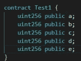
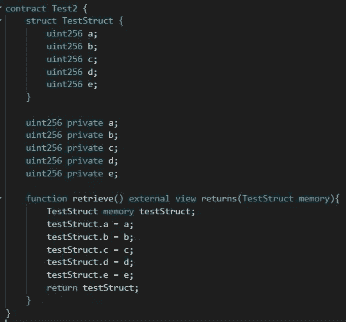
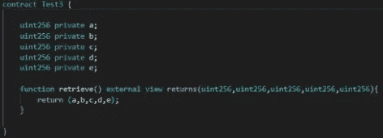
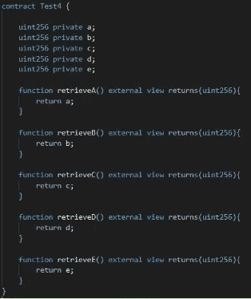
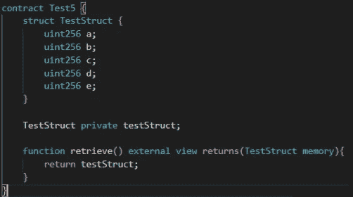
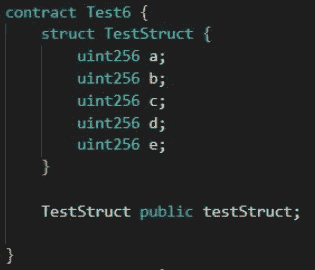
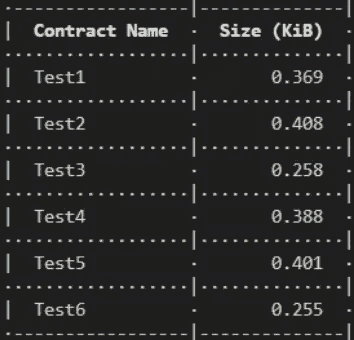

# 可靠性—测试最佳实践

> 原文：<https://medium.com/coinmonks/solidity-testing-for-best-practices-741109035ea7?source=collection_archive---------15----------------------->

问题:面对合同规模限制作为完成合同的障碍是很正常的。

这意味着在设计和撰写合同时，我们需要尽可能地节省空间。

目标—找到存储和检索信息的最有效的解决方案。

测试 1–5 个变量都是公共的

测试 2-5 个私有变量&一个函数在一个结构中返回所有变量

测试 3–5 个私有变量&一个单独返回所有变量的函数

est 4–5 个变量都是私有的&每个变量都有自己的 get 函数

用自己的 get 函数测试存储在私有结构中的 5-5 个变量

测试存储在公共结构中的 6–5 个变量

我个人认为测试 3 在存储方面效率最高，你认为呢？

.

.

.

.

.

.

.

关闭！为什么？

当我们将一个变量设为 public 时，它会自动为其创建一个 getter 函数。这将占用每个公共变量的空间，将所有变量组合成一个结构&将它标记为 public 要便宜得多。

如果你觉得这很有趣，为什么不看看这个呢！
[https://medium.com/p/28a8bb064e86](/p/28a8bb064e86)

坚实发展研究小组—[https://discord.gg/KzbcGmrnfN](https://discord.gg/KzbcGmrnfN)

-多边形联盟—[https://www.polygonalliance.com/](https://www.polygonalliance.com/)

——多边形联盟不和—[https://discord.gg/kJKPCGQu66](https://discord.gg/kJKPCGQu66)

你喜欢这篇文章吗？想请我喝杯咖啡吗？
Polygon/Eth/Bsc—0x4a 581 E0 EAF 6b 71d 05905 e8e 6014 DC 0277 a1 b 10 ad

> *交易新手？试试* [*加密交易机器人*](/coinmonks/crypto-trading-bot-c2ffce8acb2a) *或* [*复制交易*](/coinmonks/top-10-crypto-copy-trading-platforms-for-beginners-d0c37c7d698c) *上* [*最好的加密交易*](/coinmonks/crypto-exchange-dd2f9d6f3769)

> 加入 Coinmonks [电报频道](https://t.me/coincodecap)和 [Youtube 频道](https://www.youtube.com/c/coinmonks/videos)获取每日[加密新闻](http://coincodecap.com/)

# 另外，阅读

*   [免费加密信号](/coinmonks/free-crypto-signals-48b25e61a8da) | [加密交易机器人](/coinmonks/crypto-trading-bot-c2ffce8acb2a)
*   [杠杆代币](/coinmonks/leveraged-token-3f5257808b22)终极指南
*   [16 款最佳折叠电动自行车](/coinmonks/top-17-folding-electric-bikes-5e296f0918cb)
*   [28 款最佳电动自行车点评](/coinmonks/the-28-best-electric-bikes-review-and-buying-guide-in-2023-7bb3146cb403)
*   前三名[币安期货交易机器人](/coinmonks/top-3-binance-futures-trading-bots-e6031f84b3f9)