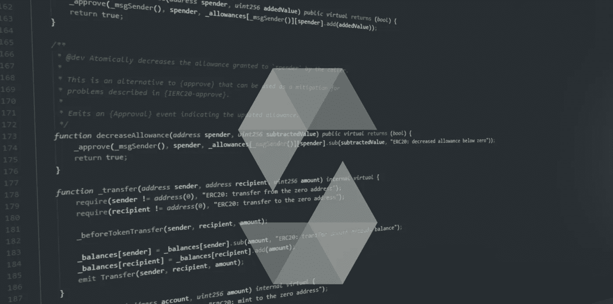

# 可靠性:使用设计在过时的 pragma 上的代码

> 原文：<https://medium.com/coinmonks/solidity-usage-of-code-designed-on-outdated-pragma-52069c27976?source=collection_archive---------13----------------------->



## 介绍

Solidity 是一种用于在 EVM 兼容平台上实现智能合约的编程语言。随着 it 的高速发展，包含重大变更的新版本会定期出现。

然而，solidity 发布了[重大变更列表](https://docs.soliditylang.org/en/v0.8.17/080-breaking-changes.html#solidity-v0-8-0-breaking-changes)和[对编译指示迁移的建议](https://docs.soliditylang.org/en/v0.8.17/080-breaking-changes.html#how-to-update-your-code)。pragma 会被错误地迁移，一些功能会被破坏。

## 为什么 pragma 迁移错误？

*   开发人员不了解代码依赖于旧的行为
*   开发人员不理解其中的逻辑，并提供无意识的修复，直到编译器停止显示警告

# pragma 迁移可能出错的示例

例如，UniSwap [FullMath](https://github.com/Uniswap/v3-core/blob/fc2107bd5709cdee6742d5164c1eb998566bcb75/contracts/libraries/FullMath.sol) 库是为 *solidity < 0.8.0* 设计的。
迁移到 *solidity ~0.8.0* 时有哪些常见错误？

**首先，开发者要注意** [**第 91–96 行**](https://github.com/Uniswap/v3-core/blob/fc2107bd5709cdee6742d5164c1eb998566bcb75/contracts/libraries/FullMath.sol#L91-L96) **:**

```
inv *= 2 — denominator * inv; // inv and denominator are uint256
```

想要的数学下溢经常发生在那里。但是在 *solidity ~0.8.0 中，*数学上溢和下溢是被阻止的，开发者经常会错过，所以代码可能会返回一个不想要的异常。

**二、** [**线 64**](https://github.com/Uniswap/v3-core/blob/fc2107bd5709cdee6742d5164c1eb998566bcb75/contracts/libraries/FullMath.sol#L64) **:** 处有一个不可比拟的瞬间

```
// Factor powers of two out of the denominator
// Compute the largest power of two divisors of the denominator
uint256 twos = -denominator & denominator;
```

返回编译异常， *solidity ~0.8.0* 编译器为一元运算符“-”不能应用于类型 *uint256* 。建议开发商把这个数字做成有符号的整数。因此，最终迁移的代码看起来可能是这样的:

```
uint256 twos = uint256(-int256(denominator) & int256(denominator));
// is equal to
uint256 twos = uint256(-int256(denominator)) & denominator;
```

但是这两个修改都因为*分母= 2**255* 而被打破。由于 *MAX_INT256 = 2**255-1* 和 *int256(2**255) = -2**255* ，所以对 *int256(2**255)* 应用一元运算符“-”会溢出 *int256* 类型。

**第三，台词** [**80**](https://github.com/Uniswap/v3-core/blob/fc2107bd5709cdee6742d5164c1eb998566bcb75/contracts/libraries/FullMath.sol#L80) **，** [**87**](https://github.com/Uniswap/v3-core/blob/fc2107bd5709cdee6742d5164c1eb998566bcb75/contracts/libraries/FullMath.sol#L87) **，**[**104**](https://github.com/Uniswap/v3-core/blob/fc2107bd5709cdee6742d5164c1eb998566bcb75/contracts/libraries/FullMath.sol#L104)**:**

由于没有提供算法的数学证明，因此不清楚是否应该防止溢出。所以动作也可能被忘记包装到未检查的块中。

但是，可以通过简单的测试来检查行中是否抛出了错误。根据下面的例子，溢出应该在那里，所以需要包装到未检查的块。

mulDiv(2**253，2**254，2**255)导致第 [104](https://github.com/Uniswap/v3-core/blob/fc2107bd5709cdee6742d5164c1eb998566bcb75/contracts/libraries/FullMath.sol#L104) 行溢出；mulDiv(2 * * 253–2，2 * * 254–3，2**255n-4)导致第 [80](https://github.com/Uniswap/v3-core/blob/fc2107bd5709cdee6742d5164c1eb998566bcb75/contracts/libraries/FullMath.sol#L80) ，[91–96](https://github.com/Uniswap/v3-core/blob/fc2107bd5709cdee6742d5164c1eb998566bcb75/contracts/libraries/FullMath.sol#L91-L96)
行溢出

**虽然所有的点都可能被正确地修正，但是修改节能代码被认为是一个坏主意。**

# 如何使用带有过时 pragma 的代码？

解决方案是将设计在过时 pragma 上的代码分离到一个单独的库中，然后链接目标契约。

*   使用旧的 solidity 编译器将所有硬更新逻辑移到库中

```
pragma solidity outdated;library Lib {
    function foo(params) external/public pure? returns (types) {
        *logic requires an old compiler version* ...
    } ...
}
```

*   使用实际的 pragma 创建一个具有相同函数签名的库模型

```
pragma solidity actual;library LibMockup {
    function foo(params) external pure? returns (types) {} ...
}
```

*   将模型库导入目标合同，并在需要的地方使用它

```
pragma solidity actual;import "LibMockup";contract Target {
    function func(params) public? pure? returns (types) {
        ... results = LibMockup.foo(lib_params); ...
    } ...
}
```

*   配置 HardHat，用环境配置文件中部署的库地址替换契约中的模型引用

```
const LibFactory = await hardhat.ethers.getContractFactory("Lib")
const LibInstance = await LibFactory.deploy()const ContractFactory = await hardhat.ethers.getContractFactory("Target", {
  libraries: {
    LibMockup: LibInstance.address,
  },
})
const ContractInstance = await ContractFactory.deploy()
```

详细工作代码示例[见这里](https://github.com/SteMak/solidity_outdated_lib_usage)。

# 尾声

如果将节能代码迁移到新的编译指令:

*   记住！强制杂注迁移可能会导致意外的结果
*   仔细检查每一行，将其与重大变更列表进行比较
*   **彻底测试移植的代码！**

如果你不确定你在做什么，使用上面的指南来避免代码修改。

**被迁移的代码在被可信的审计公司检查之前是不安全的！**

> 交易新手？尝试[加密交易机器人](/coinmonks/crypto-trading-bot-c2ffce8acb2a)或[复制交易](/coinmonks/top-10-crypto-copy-trading-platforms-for-beginners-d0c37c7d698c)