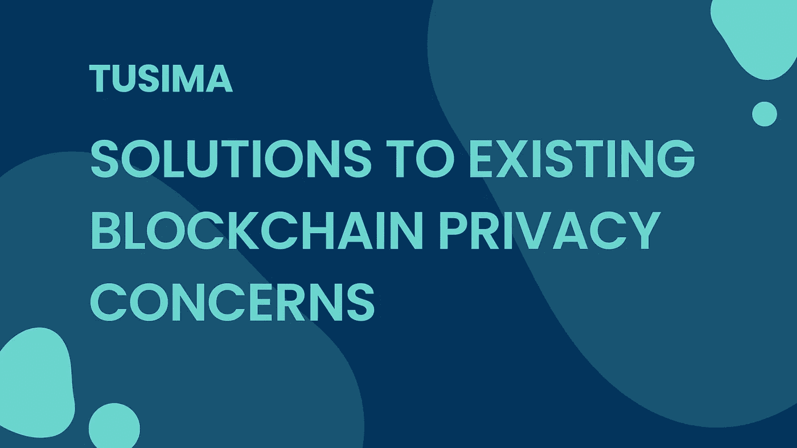

# 现有区块链隐私问题的解决方案

> 原文：<https://medium.com/coinmonks/solutions-to-existing-blockchain-privacy-concerns-17397cbfb5aa?source=collection_archive---------8----------------------->

**TL；博士**

世界性的网络安全事件，如数据泄露、勒索软件、黑客攻击等。正在肆虐。随着有组织、有针对性的网络攻击加剧，网络安全风险正在上升。区块链隐私解决方案，包括零知识证明、加密货币混合和环签名，可能会拯救我们。

## **全球网络安全事件频发**

去年，美国最大的保险公司之一 CNA 金融公司遭受了勒索软件攻击。CNA 试图找回他们的文件，但没有成功。在他们的谈判中，黑客勒索了高达 6000 万美元。袭击发生两周后，该案件以 4000 万美元了结，交换条件是重新获得对自己网络的控制权。CNA 金融公司在发布的顶级勒索软件支付中名列榜首，打破了已知最大支付记录。

据*报道，来自 106 个国家和地区的超过 5.33 亿脸书用户的个人数据在一个黑客论坛上被泄露，包括用户个人数据，如脸书身份证、全名、地点、出生日期、电子邮件地址，以及从用户档案中检索到的任何其他细节。泄露还暴露了用户的电话号码，包括那些未公开的号码，都是通过数据库检索的。通过随机抽样验证了数据的真实性。*

黑客在黑网上出售涉及 7 亿多用户的 LindkeIn 用户数据，提供大约 100 万 LinkedIn 用户的样本数据收集。LinkedIn 声称的 7.56 亿用户中约 92%的个人数据可以在这个“泄露”的数据库中检索到，这是 LinkedIn 成立以来最大的数据泄露事件。

## **区块链的双刃剑解决方案**

世界性的网络安全事件，如数据泄露、勒索软件、黑客攻击等。正在肆虐。随着有组织、有针对性的网络攻击加剧，网络安全风险正在上升。区块链通过去中心化的分布式同步记账、防篡改、可追溯性、数据加密等辅助，在本地锁定所有数据。在保证数据安全的同时，实现了多源数据的跨域协作和共享。智能合约解决了困扰传统集中式系统的信任、数据所有权和其他问题。

现有的网络问题似乎已经在区块链找到了答案，刺激了这项新兴技术近年来的快速发展。区块链成为技术革命的热门话题，因为它使用智能合约验证数据，并通过不可变的共享数据实现网络参与者之间的透明。然而，安全、透明的特性阻碍了区块链应用的大规模起飞和普及。当我用比特币购买披萨时，整个世界(每个访问比特币节点的人)都可以看到交易，因为该操作在所有比特币节点之间共享。所有交易都在公共区块链网络的所有节点之间共享，如比特币和以太坊。由于交易需要多方确认，隐私信息的泄露变得越来越突出。商业世界对共享账本中的敏感数据持谨慎态度，不能删除信息，阻止许多大型组织进入市场。

## **区块链隐私解决方案**

敏感数据的隐私保护不足等问题正日益阻碍该行业的发展。在区块链，账户隐私的安全性和交易数据的隐私已经成为主要研究领域和领域的基础。

零知识证明(Zero-knowledge proof)强调了保护账户隐私和安全的前沿技术，如 ZkSnarks。在链上发送 1000 次签名验证和其他交易验证已按指示完成的证明，而不是用户的签名数据，实现了可扩展性并保持了数据隐私和安全性。ZkSnarks 把要证明的问题分成若干个多项式，形成一个算术回路，然后把算术回路转化为秩 1 约束系统(R1CS)，辅助证明。电路有输入和输出，其中输入分为公共输入和私人输入，意味着接近外界。在电路被执行后，产生从输入到输出的计算过程有效的证明。比较作为方程的电路和作为解的私有输入，在不公开方程的解的情况下证明了方程是可解的。这就解释了 ZkSnarks 的神奇之处。

交易数据隐私的常见解决方案包括 Tornado cash、Monero、Dash 等，它们都基于 UTXO 模型。Tornado cash 采用加密混合，而 Monero 和 Dash 则由环签名技术支持。

Merkle tree 公布了混合货币中的基本数据结构。诀窍是在事务中分离输入和输出地址，即切断输入和输出地址之间的联系。它旨在提高加密货币的隐私性和匿名性，为追踪加密货币的目的及其所有者带来困难。

我们日常生活中的一个例子:游客们正在往许愿池里扔当年的硬币。第三方站在一旁观察谁在什么时间扔了多少硬币。但是当第三方试图检查井里的硬币时，他无法弄清楚哪个硬币是谁扔的。

环签名技术的概念可以追溯到 17 世纪的法国。传说当时的法国大臣在向国王提出想法时，想出了这个绝妙的主意。签名者的名字被签在一个圆圈里，让人很难分辨是谁发起了这个提议。

在环签名中，所有人都是环成员，而不是管理者，成员之间不需要合作。签名是使用签名者的私钥和组中其他成员的公钥独立签名的，其他成员可能甚至没有意识到它的被动参与。环签名欢呼匿名，但厌恶伪造。强调匿名增加了审计和监督的障碍。

# 📚必读

[图西玛系列-1](/coinmonks/public-chain-market-outlook-823eaec076cb) | [图西玛系列-2](/coinmonks/challenges-and-solutions-for-public-chain-36c183eb608e) | [图西玛系列-3](/coinmonks/controllable-privacy-financial-infrastructure-on-layer-2-d858cd6224a3)

***NetX，面向可信可靠的智能自治系统的数字生活的链原生互联网(***[***Trias***](https://www.trias.one/)***)***

[***铁人三项***](https://www.triathon.space/#/)***|***[***Ethanim***](https://www.ethanim.network/)***|***[***Tusima***](https://www.tusima.network/#/)***| behemo tum | Octavius | leviam | Divina***

> 交易新手？尝试[加密交易机器人](/coinmonks/crypto-trading-bot-c2ffce8acb2a)或[复制交易](/coinmonks/top-10-crypto-copy-trading-platforms-for-beginners-d0c37c7d698c)