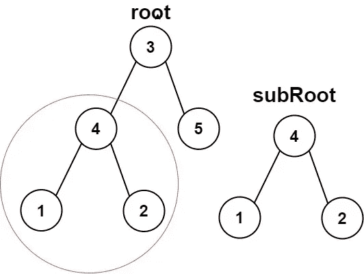
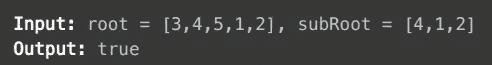
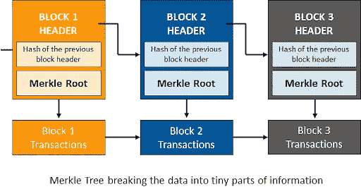

# 用区块链概念解决一个 LeetCode 问题😎

> 原文：<https://medium.com/coinmonks/solving-a-leetcode-problem-with-blockchain-concept-8d985c2ad66f?source=collection_archive---------17----------------------->

我很惊讶地看到，一个简单的问题可以教给我们一个在区块链 T2 用于分权的概念🤯。让我们戴上**神奇的眼镜**，给我们**不同的视角来看待这个问题**！

先睹为快的概念🤫:我们将使用 **Merkle 树**

# ⁕的问题:

[https://leetcode.com/problems/subtree-of-another-tree](https://leetcode.com/problems/subtree-of-another-tree)



# ⁕通用方法:

最简单的方法是简单地使用一个函数 isSameTree 并递归地运行它来检查它们的根是否与子树匹配！嗯，**不深入解释，因为这不是本文的目的**。

> 交易新手？在[最佳加密交易](/coinmonks/crypto-exchange-dd2f9d6f3769)上尝试[加密交易机器人](/coinmonks/crypto-trading-bot-c2ffce8acb2a)或[副本交易](/coinmonks/top-10-crypto-copy-trading-platforms-for-beginners-d0c37c7d698c)

如果你想学这个，这里有代码:

```
 bool isSameTree(TreeNode* p, TreeNode* q) {
        if(p == NULL || q == NULL) return (p == q);
        if(p->val != q->val) return false;

        return (isSameTree(p->left, q->left) && 
                isSameTree(p->right, q->right));
    }

    bool isSubtree(TreeNode* root, TreeNode* subRoot) {
        if(isSameTree(root, subRoot)) 
            return true;
        if(! root) 
            return false;

        return (isSubtree(root->left, subRoot) ||
                isSubtree(root->right, subRoot));
    }
```

# ⁕教授在区块链使用的概念的方法💙

🥁🥁🥁鼓乐

我们将在这里使用的概念是 **Merkle 树。**

## ⁕深入研究了 Merkle 树的概念


image credits: brilliant.org

*   Merkle 树或散列树是一种树结构，其中**叶节点**包含数据块的**加密散列**，而**非叶节点**包含其子节点**的**加密散列。
*   在**比特币**和其他**加密货币**中，Merkle tree 数据库被用来安全地分割区块的数据，并确保其不被丢失、损坏或更改，**基本上是为了更安全地加密数据**。
*   如果 Merkle 树不存在的话，网络上的每一个节点都需要维护区块链上发生的所有事务的完整副本！！！
*   在验证交易时，每个节点都必须逐行比较每个条目，以确保其记录与网络记录完全匹配，这将需要巨大的**计算能力！！**



image credits: simplilearn.com

> 现在我们已经知道了 merkle 树的基础知识，我们可以从 Merkle 树的根的散列中识别出子节点的所有事务，让我们在 Leetcode 问题中使用相同的概念！

## ⁕用 merkle 树解决 leetcode 问题；

*   因此，对于树的每个节点，我们创建 merkle，它是其子节点或子树的散列。
*   在区块链，通常使用哈希 **SHA256** ，这是一个**密码**哈希。点击查看更多关于[的信息。](https://www.educative.io/answers/how-is-sha-256-used-in-blockchain-and-why)
*   是左子树的**merkle+根的值+右子树的 merkle 的串联！**
*   一旦我们形成了每个根的 merkle，我们可以简单地遍历并**检查树的根的 merkle 是否匹配子树的根的 merkle。**
*   这是来自[讨论选项卡](https://leetcode.com/problems/subtree-of-another-tree/solutions/102741/python-straightforward-with-explanation-o-st-and-o-s-t-approaches/?q=merkle&orderBy=most_relevant)的 python 代码，通过导入 sha256 实现。

```
def isSubtree(self, s, t):
    from hashlib import sha256
    def hash_(x):
        S = sha256()
        S.update(x)
        return S.hexdigest()

    def merkle(node):
        if not node:
            return '#'
        m_left = merkle(node.left)
        m_right = merkle(node.right)
        node.merkle = hash_(m_left + str(node.val) + m_right)
        return node.merkle

    merkle(s)
    merkle(t)
    def dfs(node):
        if not node:
            return False
        return (node.merkle == t.merkle or 
                dfs(node.left) or dfs(node.right))

    return dfs(s)
```

# ⁕参考:

1.  [https://leet code . com/problems/subtree-of-other-tree/solutions/102741/python-straight-with-explain-o-ST-and-o-s-t-approach/？q = merkle&order by = most _ relevant](https://leetcode.com/problems/subtree-of-another-tree/solutions/102741/python-straightforward-with-explanation-o-st-and-o-s-t-approaches/?q=merkle&orderBy=most_relevant)
2.  [https://brilliant.org/wiki/merkle-tree/](https://brilliant.org/wiki/merkle-tree/)
3.  高拉夫·森的视频:[https://www.youtube.com/watch?v=qHMLy5JjbjQ](https://www.youtube.com/watch?v=qHMLy5JjbjQ)
4.  [https://www . simpli learn . com/tutorials/区块链-tutorial/区块链的 merkle-tree](https://www.simplilearn.com/tutorials/blockchain-tutorial/merkle-tree-in-blockchain)
5.  [https://www . educative . io/answers/how-is-sha-256-used-in-区块链-and-why](https://www.educative.io/answers/how-is-sha-256-used-in-blockchain-and-why)