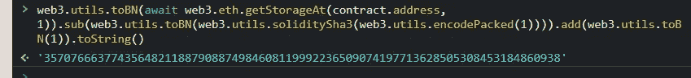

# 解决以太 19-外星人法典

> 原文：<https://medium.com/coinmonks/solving-ethernaut-19-3ec869ac89be?source=collection_archive---------5----------------------->


Photo by [Kevin Ku](https://unsplash.com/@ikukevk?utm_source=medium&utm_medium=referral) on [Unsplash](https://unsplash.com?utm_source=medium&utm_medium=referral)

 [## 以太人

ethernaut.openzeppelin.com](https://ethernaut.openzeppelin.com/) 

战胜这一挑战的诀窍是理解静态变量和动态数组是如何存储的。

目标很简单——通过覆盖“所有者”地址来要求合同。

# 要破解的合同

您可能注意到的第一件事是,“AlienCodex”契约继承了另一个名为“Ownable”的契约，但是该契约的代码不可用。这里的“Ownable”契约是 OpenZeppelin 实现的早期版本，但是出于我们的目的，我们只需要知道这个契约将在存储槽中存储“所有者”地址。

## 智能合同中的存储机制提醒

契约中的所有持久状态——意味着所有变量和所有动态数组——都存储在一个 32 字节的长列表中。每个槽都有一个从 0 开始的索引，一直到索引 2 ⁵⁶ -1。如果一个接一个定义的变量可以放入 32 个字节，那么它们可以一起放入一个存储槽中。


与之前的挑战一样，您需要找出一种方法，以一种意想不到的方式操纵存储插槽。

乍一看，这似乎不那么简单，但是让我们试着弄清楚变量是如何存储在我们的契约中的。在浏览器控制台中，您可以通过写入以下内容来尝试查看合同的第一个存储位置:

```
await web3.eth.getStorageAt(contract.address, 0);
```

您得到的结果应该是这样的:


该值是一个 32 字节长的十六进制字符串，最后 40 个字符设置为一个地址。这实际上是所有者的地址，因为即使我们在 ethernaut 质询提供的代码中看不到该变量，但该变量是在“Ownable”契约中定义的。变量也根据继承层次结构存储，因此从另一个协定继承的协定将其变量存储在它所继承的协定之后。在我们的例子中，这意味着所有者地址变量存储在槽 0 中，因为“AlienCodex”继承自“Ownable”。

您可以尝试通过检查更多存储插槽，但您会发现插槽 0 以外的所有存储插槽都将以十六进制返回 0。让我们看看代码，找出前进的方向。

```
bool public contact;  
bytes32[] public codex;modifier contacted() {   
 assert(contact);    
_;
}
```

我们需要做的第一件事是将 contact 变量改为 true，否则我们将无法调用其他方法。这样做很简单。我们只需要调用这个方法:

```
function make_contact() public {    contact = true;  }
```

再次使用浏览器中的控制台:

```
await contract.make_contact()
```

如果您在调用成功后检查存储插槽 0，您可能会注意到一些奇怪的情况:


我们的存储槽中的地址前面现在有一个 1！这个 1 实际上是我们刚刚在最后一个调用中设置为 true 的 bool 变量 contact。原因是 bool 只占用 1 个字节，它与地址变量打包在一起，以便为契约节省存储空间。

既然我们可以调用契约中的其他函数，那么让我们看看我们可以做些什么来破解这个契约。你应该关注的重要方法是:

```
function retract() contacted public {   
 codex.*length*--;  
} function revise(uint i, bytes32 _content) contacted public { 
  codex[i] = _content;  
}
```

“retract”方法允许我们将动态数组“codex”缩小 1，而“revise”允许我们索引插入数组。在我们继续之前，我们需要了解动态数组在存储槽中的行为。因为动态数组存储大小不确定的数据，所以 EVM 不能像静态变量那样将数据按顺序打包在一起。相反，阵列数据将存储在通过使用 keccak256 散列函数散列存储槽索引而确定的存储槽中。在控制台中，您可以这样做:

```
web3.utils.soliditySha3(web3.utils.encodePacked(1))
```

我们使用槽 1，因为地址和布尔值都可以放入槽 0，所以数组被放入槽 1。关于动态数组存储，另一件要注意的事情是，数组的长度将存储在这个存储槽中。所以，如果你看一下 slot 1，你会看到它将返回 0，但是如果我们改变数组的大小呢？我们可以调用“收回”功能:

```
await contract.retract()
```

现在再看一下存储插槽，我们看到了一些有趣的东西:


该值更改为 32 字节的最大可能值。通过从 0 中减去 1，该值下溢，并绕回以表示最大可能值。

# 好吧，很高兴知道，但这怎么帮助我们破解这份合同？

通过下溢数组长度，这意味着从 EVM 的角度来看，数组是 2 ⁵⁶-1.的最大可能长度如果您还记得前面的内容，这个数字与合同中的存储槽总数相同。这意味着这个数组的索引实际上包装了**整个契约**！

如果我们把我们到目前为止学到的所有东西结合起来，我们就可以利用我们的包装数组，在任何存储插槽中插入我们想要的任何东西！

有一种叫做“revise”的方法，它允许我们通过一个索引来访问数组，并在那个索引处插入一个新值。但是我们的目标是在 slot 0 插入我们自己的地址，那么我们应该设置哪个索引来在 slot 0 实际插入呢？

这是我们需要知道数组从哪里开始存储数据的地方，我们使用下面的公式得出这些数据:

```
web3.utils.soliditySha3(web3.utils.encodePacked(1))
```

要计算正确的索引，我们需要用最大可能值减去数组的存储槽索引，然后加 1，这样数组索引应该正好在存储槽 0 上。在控制台中，我们可以计算该值:

```
web3.utils.toBN(await web3.eth.getStorageAt(contract.address, 1)).sub(web3.utils.toBN(web3.utils.soliditySha3(web3.utils.encodePacked(1)))).add(web3.utils.toBN(1))
```



如果我们使用这个值作为我们的索引，我们可以在存储槽 0 中插入任何我们想要的东西。

```
await contract.revise(web3.utils.encodePacked("35707666377435648211887908874984608119992236509074197713628505308453184860938"), web3.utils.padLeft("**insert your wallet address**", 64))
```

我们必须填充输入以匹配函数参数所需的 32 个字节，并且我们可以通过查看存储槽 0:


如果成功了，你将会看到你自己的地址，这使得**现在是你**的主人了！

不要忘记提交以完成挑战。

> 交易新手？试试[密码交易机器人](/coinmonks/crypto-trading-bot-c2ffce8acb2a)或[复制交易](/coinmonks/top-10-crypto-copy-trading-platforms-for-beginners-d0c37c7d698c)