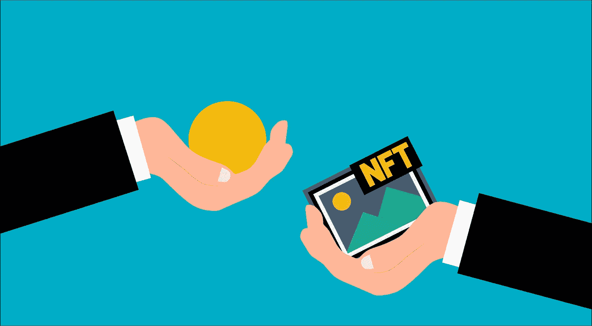

# 解决 NFT 房屋租赁中的超额抵押问题

> 原文：<https://medium.com/coinmonks/solving-over-collateralisation-in-nft-rentals-bf5c97108ab1?source=collection_archive---------58----------------------->

*本文是数字收藏品，购买本文在*[*token blogs*](https://tokenblogs.app/listing/buynow/983218045)*上的出版权。*

# 如何解决非住宅物业租金超额抵押的问题

NFT 租赁是数字资产领域令人兴奋的创新产品。它允许代币持有者从他们原本陈旧的资产中获得回报，借款者可以获得代币的效用，而不必直接购买。

然而，当创建租赁列表时，贷方通常会要求押金作为交易的一部分，以便他们同意将其借出，这是可以理解的。

但由于 NFT 可能会被借款人窃取，这通常会导致所需的抵押品超过资产价值的 150%。对于租房者来说，这可能会令人不快，因为如果他们将这笔钱放在智能合同中，他们“还不如买下它”。

# 那么如何才能解决呢？

可以说，如果你打算归还 NFT，只是暂时支付资产价值会有什么问题？

# 借款人

让我们从借款人开始，我们如何让借款人对支付超额抵押存款感到更放心？

# 插入 DeFi

如果借款人的存款可以插入 DeFi lending pool 的 API 中，他们的存款就可以获得利息。这也给他们的抵押品的位置更大的信心，特别是如果使用流行的贷款协议。

租赁平台还可以向借款人提供更多奖励，可能与 DeFi 平台提供的 APY 相当或更多。

这种做法的额外好处还可能刺激更长的租赁期，就好像它有收益一样——借款人会被诱惑借更长时间，从而增加平台的费用。

# 使用现有的 DeFi 头寸作为抵押品

这个想法对于在 DeFi 协议中拥有现有附属或 LP 令牌的用户来说非常好。假设你在 ALGO 的一个 DeFi 平台上借出了 5000 美元，你可以将他们的 API 连接到租赁平台，基本上允许借款人在租赁应用程序中自由支配，永远不必*支付*押金来借用数字资产；就像他们不归还 NFT 一样——所需的保证金可以从 DeFi 平台中提取。

通过这种方式，从心理上来说，借款人永远不必“部分”或“发送”任何额外的资金给智能合同，他们可以使用现有的抵押品作为备份。

如果实现了这一点，租赁平台上的界面可以只显示每天的租金，这为用户提供了无缝借书的良好体验。

# 对贷方来说

什么会让贷方降低存款？

# 使用市场价值来确定适当的抵押品级别:

为了避免过度抵押，借款人和贷款人可以商定一个抵押比率，该比率基于用作抵押品的非金融债券的当前市值。这有助于确保抵押品的价值与贷款的价值成比例。

# 设定最高抵押率

另一种方法是设定一个不能超过的最高抵押比率。例如，贷方可能同意接受最高 100%的抵押，这意味着用作抵押品的非金融资产的价值不能超过贷款的价值。

# 信任分数

为每个借款人设定一个指标*“成功的 NFT 回报数量”*，如果你将这个指标与*“支付的存款规模”*结合起来，你就能很好地理解平台中谁是可信的借款人。因此，如果贷款人想借出高价物品，他们可以这样做，只有值得信赖的借款人可以租用。

这可能会刺激贷款机构降低存款利率。

# 平台支付部分押金。

基于以上所述，如果借款人被认为是值得信赖的，那么该平台可能会为借款人支付 25%的存款价格。因此，这鼓励了借款人不必为租赁而“放弃”如此大的押金，并给予了可信用户更多的访问权。

# Chrome 扩展

这是一个有趣的想法，但本质上你可以有一个数据库记录所有被租赁和被盗的 NFT，如果它们再次出现在任何 NFT 市场上出售，会弹出一个控制台. log 警报，通知登录页面查看者这是一个被盗/租赁的项目。这可能会让购买者望而却步，让偷窃 NFT 的生意无法转售…只是一个想法。

# 保险

我们能为 NFT 租赁合同投保吗？

如果物品被盗，贷方可以投保赔付。

该平台的智能合同审计将需要由保险平台验证，以评估保费价格。

然而，如果你没有要求存款，而是依靠保险来支付——可以说保费很高，因为 NFT 是*要求*被盗…

但显而易见的问题是:欺诈能被发现吗？

只是一个想法，但将来会评估…

# 结论

解决超额抵押是一个富有挑战性的话题，让我非常兴奋，并愿意讨论。

我们已经在 Algorand out 上完成了第一个 NFT 租赁平台，现在叫做 [Tokenrent](https://www.tokenrent.app/)

用户可以通过效用过滤，我们将展示案例研究，说明为什么有人会通过收集和荣誉创作者版税来租用 NFT。

**

*本文是数字收藏品，在*[*token blogs*](https://tokenblogs.app/listing/buynow/983218045)*上购买本文的出版权。*

> 交易新手？在[最佳密码交易所](/coinmonks/crypto-exchange-dd2f9d6f3769)上尝试[密码交易机器人](/coinmonks/crypto-trading-bot-c2ffce8acb2a)或[复制交易](/coinmonks/top-10-crypto-copy-trading-platforms-for-beginners-d0c37c7d698c)