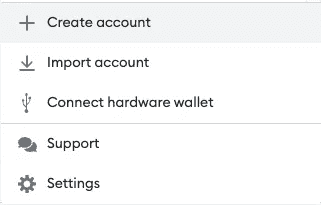
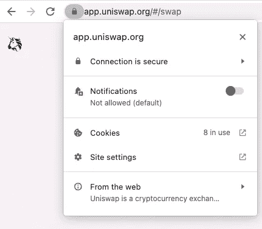

# 在 Web3 之旅中保证自身安全的一些最佳实践

> 原文：<https://medium.com/coinmonks/some-best-practices-to-keep-yourself-safe-r-on-your-web3-journey-9f30bc333c77?source=collection_archive---------23----------------------->

尽管我们现在处于熊市，但这可能是探索、学习和建设的最佳时机。大量炒作已经消失，大量垃圾协议和硬币已经被更大的市场力量和资本逃离风险更高的风险企业过滤掉。

考虑到在一个不那么狂热的环境中探索 web3 的空间，你仍然应该警惕无处不在的骗子。即使现在可能没什么可失去的了，你所建立的习惯对保护你在牛市和以后的周期中是至关重要的。

## **使用一次性钱包**

所以你可能知道你有一个种子短语，你应该保持安全，这个种子短语允许你访问你的钱包。事实上，它允许您访问无限的钱包，因为现代钱包提供商使用的 [**BIP-39 算法**](https://github.com/bitcoin/bips/blob/master/bip-0039.mediawiki) 允许确定性地生成额外的私有/公共密钥对供您使用。

换句话说，您可以在 MetaMask(或您使用的任何钱包提供程序)中轻松创建一个新的钱包地址，该地址不同于您正在使用的主钱包，并具有独立的私钥/公钥。然后，当您与任何您不确定的 dapp(智能联系人或支持 web3 的网站)交互时，您可以切换到您的一次性钱包。

Option to create a new wallet address in MetaMask.

跟踪你的各种钱包(尤其是如果你在多个链上使用相同的公钥)，这是一个好主意(也是为了一般的记录保存)，但是**绝对不要在任何地方在线存储你的私钥**。Ledger 在这里 很好地概述了存储你的私钥 [**的不同方式。也就是说，把你的公钥(钱包地址)放在一个方便的地方是很好的，因为这不会授权访问你的钱包，并且更容易跟踪烧录者。**](https://www.ledger.com/academy/crypto/the-best-way-to-store-your-private-keys-hardware-wallets)

## **仅点击官方链接**

确保你实际上正在与你打算与之互动的网站/合同互动！这似乎是常识，但骗子变得越来越聪明，已经有整个 DeFi 协议或 NFT 网站克隆的目的是误导用户。

Discord 服务器通常有官方链接作为专用频道(如果没有，他们可能不知道自己在做什么……)。使用它，或者使用官方 Twitter 上的链接。

尽管如此，还是要小心检查 URL 是否符合您的预期，以及网站是否使用了标准的安全措施，如 SSL 证书。

Uniswap’s correct domain and proof of its SSL usage.

可惜以上都是可以恶搞的！推特被黑了，不和谐也是。因此，请确保将它与其他安全最佳实践结合使用。

## **不要点击电子邮件中的任何内容**

一般来说，电子邮件是非常常见的诈骗媒介，甚至在 web3 之外也是如此。不要点击不可信邮件中的链接。即使您信任发件人，也要尝试找到另一种方法来访问它所链接的任何内容。例如，如果你有一封你出售的 NFT 的电子邮件，**在你的浏览器中直接进入市场，而不是点击链接，并验证销售**。

## **使用硬件钱包**

我用了一段时间 [**账本硬件钱包**](https://shop.ledger.com/?r=bbe944d85719) 了，我是个粉丝。它与 MetaMask(我的软件钱包提供商)互动良好，所以我几乎可以与任何 dapp 互动。它也适用于我使用的所有链条，尤其是当我深入 L2 联邦理工学院的世界时。

在解释为什么硬件钱包是必要的方面，莱杰比我做得更好，但简而言之，你的私钥存储在一个单独的硬件设备中，而不是在你的计算机上(黑客可能会在那里访问你的热钱包)。

硬件钱包可能会有一个额外的步骤，即必须在钱包本身上接受交易，但这种轻微的额外摩擦实际上可能是一种好处，因为它会让你停下来想想你在做什么(这有时会造成很大的不同)。快速移动可能是一个问题，可能会导致您与诈骗合同进行交互。

## **有疑问时，置身事外**

如果有任何可疑之处，就帮你自己一个忙，退后一点。如果这是一个新的协议，你可以等待一段时间，让社区中的早期采用者来验证它。明天它就会出现，如果没有，那么还好你没有使用它！

一般来说，耐心在投资中是非常重要的技能，尤其是在加密领域。事情发展得如此之快，以至于 FOMO 在常规的基础上变得非常真实和强大。你可以等一会儿。

## **结论**

上述建议主要归结为:

*   知道你在和什么 dapp 互动。
*   知道你在做什么交易。
*   当你不确定以上几点时，隔离自己。

只要你记住这些规则，你就会变得更好(但永远不会完美！)斑。安全是减少风险载体的问题，从长远来看，结合最佳实践将使您更加安全。

也就是说，crypto 和 web3 是有风险的，所以上面没有任何投资建议，只是让用户比以前更安全(r)的一般指导。

**还有其他的小技巧或窍门吗？欢迎评论或发送给我！**

## **词汇表**

我想为我使用的术语添加一个简短的词汇表，以帮助新用户。Web3 不需要隐藏在这么多术语和首字母缩略词之后，所以让我们在这里把它变得简单一点。

**L2**

*   在这种情况下，指以太坊上的第二层上卷(如乐观主义、Arbitrum、zkSync)，更多见 [**此处**](https://ethereum.org/en/layer-2/) 。

**硬件钱包**

*   也被称为冷钱包。莱杰和特雷佐就是例子。将您的密钥加密保存在单独的设备上，您可以通过该设备进行身份验证，以便进行交易并与 dapp 进行交互。在热钱包上使用更高级，但更安全。

**软件钱包**

*   也被称为热钱包。元掩码、信任钱包和比特币基地钱包就是例子。可以在浏览器、独立的桌面应用程序或移动应用程序中。将您的私钥保存在应用程序中，因此存在黑客能够访问它的风险。然而，可以更容易使用。也可以是硬件钱包的前端。

**Dapp**

*   去中心化 app。换句话说，这是一个智能合约或支持 web3 的网站，你可以使用你的钱包与之互动。

**SSL**

*   安全套接字层。这不是一个 web3 术语，而是支撑 HTTPS 的网络安全的一个普通部分。更多信息 [**此处**](https://www.cloudflare.com/learning/ssl/what-is-ssl/) 。

*我只推荐我自己会用的产品，这里表达的所有观点都是我自己的。这个帖子可能包含附属链接，在不增加你的费用的情况下，我可能会赚取一小笔佣金。*

> 交易新手？试试[加密交易机器人](/coinmonks/crypto-trading-bot-c2ffce8acb2a)或者[复制交易](/coinmonks/top-10-crypto-copy-trading-platforms-for-beginners-d0c37c7d698c)