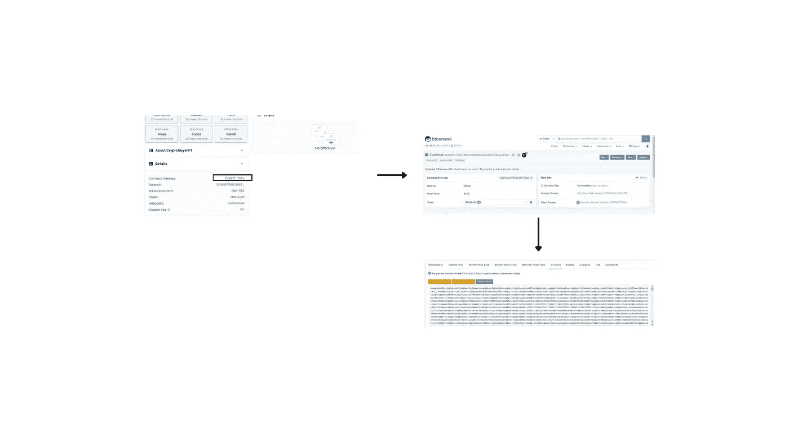
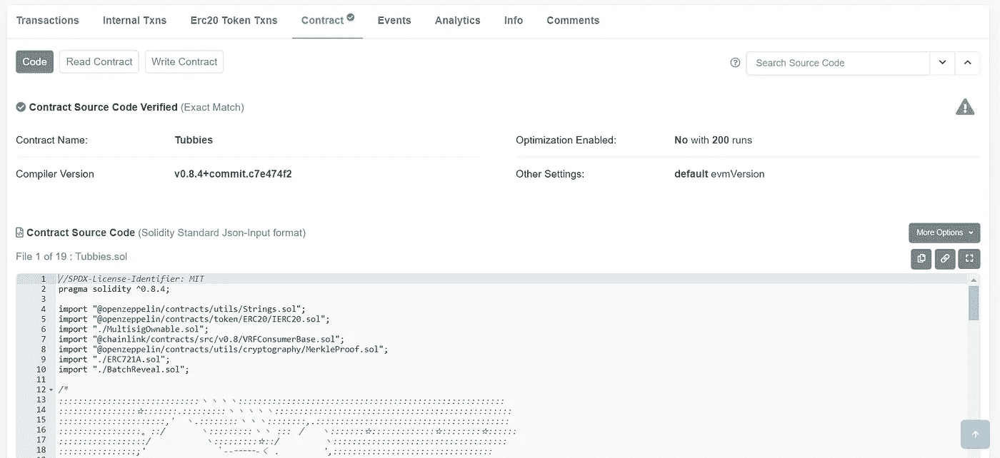
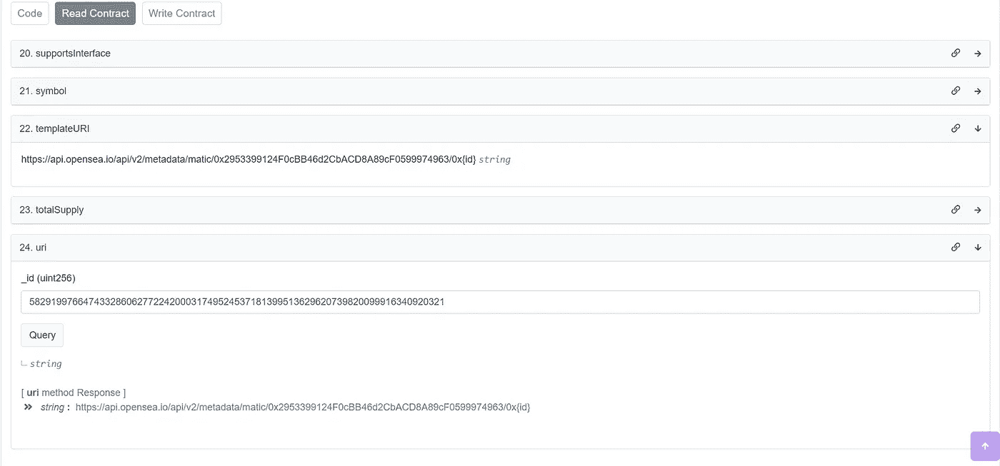
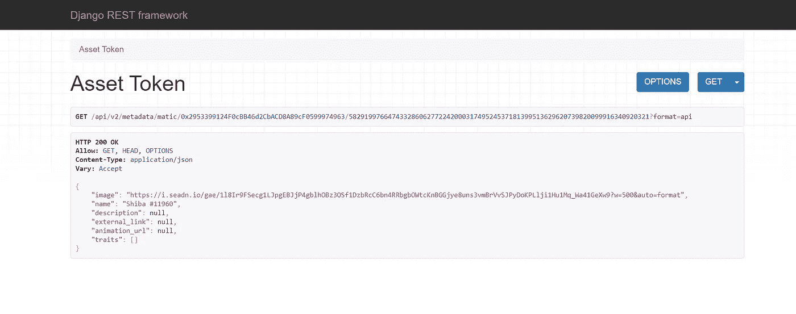

# 有些 NFT 可能比你想象的更集中！！

> 原文：<https://medium.com/coinmonks/some-nfts-might-be-more-centralized-than-you-think-a957e871141c?source=collection_archive---------34----------------------->

所有的 NFT 都是他们宣称的那样吗？如何看过去 NFT 的美丽照片

在 2021 年的加密热潮中，不可替代令牌(简称 NFT)成了热门话题。在此期间，大量的 NFT 收藏品进入流通领域，许多投资者/交易者也参与了 NFT 的买卖。像世界上的任何其他事物一样，由于非正规金融工具获得了巨大的声望，假非正规金融工具(非正规金融工具不符合标准)进入了流通领域。这些 NFT 可能看起来像普通的 NFT，但如果你能透过美丽的图像看过去，你会发现它们是一个骗局。无论你是投资者、交易者还是 web3 领域的狂热爱好者，知道什么是真实的，什么不是真实的，这一点非常重要。

你可能会问，我在上面提到的“标准”是什么？这很简单。每个 NFT 都必须遵守 web3 的基本原则。换句话说，非职能部门必须真正去中心化。它们不应该依赖于创建它的平台、所有者或其他任何东西。即使创建 NFTs 的平台被破坏，即使用来创建它的地址不再存在，或者任何其他原因，NFTs 也应该存在。但是市场上流通的所有 NFT 都遵守 web3 的这些基本原则吗？答案是“没有”。这些“假”NFT 甚至可以在像 Opensea 这样的著名市场上看到出售。

Photo by [fabio](https://unsplash.com/@fabioha?utm_source=unsplash&utm_medium=referral&utm_content=creditCopyText) on [Unsplash](https://unsplash.com/s/photos/decentralized?utm_source=unsplash&utm_medium=referral&utm_content=creditCopyText)

在这篇文章中，我将解释如何看穿一个 NFT 的“漂亮图片”，这样你就可以验证你试图购买的 NFT 是真正去中心化的。为此，我将使用 Opensea marketplace 上列出的一些 NFT 作为参考和示例。

这些是关于非功能性测试的一些“危险信号”,当你通过非功能性测试时，你应该小心。

## 1.如果智能协定的源代码被隐藏。

在购买 NFT 之前，重要的是要知道这个 NFT 代表什么项目。作为一名投资者，阅读 NFT 的精明契约，也能让你更好地了解这一系列作品的创作者的愿景。

但如果智能合约的源代码被隐藏起来，不能公开获取，作为投资者，这可能是一个巨大的危险信号。这不仅意味着你将无法对这个 NFT 项目有一个整体的了解，而且有可能存在安全漏洞，并且创建者故意隐藏了智能合约的源代码。有时，创作者可能已经为他编写了代码，以便能够在 NFT 被出售后将所有 NFT 检索回他的钱包。谁知道呢！！。

在 Opensea 上，您可以很容易地看到如下合同代码:

首先进入你的 NFT，点击“细节”标签，如第一张图片所示。点击合同地址，您将进入 Etherscan 上该合同的相关页面。(如图 2 所示)。向下滚动并单击“合同”选项卡。如果您的输出看起来像图片中的一样(一些十六进制值)，我们确实有一个问题。这意味着创建者没有用 Etherscan 验证智能合约，也没有公开合约。如果集合的创建者已经验证并公开了合同，这将是您在 Etherscan 上看到的内容，

绿色勾号将确保用于铸造 NFT 的智能合同已经过验证。你甚至可以通读代码，看看有没有任何安全漏洞。像这样的 NFT 是真正去中心化的 NFT。

## 2.元数据托管在私有服务器上

元数据是 NFT 非常重要的一部分。元数据描述了 NFT 及其特殊功能。它增加了额外的价值。如果没有图像、名字或其他细节，NFT 将一文不值。

我在浏览 Opensea 上列出的 NFTs 时发现了一个令人不安的事实，即很多 NFTs 元数据都存储在集中式服务器中。如果这些服务器真的停止服务，NFTs 将失去所有价值。从 NFTs 的角度来看，这是一个单点故障，应该始终避免。

这就是如何检查您的 NFTs 元数据是否托管在中央服务器上。

对于这个例子，我选择了多边形上的 NFT。在 Polygonscan 上，我输入了 NFT 的合同地址，并向下滚动到“合同”会话，就像我在 Etherscan 上对上一个示例所做的那样。

在“阅读合同”选项卡下进行搜索，您可以在其中查询给定令牌 ID 的元数据 URI。如上所示，您将收到元数据 URI。导航到上面的 URI，你会看到类似这样的东西，

如你所见，这是一个由 Opensea 托管的集中式服务器。如果 Opensea 不存在了，它也将关闭这个服务器上的所有 NFT。这不是我们所知道的网络 3。我看不出这种非功能性测试使用区块链技术的意义。实际上，这些不能被称为非功能性测试。它们实际上是 web2 世界中的图像。如果你要买这些非功能性食物，你很有可能会失去你的钱。

当你浏览像 Opensea 这样的 NFT 市场时，你会惊讶地发现有这么多的 NFT，甚至不符合被命名为 NFT 的基本要求。但是如果你知道你的 NFTs，并且知道如何出牌，你就可以成为 NFT 生态系统的主人。

虽然有许多像上面这样的离群值，但是有许多纯粹分散的 NFT 项目。我们只是在购买 NFT 时要小心。这些真正去中心化的 NFT 确实具有巨大的价值和潜力。你只需要学会超越 NFT 的美丽形象，因为不是所有美丽的石头都是宝石！！！

> 交易新手？试试[加密交易机器人](/coinmonks/crypto-trading-bot-c2ffce8acb2a)或者[复制交易](/coinmonks/top-10-crypto-copy-trading-platforms-for-beginners-d0c37c7d698c)