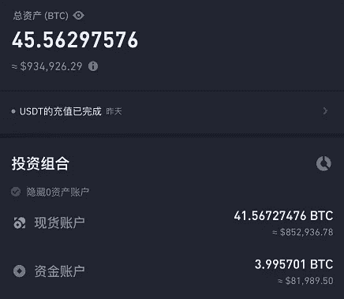
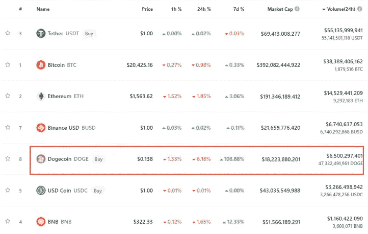
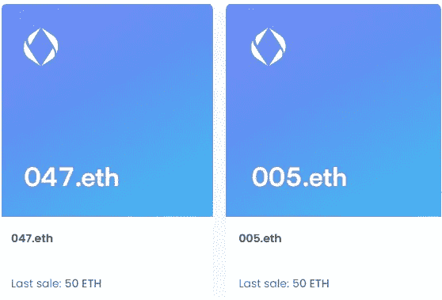
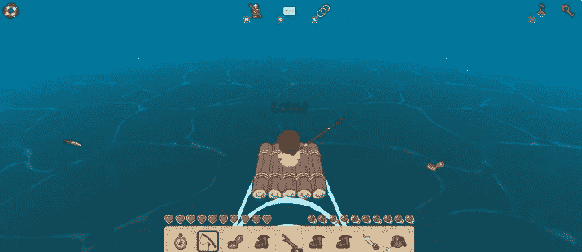
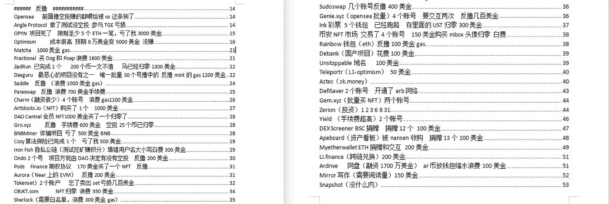
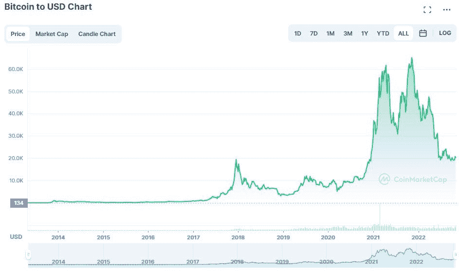

# 有些人玩游戏输掉了 4000 多万美元的合同，有些人玩 web3 游戏一天赚 10 美元

> 原文：<https://medium.com/coinmonks/some-people-lose-more-than-40-million-playing-contracts-and-some-people-play-web3-games-and-earn-c5aab80e73b1?source=collection_archive---------3----------------------->

看到有玩家在群里分享自己的账号，很羡慕。总资产约 45BTC，超过 93 万美元，非常惊人。

这个朋友说他从一万开始积累，多开了 20 倍的面膜合约，拿了 2 个月，真的很厉害。

面膜不知道这段时间吃什么好。一个月内涨了 4 倍，今天涨幅高达 76%。

市场真的是轮动的，没有归零的项目，才有机会唱主角。

当然合同的风险也是巨大的，也是另一个群友。打了半年合同，亏了 4000 多万，亏的挺快。

A player’s asset over $930,000

去年 1 月还没出圈的 DOGE 价格还在 0.01 上下波动。后来马斯克喊单，一路涨到 0.7，涨了 70 多倍。当然很多新玩家是 0.5 进入游戏的，现在只能在山顶站岗。

doge 的价格这两天涨了 2.6 倍，最高达到了 0.17。距离去年高点还有 4 倍以上的空间。不知道它会不会跟着马斯克登月，未来未知。

从共识的角度来看，DOGE 现在排名第 8，市值超过 200 亿美元，24 小时交易量超过 65 亿美元。

DOGE 24-hour volume of $6.5 billion

虽然目前熊市，还是有很多人抓住了机会。楚小莲从身边的朋友那里总结了几种不同的玩法，他们正在以这种方式参与加密市场。

某人正在做一个项目。

Web3 是未来的趋势。在区块链技术的背景下，更多的 web2 项目有可能升级到 web3。

有些人做了一些轨道，web3 域名。如果他们需要与链上的某人进行交互，他们不需要记住长而不规则的钱包地址，他们可以直接通过 web3 域名。

最流行的 ENS 域名，用户注册。eth 域名绑定 ETH 钱包地址，方便操作。首批注册使用的用户也获得了 ENS 空投。

还有各种域名，比如。bnb，。索尔还有。nft，已全部开放报名。

当然，要做项目，需要强大的技术团队，强大的资金背景，强大的运营实力，以及大环境的支持。

3-digit .eth domain name with 50ETH traded

**有人在玩游戏。**

也有人专注于 web3 游戏，一边玩游戏一边赚钱。

去年 CryptoMines 和 Farmes world 爆炸暴跌后，很多人都远离了 Gamefi。有很多人在游戏中获得了巨额利润，也有很多人遭受了巨额损失。

但游戏作为参与 web3 的重要方式，也有巨大的市场需求，极有可能出圈。谁知道下一个 axie infinity 会是哪个项目？

熊市项目都是猥琐的发展中的，没有大张旗鼓的推广，但是哪个游戏真正有粘性，用户收入能够持续，游戏就可能逐渐走出圈子。

如果对游戏感兴趣，可以找一些 web3 游戏深度参与。最好是免费开始玩，或者少量投入。如果真的爆炸，也和空投一样。

比如这个最近的内测漂流者，很多人都在分享，目前是免费参与，没有收入。不知道上线后内测会不会有空投，或者其他福利。

但是漂流者，陆地，木筏的 NFT 已经上线很久了，楼面价分别是 2.8 和 19ETH。

web3 game castaways

有人在互动。

也有人专注空投，做大量交互测试，期待后期空投。前提是你能接受延迟满足，前期投入大量时间和油费，默默工作，总会有回报的。

比如下面这位朋友，真的很勤奋，做了那么多项目，还认真做笔记。当然，现在还不清楚有什么好处，但是如果真的发空投，那就是大赢家了。

A player’s interactive notes

**有人在做固定投票。**

也有主流人士定期投资 BTC 和 ETH。

他们相信循环往复，有信仰。他们不住项目，不埋伏空投，不打游戏。他们根据自身条件，每周、每月投资，制定操作策略，扎扎实实操作。等待下一轮牛市的收官

Bitcoin Cycle Curve

当然，还是有人打合同，打狗，或者各种方式。没有绝对的玩法，但最重要的是去做，投入了就有机会。

熊市不妨找个方向深度参与，或者不看好未来，离场也没错。

以上只是我个人观点，没有投资建议。我是楚小莲，我正在关注元宇宙和 web3。

> 交易新手？试试[密码交易机器人](/coinmonks/crypto-trading-bot-c2ffce8acb2a)或[复制交易](/coinmonks/top-10-crypto-copy-trading-platforms-for-beginners-d0c37c7d698c)