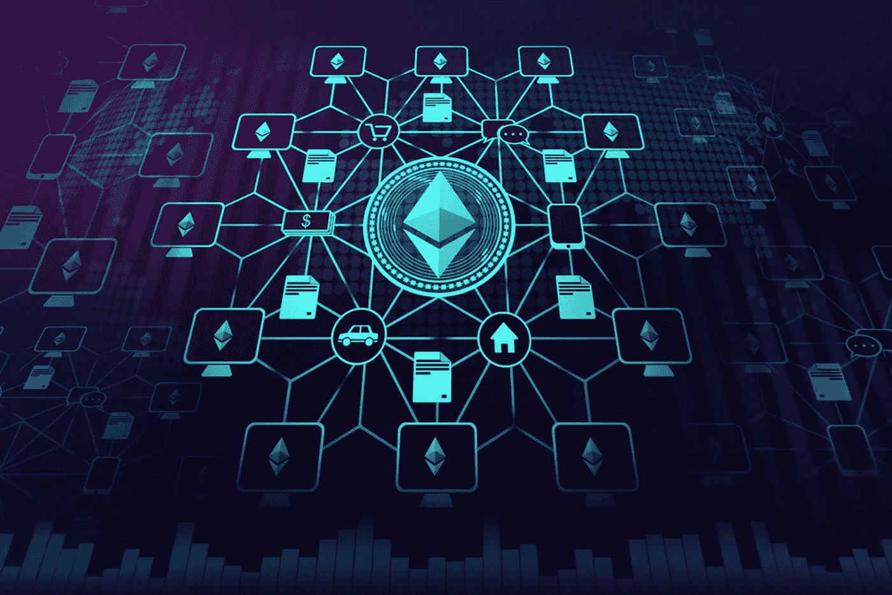

# 关于分权财政的几点思考

> 原文：<https://medium.com/coinmonks/some-thoughts-on-decentralized-finance-211ce1c4b549?source=collection_archive---------13----------------------->

*作者:* [*保罗·迪斯蒂法诺*](/@p.distefano)*—2022 年 12 月 1 日*

Picture Credits: NewsBTC.com

> **“金融和法律领域人才过剩。[..]我们应该让更少的人从事法律，更少的人从事金融，更多的人从事制造。”***——埃隆·马斯克，2020*

基于 Elon Musk 的这段话，我想详细说明为什么我认为分散金融(DeFi)有可能在未来几年颠覆金融业。

D eFi 是一种基于分布式分类账的新兴金融技术，旨在通过复制金融中介以完全分散的方式提供的服务来消除对金融中介的需求( [Sharma，2022](https://www.investopedia.com/decentralized-finance-defi-5113835) )。以太坊网络等分散生态系统的智能合约功能为 DeFi 应用提供了基础，这些应用本质上是运行在区块链上的计算机程序，网络用户可以与它们进行交互。

除了简单的存钱，大多数人需要金融机构提供的主要服务通常是:使用支付系统、投资服务和贷款。

随着 2008 年比特币的推出，第一个无需中央机构、不受国界限制的数字点对点交易支付系统诞生了( [Nakamoto，2008](https://www.bitcoin.com/bitcoin.pdf) )。

DeFi 还允许所谓的*资产令牌化*，通过这种方式创建令牌来虚拟地代表真实世界的资产，从而利用交易效率和公共区块链的审查阻力。例如参见 [Aktionariat](http://www.aktionariat.com) 。

分散式交易所(dex)如 [Uniswap](http://www.uniswap.org) 促进了此类代币的交易，并允许用户提供流动性，从而参与*自动做市* (AMM)过程，在拥有代币时赚取收益。

最后，像 [Liquity](http://www.liquity.org) 这样的 DeFi 应用程序甚至允许用户通过锁定合格的抵押品直接在区块链上获得贷款，这使他们能够铸造(=创造)可兑换为法定货币的协议本地稳定货币。

虽然我不认为这种 DeFi 应用程序有能力使传统的金融中介完全变得多余，但我相信它们可以以更有效和更方便的方式提供一些服务。为了挑选一个我认为特别强大的 DeFi 应用程序，我想详细说明 dex 相对于传统集中式交易所(CEXs)的潜在优势。

dex 不是基于订单簿匹配买卖订单，而是基于预先注资的资产池(所谓的流动性池)。对于每个可用的交易对，有两个流动性池，每个池包含一种资产。常数乘积公式确定两项资产之间的相对价格，这样两个资产池中的总金额总是相同的。

想要参与交易的用户可以将他们想要出售的资产存放在一个池中，并且作为交换，接收他们想要从另一个池中购买的相应数量的资产。由于一些新资产被添加到一个池中，而一些新资产从另一个池中被扣除，所以两个资产之间的相对价格将更新，使得常数乘积公式再次得到满足( [Uniswap，n.d.](https://docs.uniswap.org/concepts/uniswap-protocol) )。

根据[Barbon&Ranaldo(2022)](https://papers.ssrn.com/sol3/papers.cfm?abstract_id=3984897)的研究结果，就价格效率而言，dex 仅略次于 CEXs，而就交易成本和流动性而言，它们的运营质量已经相当。因此，dex 几乎已经赶上了 cex，尽管它们从 2018 年末才开始存在( [Adams，2019](https://uniswap.org/blog/uniswap-history) )。但是，尽管就必要的人员和基础设施而言，管理和维护 cex 的成本相当高(例如，见 [SIX Group，2022](https://www.six-group.com/dam/download/company/report/annual/2021/six-fy-2021-media- presentation.pdf) )，但 dex 以完全分散和完全自动化的方式运行。

因此，如果现有的传统金融产品交易所找到了利用这种新技术的方法，比如通过资产令牌化，我可以想象这将有巨大的效率提升潜力。此外，它还将使用户能够直接与交易所本身进行交互，即不需要可信的经纪人和托管人，从而进一步减少金融业内必要的人力和基础设施的数量。

除了上面提到的效率提升，不需要银行或经纪人也会让投资变得更加容易。截至 2022 年 7 月，全球有 14 亿人完全没有银行账户([世界银行集团，2022](https://www.worldbank.org/en/news/feature/2022/07/21/covid-19-boosted-the-adoption-of-digital-financial-services) )。这些人要么生活在金融基础设施不发达的国家，要么根本无法克服在金融机构开立账户的障碍。对他们来说，这种指数将是获得投资服务的第一个机会。

然而，对于 dex 等 DeFi 应用，也有一些注意事项。首先，用户完全自主交易的可能性转化为他们更多的责任，因为没有人能够撤销错误的交易。其次，金融机构通常还会指导客户做出正确的投资决策，因此，金融机构的缺席也会让未受过教育的用户更难做出明智的投资。最后，金融监管将不得不经历巨大变革。有关市场行为、KYC 和反洗钱的法律将不得不完全重新考虑，因此，金融当局将会害怕改变现状。

总之，我相信像 dex 这样的 DeFi 应用程序有可能在金融行业内大幅提高效率——这样更多有才华的人就可以专注于真正的*“制造东西”*，正如 Elon 所说。我还认为，DeFi 应用程序的免许可性质有能力使金融服务更容易获得，从而大大减少世界各地没有银行账户的人数。本质上，这意味着比现在更少的人可以满足比以往更多人的金融需求。然而，通过 DeFi 消除金融中介也在用户责任&教育方面提出了挑战，监管将不得不经历实质性的转变。

**参考文献**

[h .亚当斯(2019 年 2 月 11 日)。Uniswap 的简史。Uniswap 协议。](https://uniswap.org/blog/uniswap-history)

[巴尔邦、安德里亚和拉纳尔多、安杰洛。(2022 年 10 月 3 日)。*关于加密货币市场的质量:集中式与分散式交易所。*圣加仑大学](https://papers.ssrn.com/sol3/papers.cfm?abstract_id=3984897)

中本聪(2008 年 10 月 31 日)。*比特币:一种点对点的电子现金系统*。

强大的。(2020 年 5 月 7 日)。乔·罗根经历# 1470——埃隆·马斯克。YouTube。

[夏尔马河(2022 年 9 月 22 日)。*什么是分散财务(DEFI ),它是如何工作的？投资媒体。*](https://www.investopedia.com/decentralized-finance-defi-5113835)

[六组。(2022).*六 2021 财年财报*。](https://www.six-group.com/dam/download/company/report/annual/2021/six-fy-2021-media- presentation.pdf)

Uniswap。UNISWAP 协议。

世界银行集团。(2022 年 7 月 21 日)。 *Global Findex database 2021 报告了新冠肺炎疫情* *期间全球金融包容性的增长。*

> 交易新手？尝试[加密交易机器人](/coinmonks/crypto-trading-bot-c2ffce8acb2a)或[复制交易](/coinmonks/top-10-crypto-copy-trading-platforms-for-beginners-d0c37c7d698c)