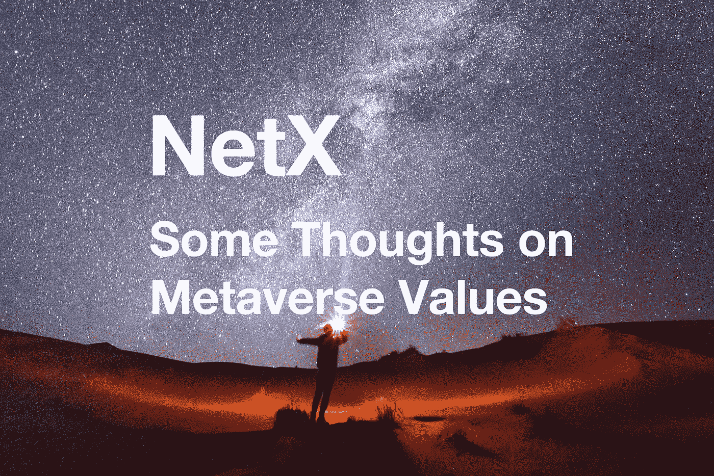

# 关于元宇宙价值观的几点思考

> 原文：<https://medium.com/coinmonks/some-thoughts-on-metaverse-values-cd08a52f4e43?source=collection_archive---------16----------------------->

乙烷系列的第三部分

TL；速度三角形定位法(dead reckoning)

*   元宇宙将成为 NetX 最激动人心的组成部分。
*   元宇宙的包容性上限决定了其增长的下限。
*   元宇宙随着竞争淘汰不适合的人而发展。

元宇宙被寄予了巨大的希望，它被认为是通向互联网未来的几条道路之一。它的流行伴随着高用户期望和粘度。也就是说，交互模式正是我们想要开发的。

一个 NetX 有机体只有在建立了一个从开发人员到用户的完善的组织结构之后才能完成它自己。元宇宙是将集成有机体内部的应用程序引导到用户的隧道。其强大的包容性使其与其他部分密切相关。

NetX 设想了一个元宇宙，里面居住着各种规模的应用，大型社交平台，以及国内成果的展示平台。这个虚拟化的空间将发展成为生物体进化不可或缺的一部分。有见地的想法最终会使这个地方充满深情的喧嚣。

# **元宇宙应该是包容的**

在之前的文章中，我们已经给出了很好的例子，说明为什么现有的元宇宙受到其门槛的限制，以及公司和组织如何难以打入当前的去中心化世界。答案在于权利的归属和分配。

元宇宙将用权力下放的技术来解除这一负担。即使是集中的工作也是以分散的形式存在的。每个人都有进入这个世界的权威和权力，无论是个体还是群体，无论有没有中心化的过去。

包容性的上限划定了元宇宙能够达到的最低线。也就是说，我们的理念之一是通过我们的技术实现所有这些集中的人员、应用程序和代码的去中心化。我们特别希望这种情况发生在开发者身上。我们为开发人员描绘了一个实现去中心化的世界，尽管是集中开发，但他们的旧开发实践保持不变，不需要求助于我们的去中心化平台。在此期间，开发人员不必担心去中心化可能给应用程序带来的不稳定性和障碍。

# **存在与消灭**

我们的元宇宙通过我们的分散渠道接受集中式应用程序。与此同时，我们希望有更多的人加入我们的 flock 系统，在这个系统中，应用程序被开发成去中心化的。以任何一种方式开发的项目都将汇聚在我们的元宇宙平台上。

在我们技术的推动下，用户和开发者可以在我们的元宇宙中获得永恒，在那里他们更新和淘汰。用户不必担心一些滥用权力的后端人员错误地修改、暂停或关闭应用程序。用户资产和其他信息将在元宇宙中实现无限存在。这是物理世界和其他基于互联网的群体系统所缺乏的能力。

存在玩弄平等；淘汰也是如此。用户和应用程序通过重复的“新陈代谢”和进化迭代优化内部增长的产品。趋势性的社会互动随着进化的引领而出现。在这里，适者生存更加残酷和公平。

# **没有社会互动，就没有进化**

申请很枯燥；人类令人激动。交织在一起的应用创造了复杂的算法；混合的人类促进生物体进化。这是我们求助于元宇宙的主要原因。

其他 NetX 组件缺乏社交属性。因此，日益增长的社会需求将沿着这些有利的部分流入这个言论自由非常受欢迎的元宇宙。我们的元宇宙紧密地编织在一个绑定所有应用程序的共识机制上。这种机制可以以任何形式存在，令牌，NFT，或其他，只要它带来了生活的共识机制。

最终，一切都是为了进化。一个更紧密的社会关系模式推动着有机体的成长和繁荣。随着用户涌向我们多元化的元宇宙，群体效应形成了一个积极的进化循环。

在接下来的文章中，我们将向读者简要介绍为什么分散化经常与元宇宙的概念一起出现，以及为什么我们过滤了大量集中的项目，只留下分散的项目。我们的能力可能有限。我们需要那些对我们感兴趣的人。来，让我们热烈讨论，集思广益。

# 📚必读

[Ethanim 系列-1](/coinmonks/metaverse-an-open-and-destined-future-b652734fbdf2) | [Ethanim 系列-2](/coinmonks/the-present-metaverse-doesnt-denote-decentralization-51cf038f6651) | [NetX 系列 1.1](/triaslab/rethinking-the-it-industry-d101384e801) | [NetX 系列 1.2](/coinmonks/a-letter-from-satoshi-nakamoto-345a45d012bb) | [NetX 系列 1.3](/coinmonks/out-of-control-the-post-it-evolution-dd64e05ff5bc) | [NetX 系列 2.1](/coinmonks/life-emerges-9ebf26304cd4) | [NetX 系列 2.2](/coinmonks/life-is-out-of-control-9f8e5b7b4b99) | [NetX 系列 2.3](/coinmonks/the-kite-flies-up-and-i-become-the-kite-40678b9dabda) | [NetX 系列 3.1](/coinmonks/the-container-in-the-it-field-21250e3e8b5)|

***NetX，面向可信可靠的智能自治系统的数字生活的链原生互联网(***[***Trias***](https://www.trias.one/)***)***

****|***[***Ethanim***](https://www.ethanim.network/)***|***[***Tusima***](https://www.tusima.network/#/)***| behemotumius | leviam | Divina****

> *交易新手？尝试[加密交易机器人](/coinmonks/crypto-trading-bot-c2ffce8acb2a)或[复制交易](/coinmonks/top-10-crypto-copy-trading-platforms-for-beginners-d0c37c7d698c)*