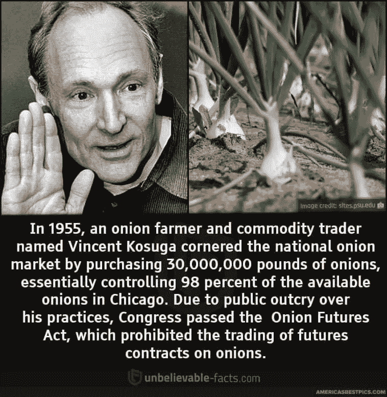

# 有人摧毁了美国的整个洋葱市场，赚了数百万，离开了斯科特，开了一家洋葱餐馆。

> 原文：<https://medium.com/coinmonks/someone-crashed-the-entire-onion-market-in-america-made-millions-walked-away-scott-free-and-d3bb18f23cb8?source=collection_archive---------20----------------------->

We learnt that perfect monopoly can cause catastrophic damage to any economy, even the onion market.

一个用洋葱震撼美国的小个子男人

历史不会重复，但会押韵。

你想学点什么吗，什么都行？

回顾历史，你会惊讶地发现，即使是在现代，这种关联也是如此惊人。

随着比特币、加密货币、科技巨头和初创公司的出现，你会看到各种各样的事情，比如郁金香狂热、经济衰退、联邦政府介入、市场操纵等等。

事实是，这些事情在历史上一直都在发生。

它们只是在不同的时代以不同的形式出现。

你知道吗，美国政府提出了洋葱期货法案，规定交易洋葱期货是非法的。

没错。

在世界上所有的东西中，洋葱。

Crazy, wild, inane but true.

为什么？

这是对 Vincent Kosuga 所作所为的直接回应。

20 世纪 50 年代，一个名叫文森特的洋葱农民，身高只有 5 英尺 4 英寸，决定开始收购美国所有的洋葱。

长话短说，他在 1955 年垄断了整个洋葱市场，但秘密囤积洋葱，从所有其他农民手中收购洋葱，购买洋葱种植的期货合约。

实际上，他和他的朋友们一度完全控制了美国的整个洋葱市场。

这似乎是一个巨大的问题，对不对？

当然，它可能只是洋葱，但当你完全控制了一种每个家庭都容易使用的单一商品的供应时，你就拥有了无可估量的力量。

We can learn so much from what happened to the Onion market in decades ago.

他操纵价格，强迫其他人购买他的洋葱(这在当时是一种无情的垄断)，后来又将所有剩余的洋葱倾销到芝加哥。

“他把仓库里剩下的洋葱用卡车运到芝加哥期货交易所，让洋葱充斥了市场和街道。洋葱，当时一文不值，被扔进了芝加哥河。这一行动摧毁了洋葱农民的同胞，留下了一个毫无价值和易腐的产品。破产和自杀都有报道。小笠原赚了几百万美元。”

聪明的农民还是疯子？

让我想起了灭霸。

历史上充斥着贪婪的人操纵经济和市场的例子。

洋葱和加密货币发生了这种情况，而且还会继续发生。

Bitcoin is a special digital, decentralized currency from the people, for the people, by the people.

金钱流向哪里，贪婪就会跟到哪里。

控制了供应，你就控制了市场。

这就是大多数加密货币的价值所在。

比特币的固定供应量为 2100 万。

无论任何人做什么，代码是固定的，不会再有 BTC 了。

随着时间的推移，它只会越来越稀缺，而有限的供应增加了它的稀有性和价值。

令牌组学很快就变得复杂了，所以我们改天再讨论它吧。

疯狂的是文森特和他的朋友们逃脱了斯科特。

令人震惊的是，他们没有违反任何法律，也没有什么可起诉的。

我不知道这是好事还是坏事。

Ever visited this restaurant before?

文森特继续开了一家名为“T2 快乐洋葱酒店”的餐馆，并在那里做厨师。

是的，我刚刚谷歌了一下,“快乐洋葱”仍然在纽约运行，而且运行良好！

必须尊重文森特的努力。

-

你同意历史会重演吗？

-

#创业#商业#创业#成长#成功#社交媒体#文化#创业#战略#密码# vincentkosuga #洋葱#未来合同# BTC # ETH #供应#贪婪#市场

> 交易新手？试试[加密交易机器人](/coinmonks/crypto-trading-bot-c2ffce8acb2a)或者[复制交易](/coinmonks/top-10-crypto-copy-trading-platforms-for-beginners-d0c37c7d698c)