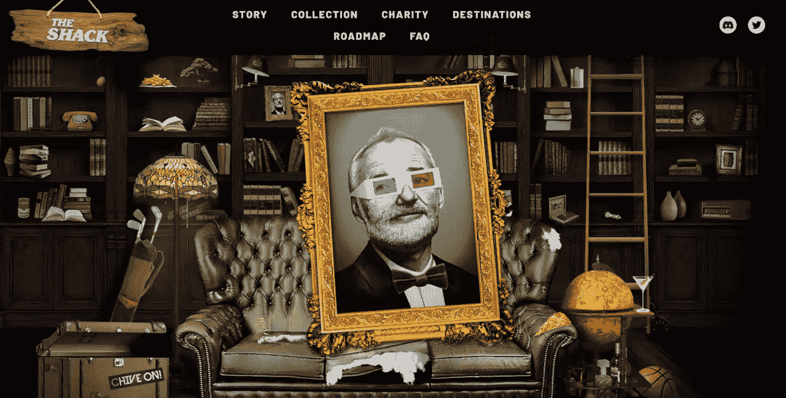
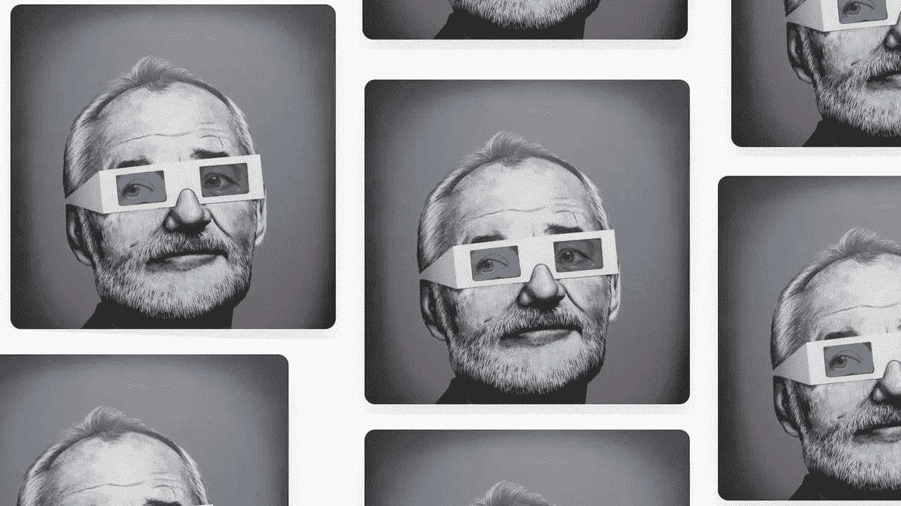
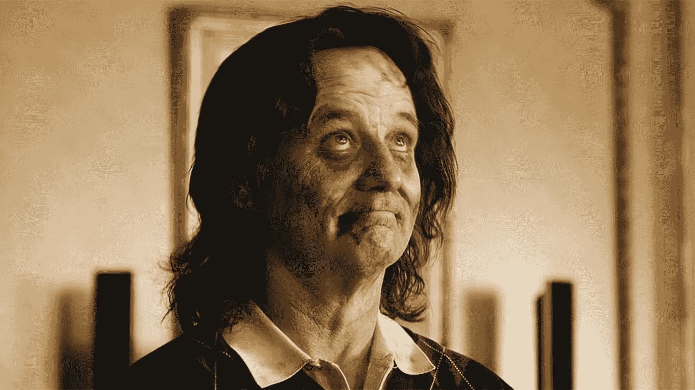

# 有人输掉了一场慈善拍卖，仍然捐了 18.7 万美元。

> 原文：<https://medium.com/coinmonks/someone-lost-a-charity-auction-and-still-donated-187-000-75611084fc32?source=collection_archive---------41----------------------->

Comedian Bill Murray’s Wallet Hacked for $186K Worth of Ethereum After NFT Charity Auction.

不知道你是否听说过比利·穆雷的 NFT 慈善拍卖被黑客盗窃？

但是在结尾有一个巨大的转折。

因此，比利·穆雷现在是某种互联网迷因传奇，他所有的滑稽动作，报价和电影。

不知怎么的，最近几年，他和僵尸有很多联系。

不太清楚为什么。

但他是一个巨大的 NFT 收藏家，个人拥有 CryptoPunks 和 Damien Hirsts。

他最近举办了一场名为“一个伟大的故事”的慈善拍卖，拍卖的是他的 1 合 1 NFT。

他正试图为患有罕见基因疾病和癫痫的三岁女孩伊芙琳筹集资金。

Awesome to see a Hollywood celebrity veteran embracing NFTs for good.

但是，唉，没有人能幸免于加密黑客的魔爪。

如今，加密黑客多如牛毛，但有趣的是，攻击者厚颜无耻地窃取像比尔这样的名人。

更糟的是，从一个健康状况不佳的女婴身上偷东西。

哦，他们灵魂中的人性在哪里？

显然，黑客们设法从他的钱包里偷钱，并把所有 119.2 ETH 的中标金额都榨干了。

如果记录比尔生活和职业生涯的另外 1000 份非功能性文件也被盗，情况可能会更糟。

盗窃发生后，警方立即提交了报告，区块链情报公司 Chainalysis 也被聘请来协助调查

怎么可能追踪并抓住罪犯呢？

让狩猎开始，我敢打赌，如果它足够史诗，网飞将在他们的家门口，希望购买该故事的权利。

Bill Murray has a thing for Zombies.

你知道这整场惨败最值得注意的是什么吗？

他们实际上联系了出价仅次于 119.2 ETH 的第二高的投标人，但最终失败了。

你猜怎么着，她勇敢地捐了 120 瑞士法郎(187，000 美元)给这个小女孩，作为她的医疗费。

她甚至从 119.2 升到了 120。

在这一点上，如果你不认为圣人存在于这个世界上，你最好再想想。

这位用户在购买 NFT 的竞标中失败了，她不仅同意向 Evelyn 捐赠 120 ETH，而且在听到这一情况后几乎立即就这样做了。

谁会这么做？

谁会以如此无私和高尚的方式帮助一个与他们的生活毫无关系的陌生人呢？

告诉我这不会让你笑逐颜开。

也许比尔应该创造另一个 1 合 1 NFT 送给她！

告诉我，你会在拍卖失败后仍然捐出全部金额吗？

-

NFT 是为慈善机构筹集资金的好方法吗？

-

#创业#商业# startupx #成长#成功#社交媒体#文化#创业#战略# eth # btc #加密#慈善#黑客#僵尸# NFT #比尔穆雷#nftmarket

> 交易新手？试试[加密交易机器人](/coinmonks/crypto-trading-bot-c2ffce8acb2a)或者[复制交易](/coinmonks/top-10-crypto-copy-trading-platforms-for-beginners-d0c37c7d698c)