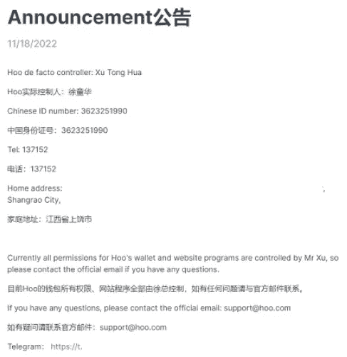
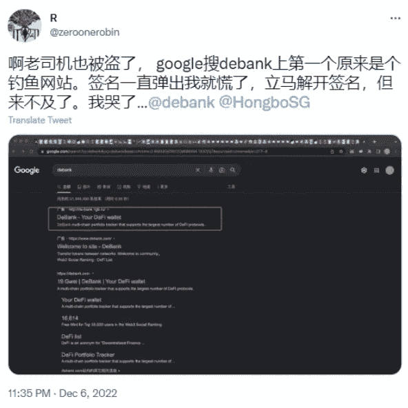
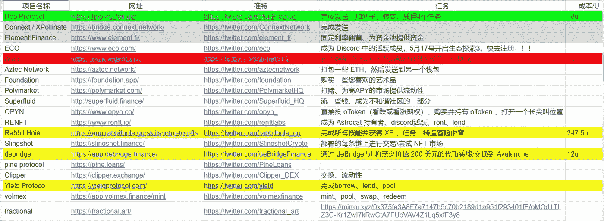
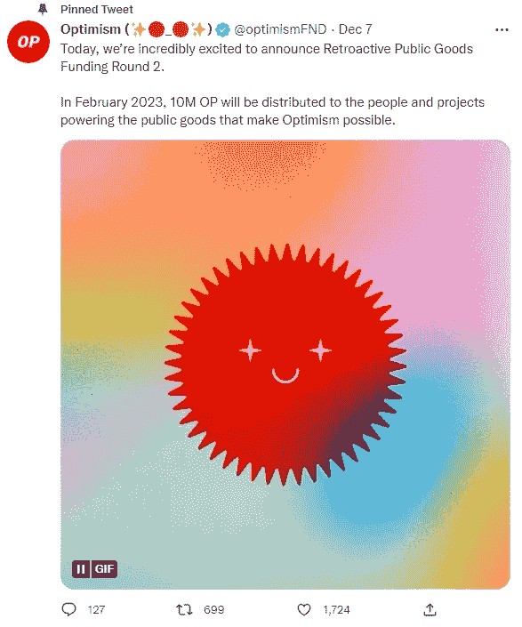
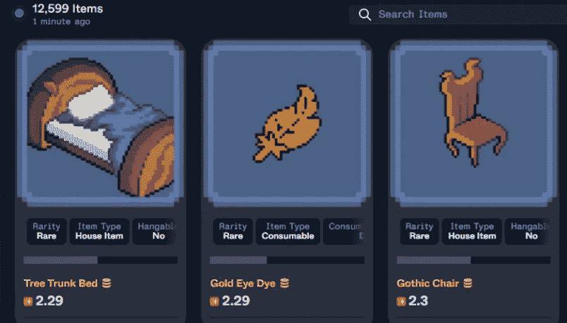
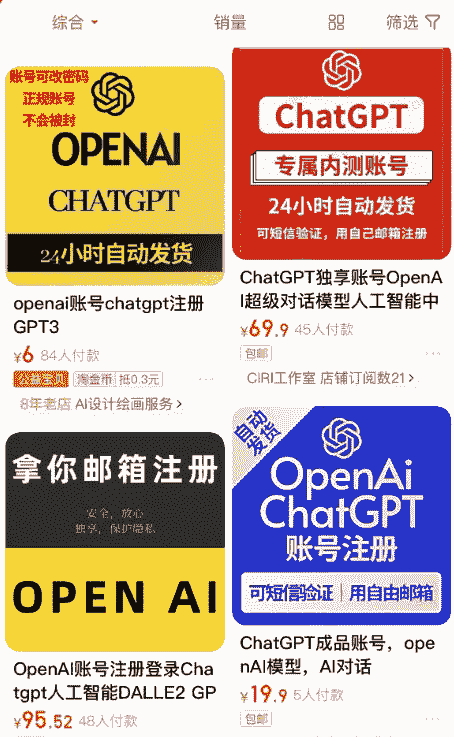

# 有人钱包被偷，有人卖 ChatGPT 体验账号，2 天赚了 8k 美金

> 原文：<https://medium.com/coinmonks/someones-wallet-was-stolen-someone-sold-chatgpt-experience-account-and-earned-8k-dollars-in-2-2c535eb69724?source=collection_archive---------0----------------------->

这两天加密市场都有不同程度的下跌。大起大落是没有原因的。大大小小的事件都可能引起连锁反应。

交易所 HOO 发布公告，网站实际控制人跑路，网站关闭，没有关于用户赔偿的声明。对于平台用户来说，又是一次意外的损失。

熊市期间，很多平台会因为雷雨天气而关闭。例如，世界上最大的交易所 FTX 已经关闭。11 月份，已经有 70 多家大大小小的交易平台关闭。

HOO Platform Announcement

如果你还有资产在小平台，那就尽快转移到大平台，或者放在数字钱包里，以免平台突然跑路，造成不可挽回的损失。

最近 BTC 一直在低位徘徊，现货暂时没有持续亏损，合同球员也没有一天 10 倍盈亏的机会。各种新项目推出免费玩，减缓了赔钱的速度。

楚小莲看了看周围的老玩家，他们都有自己的人脉和玩法。

**1。老玩家也被盗**

其中一个老玩家说，在加密市场，他可以吃可以玩，但是如果被盗，他就归零。作为一名资深玩家，无意中在谷歌上搜索到了 debank。第一个是钓鱼网站。签字后，他的钱包被偷了。

现在到处都是反馈，找 Google 或者 debank 都没办法拿回来。

如果钱包被黑被盗，那就一点机会都没有了。

Old players are also stolen

**2。交互测试不容易**

10 月 APT 空投后，很多人获利丰厚。

这段时间没有空投故事，大部分人也没有继续做交互测试，因为太难太无聊了。

Interactive items organized by a player

无法判断哪些项目有空投机会，很多项目需要气费。手术过程中即使按照教程做也不容易发现。

对于新手来说，需要很强的上进心，安排好时间和精力，循序渐进的操作。

那些坚持不下来的人，最后只有羡慕别人。

比如这次 op 的第二次空投又要开始了，是不是因为你们又没有互动了？

The second OP airdrop

**3。玩 web3 游戏不容易**

在此期间，castways、pixles、beacons 都是可以自由进入的，目前还处于测试的早期阶段。活跃的玩家可以得到 NFT 和该项目空投的代币。

比如钓鱼游戏 castways 的宝箱第二期，有人开了一个岛的 NFT 和一个木筏，也是不错的收获。但是大部分人玩了两天没钓到鱼就放弃了，玩游戏也很难。

另外，烽火游戏这两天也在做白名单活动，需要通关和答题。通过关卡的玩家可以获得 NFT 或白名单。

但是没进游戏不知道怎么玩的又错过了。

beacon game NFT

**4。通过出售 chatGPT 体验帐户在 2 天内赚了 8k 美元**

这两天 AI 智能语音 chatGPT 很火，暂时是人工智能对话的最佳体验。
对于中国玩家来说，注册相对比较麻烦，但是随时可以注册。

一些动作巨头立刻看到了商机，直接把 chatGPT 内测账号、仙宇 APP 的验证码卖了 5 元，淘宝卖了几十元。其中一家售价 9 美元的店铺已经卖出了 900 多单，两天赚了 8k 多美元。

ChatGPT internal test account on Taobao

**5。如果你不能做到以上所有，那么就玩定投吧。**

例如，今天 BTC 的价格是 16800 美元。如果涨到 68000，你投资 1000 就能变成 4000。这是赢得时间最简单的方法。当然也有可能 1000 变成 0。

加密市场机会很多，但机会只给有准备的人；如果你找到了方法，你的收入很快就会翻倍；如果找不到路，就只能继续流浪，焦虑，羡慕别人。

以上只是我个人观点，没有投资建议。我是楚小莲，我正在关注元宇宙和 web3。​​​​​​

> 交易新手？尝试[加密交易机器人](/coinmonks/crypto-trading-bot-c2ffce8acb2a)或[复制交易](/coinmonks/top-10-crypto-copy-trading-platforms-for-beginners-d0c37c7d698c)