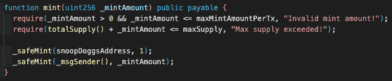
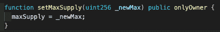

# 一些你需要知道的事情，以避免被骗

> 原文：<https://medium.com/coinmonks/something-you-need-to-know-to-avoid-getting-scammed-61b093f89749?source=collection_archive---------18----------------------->

## 0x01 预热

99%的用户在与以太坊互动时不了解幕后情况，这使他们容易受到攻击。对于新手来说，这是一条主线，所以这篇文章是为你而写的——一些你需要知道的事情，以避免上当受骗，并在上当时将损失降至最低。所以让我们深入了解更多细节。

## 0x02 更多详细信息

## 钱包

钱包是一个通用术语，指的是保存你的私人钥匙的东西，通常有一个 T2 种子短语。值得注意的是，你的钱包实际上并不储存任何密码，区块链储存。您的私钥允许您证明地址的所有权。

## 种子短语

种子短语是代表私钥集合的一组单词。如果受到危害，从该种子短语导出的*所有*地址也不可挽回地受到危害。保持这个安全和离线。

## 私人密钥

您的私钥用于签署所有类型的交易。如果遭到破坏，攻击者就可以完全、不可撤销地控制该地址。所有其他地址仍然是安全的，即使它们来自同一个种子短语。

## 硬件钱包

硬件钱包通过将您的私钥存储在一个永远不会暴露在互联网上的安全元素中来保护您的私钥不被泄露。交易是在 metamask(或您选择的钱包)中创建的，并被移交给硬件设备，在那里您必须对它们进行物理签名。然后，现在用私钥签名的交易被提交回网络。

## 签名

签名是用您的私钥签署的消息。有几种类型，每种都有不同的含义。

要更改区块链，您必须在支付汽油费的同时提交您的签名。这对于任何转让、批准、索赔等都是必要的。这些总是会耗费汽油。

## 无气签名

这些不会改变任何状态，所以除了利用现有批准的情况之外，它们是无害的。例如，诱骗您提交一个有效的 OpenSea 列表签名，如下所示。如果是简单的英语，那么签字是安全的。

## ETH _ 符号

这是一种非常危险的签名类型，基本上就是以太坊的“空白支票”。请求者可以用它用你的私钥签署任何交易。好消息是，如果需要的话，metamask 会显示一个大大的红色警告。

## 以太网传输

没有人能花你的生命。你必须寄出去。ETH 不像 NFT 或令牌那样需要批准。我们正是因为这个原因而存在，并让 ETH 表现得像一个 **ERC20** 。这一点以后会很重要。

> 交易新手？尝试[加密交易机器人](/coinmonks/crypto-trading-bot-c2ffce8acb2a)或[复制交易](/coinmonks/top-10-crypto-copy-trading-platforms-for-beginners-d0c37c7d698c)

## ERC721/1155 所有权

所有 NFT 只是令牌 id 到地址的映射。当考虑所有权时，知道*只有资产合同可以改变映射*是有帮助的。让我们来看看这种映射是如何改变的

## ` _ 转移'

这是` _transfer '的 ERC721 实现。所有 721 都继承了这一点，任何转移调用最终都会深入到该函数。在基本级别上，它做 3 件事:— **清除来自前所有者的批准** — **更新余额** — **更新令牌 ID 的映射**

## ` _transferFrom '

这也是从 ERC721 标准中提取的。它添加了一个检查来确保 **msg.sender** 被批准或者是令牌持有者。大多数 721 将此作为改变令牌所有权的唯一方法。

恶意合同偷不走你的猿。如果您从一个契约中创建，然后它在 bored ape 契约上调用`**transfer from**',**msg . sender**成为恶意契约。它将失败，因为它不是所有者(您是)，并且它没有被批准。

请参见下面关于“mint”、“transferFrom”和“isApprovedForAll”的截图。

恶意网站请求批准恶意合同无法窃取 NFT，但恶意网站可以调用“bayc.setApprovalForAll”而不是“degenMint.publicMint”。如果要求您设置批准，而您并不期望这样做，则这是一个骗局。

## 假冒的 P2P 交易网站

骗子建立了一个交易，但要求使用一个新的网站。一旦你设置了许可，它就会偷走你的 NFTs。书签 Opensea、Looksrare、x2y2、nfttrader 和 sudoswap。你不应该需要任何其他人。

## 假冒撤销网站

骗子会声称有一个新的漏洞，并指示你尽快撤销批准。他们链接一个虚假的网站来撤销批准，而不是批准他们的地址来窃取你的 NFT。书签[http://revoke . cash。](https://t.co/QeqRDwElrV)

## 恶意站点请求以太网/NFT 传输

这可能发生在与批准相同的任何来源。没那么严重，因为没有残留损伤。没有设置批准，也没有公开私钥。签字前仔细检查你的交易。

## 恶意网站会将恶意软件下载到您的设备上

这里的目标是提取您的私钥。使用硬件钱包。不要打开未知文件或书签未知网站。如果下载了你不期望的东西，删除它。

## 如果你已经妥协了，现在怎么办？

1.  失落的 NFTS

检查以太扫描。你的地址启动转账了吗？第一个图像显示令牌持有者发起的传输，第二个图像显示攻击者发起的传输。了解其中的含义很重要。

## 由攻击者地址发起的传输

如果攻击者通过审批转移资产。撤销 [http://revoke.cash](https://t.co/QeqRDwElrV) 的

重要的是要知道 [http://premint.xyz](https://t.co/ihLPkXVTlA) 对于项目来说是一个非常棒的工具，但是它们并不代表认可。任何项目都可以建立一个 premint 页面，不管他们是不是一个地毯，骗局，或其他一些骗局。

请注意，撤销批准调用与设置批准相同的函数:` setApprovalForAll`。该函数需要一个运算符(您授予权限的地址)和一个布尔值(真或假)。授予批准时，此布尔值为真。当移除它们时，为 false。

## 由您的地址发起的转账

有两种可能。要么你被骗了，要么有人拿了你的私人钥匙。如果是前者，则不需要进一步的操作。如果是后者，坚持住我稍后会提到。

## 攻击者有我的私钥

把你能转移的任何东西都转移出你的地址，然后永远不再使用它。通常如果你的私钥泄露了，会有一个扫地机附在地址上。不要发送任何东西，它会立即被提取。

买个硬件钱包。私钥泄露是你可能遭受的最具破坏性的攻击(除了你的种子短语被盗之外)，硬件钱包可以防止这种攻击。获取一个，将您的种子短语离线存储在一个安全的地方。

## 陈词滥调的建议

最后，这是我们经常提到的陈词滥调:)

-不要点击链接

—关闭您的 DMs

—假设每个人都想骗你，最重要的是…

—不要做第一个

请继续关注某些点的扩展部分

【https://twitter.com/0xQuit/status/1549558435187855360 