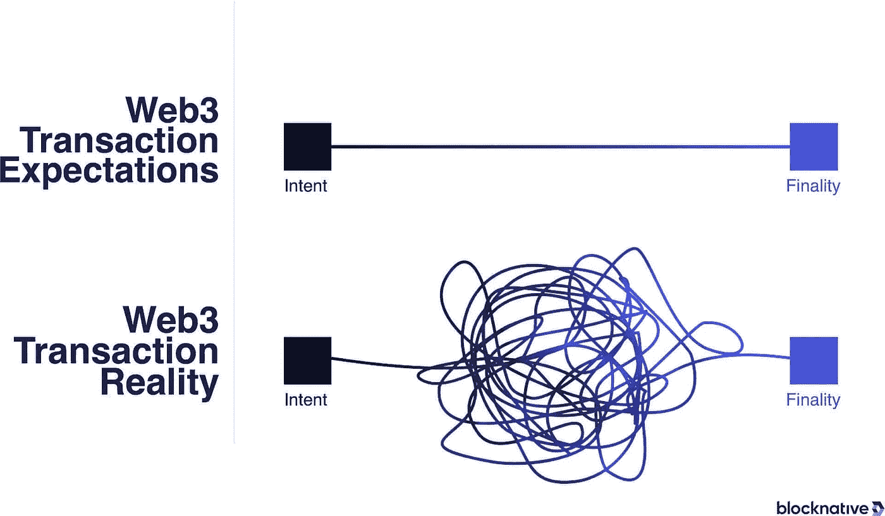
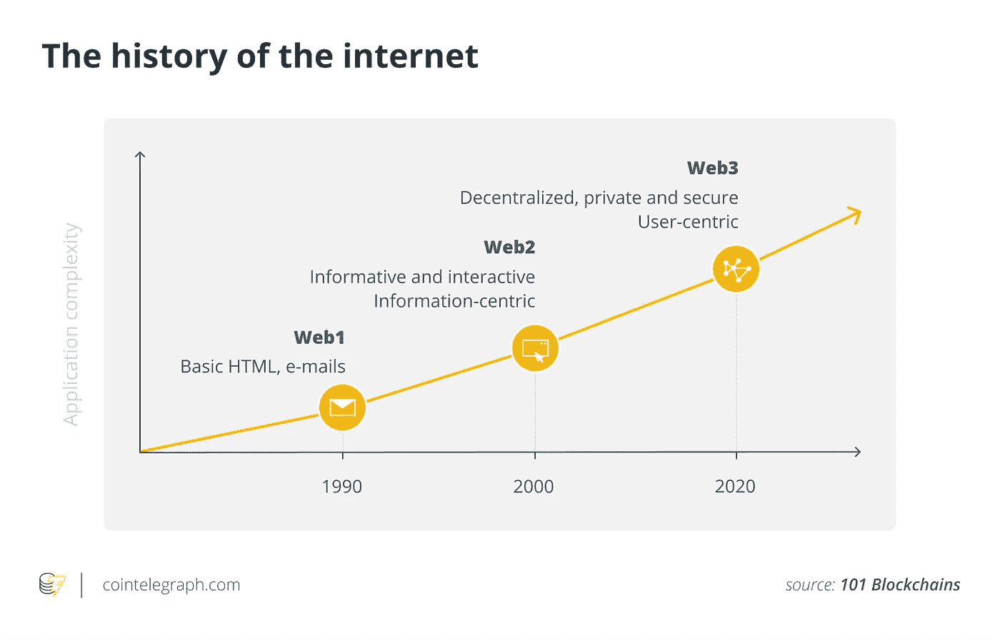

# 有时候，最棘手的问题也有最简单的解决方案。

> 原文：<https://medium.com/coinmonks/sometimes-the-toughest-problems-have-the-simplest-solution-c8b3ebefc5db?source=collection_archive---------23----------------------->

Web3 is getting really heated up these days.

你知道我喜欢网络 3 和承诺。

当然，它有它的缺点，充满了骗子和诈骗犯，但我总是希望它会开花结果，在未来的时间里为世界做好事。

但实际上，要实现这一点，有些事情必须改变。

对于普通人来说，某些简单的步骤，如切换网络、整个种子短语和在交易前阅读象形文字墙，都是不必要的复杂。

对于门外汉来说，简单的交易很成问题。

在钱包级别保护用户。

这是用户和区块链之间的第一个接触点。

一些最危险但最简单的诈骗用户的方式就发生在这个阶段。

Web3 transaction is quite painful these days, but will it get better?

只需一次错误的点击，用户就可以在不知不觉中将其整个钱包的访问权交给骗子。

价值数百万美元的密码和 NFT 就这样被盗了。

在某种意义上，你不能说资产被盗了，因为从技术上来说，用户是有意(或无意)签署交易并同意在确认交易时提交给他们的任何东西的人。

但是拜托，谁会认真仔细的去读那一堆乱七八糟的文字和十六进制的代码行呢？

谁真正理解这一切？

谁能真正合法地检查事实并指出交易是否是恶意的？

对于普通人来说，在匆忙点击“同意”去买多汁的 NFT 或购买我们的密码之前，我们几乎不会注意到它。

Seth Green’s bored ape worth hundreds of thousands of dollars was maliciously phished from him.

web3 钱包的用户体验是俗气的、不可靠的，并且正走向灾难。

事实上，灾难已经降临。

赛斯·格林失去了他所有昂贵的 NFT，数千人被 BBC 一台的小偷诈骗，数百名无聊的猿社区成员被钓鱼。

这还只是报道过的。

不管怎样，为什么会这么难呢？

为什么 web3 交易会如此复杂？

当普通人不能阅读和理解复杂的交易代码时会发生什么？

我们的目标应该是尽可能地简化和保护儿童。

如果这种交易不能为普通人简化，web3 将永远不会被完全采用。

For web3 to be truly adopted by the masses, it needs to be simple, brainless to use and fuss-free.

从事这项工作的创业公司之一是 Blowfish。

它们是钱包和用户之间的一层，用来阅读和理解交易，并用简单易懂的语言表达出来。

如果存在危险和安全漏洞，比如您可能签署了一项“掏空钱包”的交易，它会立即发出红色标记并提醒您。

“自从集成我们的 API 以来，他们已经扫描了超过 1.25 亿笔提议的交易，**阻止了超过 11，000 笔耗尽钱包的交易**被他们的用户签名。”

很聪明吧？

本质上，它只是阅读交易，并将其翻译成普通人可以理解的简单英语。

有时候，最棘手的问题也有最简单的解决方案。

我喜欢这种方法。

为用户解决一个已知的非常痛苦的问题。

如果这个问题足够痛苦，并且有足够多的人接受它，你很快就会有一个产品市场。

-

web3 交易太复杂了吗？

-

#创业#商业#创业#成长#成功#社交媒体#文化#创业#战略# eth # btc #加密#河豚#市场#骗子# NFT #利润#nftmarket

> 交易新手？试试[加密交易机器人](/coinmonks/crypto-trading-bot-c2ffce8acb2a)或者[复制交易](/coinmonks/top-10-crypto-copy-trading-platforms-for-beginners-d0c37c7d698c)