# 孩子，你一直在街上，你应该去纳米宇宙走走。…

> 原文：<https://medium.com/coinmonks/son-youre-on-street-all-the-time-you-should-take-a-walk-through-the-nanoverse-795a3dc9c3f3?source=collection_archive---------37----------------------->

向所有 jpegs 的粉丝和 web3 的孩子们问好。
[**NCNC🚫🧢**](https://twitter.com/NoCashNoCap) **和其首席 NFT 德根**[**deep syg**](https://twitter.com/BradWoofy)***都重新联系上了。***

*我马上预约文章重点是欧盟和独联体社区，所以是用两种语言做的:英语(我不太会)和俄语(我也不太会)总的来说，我很笨，只知道买 jpegs。*

*今天我们将触及 metaverses 的话题，特别是我们将谈论正在建设的[**nano verse HQ**](https://twitter.com/nanoverseHQ)meta，我将告诉你为什么 metaverses 是一个未来的趋势，我将告诉你我对它的看法，以及为什么 **NANOVERSE HQ 是一个宝石**，我们不会拉所以让我们开始吧。*

# *什么是元宇宙？*

> ***元宇宙**是 web3.0 中虚拟空间的概念，基于区块链、增强现实(AR)、虚拟现实(VR)等技术。*

**什么都不清楚，但是很有意思，和 web 3.0 他妈的是什么一回事？他们用人类的语言按顺序开车**

*尽管这两个概念都还处于起步阶段，但 Web 3.0 和元宇宙并不是一回事。元宇宙是建立在 Web3 内部的虚拟世界。把元宇宙想象成数字空间中真实事物的沉浸式体验。元宇宙将由独立的三维世界组成，包括游戏、时尚、生活方式、社交网络、学习平台等等。*

*简单地说，元宇宙就像真实世界，但是在电脑中，它变成了真实世界的一个补充，一个叫做真实生活的游戏的 **MOD** 。记得你最喜欢的游戏，其中有一个开放的世界，想象你扮演的角色是你——这是元宇宙。*

*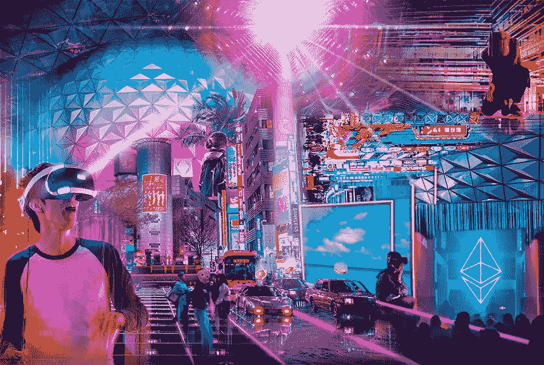*

****现在关于 web 3.0****

*我们目前使用的互联网叫做 web2.0，在 web 1.0 之前，世界在发展，技术每天都在惊喜，甚至互联网也需要更新，就像你的特朗普 iPhone 5S 一样，所以我们将平稳地切换到 web3.0。*

> ***Web 3.0** 即将到来的第三代互联网，其中网站和应用程序将能够像人一样处理信息，使用机器学习(ML)、大数据、分散注册技术(DLT)等技术。*

*总的来说，web 3.0 只是一个完成的、去中心化的智能互联网，基于区块链和其他酷的计算机奇迹，在其中人工智能将为你做一切。*

*尽管 Web 3.0 和元宇宙是两个不同的概念，但它们注定会在塑造互联网的未来方面相辅相成。Web 3.0 的主要愿景是创建一个开放、透明、去中心化和包容性的生态系统，其中任何组织都无法控制用户数据和资产。元宇宙的设计也是开放、包容和分权的。*

*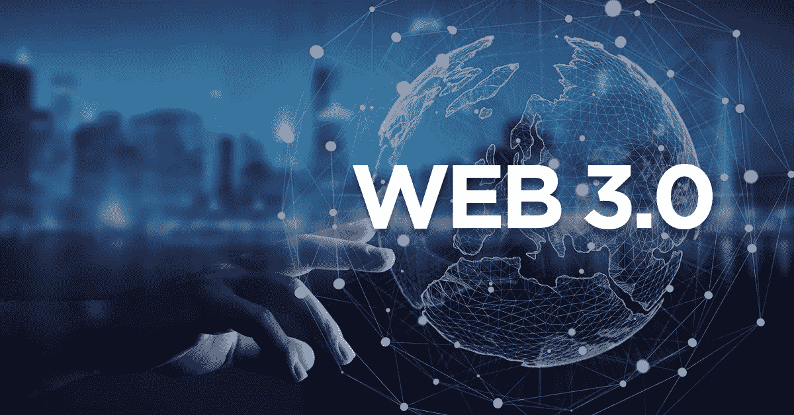*

****唷！这是整理出来，我们开车到最有趣的，该项目，在我的愚见，将使最好的元宇宙在不久的将来。****

# *世卫组织，这是纳米宇宙总部吗？*

*[**nano verse HQ**](https://twitter.com/nanoverseHQ)——这是一个对每个项目和整个元宇宙都有着深思熟虑的知识的元宇宙，它将是一个项目、人工智能、游戏内货币和货币化可能性的生态系统，**它包括三个阶段**(可能会有更多)，**阶段 1** 引入土地，**阶段 2** 引入代理人，**阶段 3** 将土地和代理人统一成一个元宇宙， 以及在打造他们的元宇宙的路上，哦不好意思， **NANOVERSE** ，独立项目如 [**BF 党**](https://twitter.com/B_F_Party) 和 [**项目 PXN**](https://twitter.com/projectPXN) 可能会出现(对，对，对，这些也是这些家伙的项目)。*

*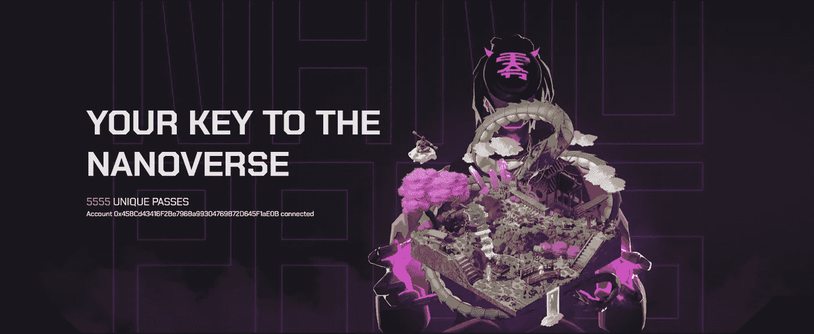*

# *让我们从已知的开始:*

***第一阶段:** 第一阶段是 [**NFT 项目 NANOPASS**](https://www.nanopass.io/) ，它由 **5555** 定性渲染的动画土地组成，做到了最小的细节，有 **22** 种独特的土地，不同的稀有度，稀有度不会带来任何优势，我将这一阶段指定为 nanoverse 和社区项目的起源，我会这样说——**这是基础**。*

*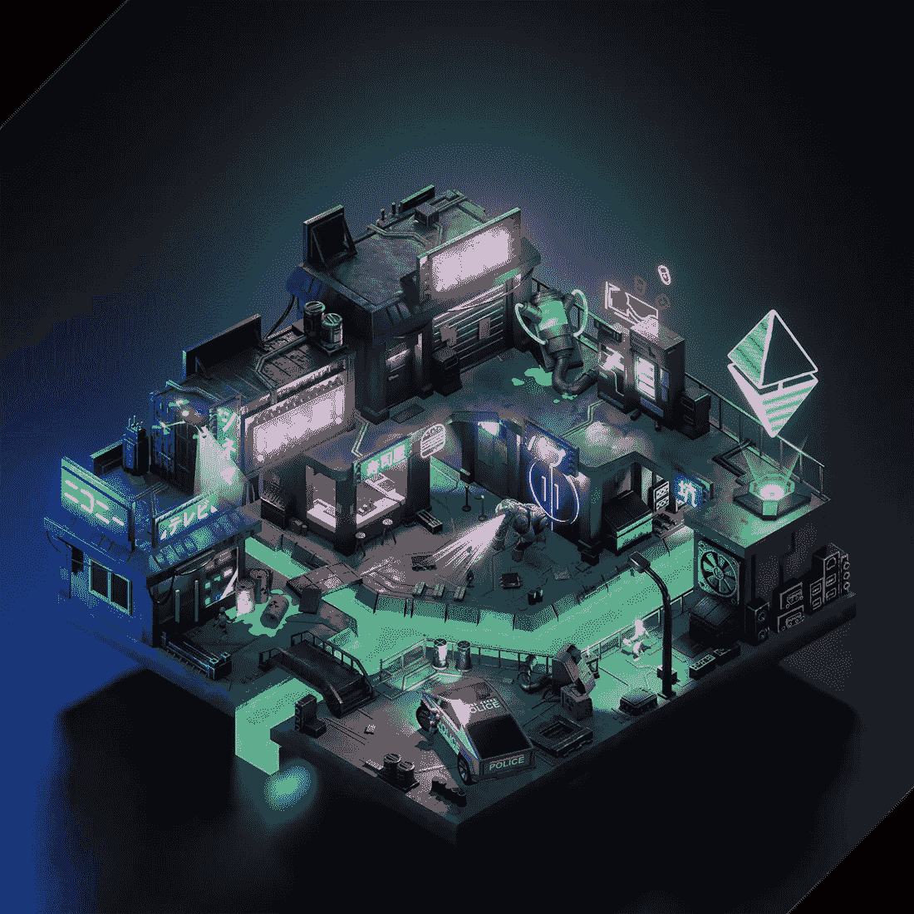*

*纳米通行证是一个早期的通行证，在**纳米宇宙**中充当一块虚拟土地。
收藏的造币厂已经过去了，在巅峰时期的通行证(地)费用[**~4.5 ETH**](https://opensea.io/collection/projectnanopass/activity) ，在写作的时候收藏的 **FP** 是 [**~0.65 ETH**](https://opensea.io/collection/projectnanopass) 。*

*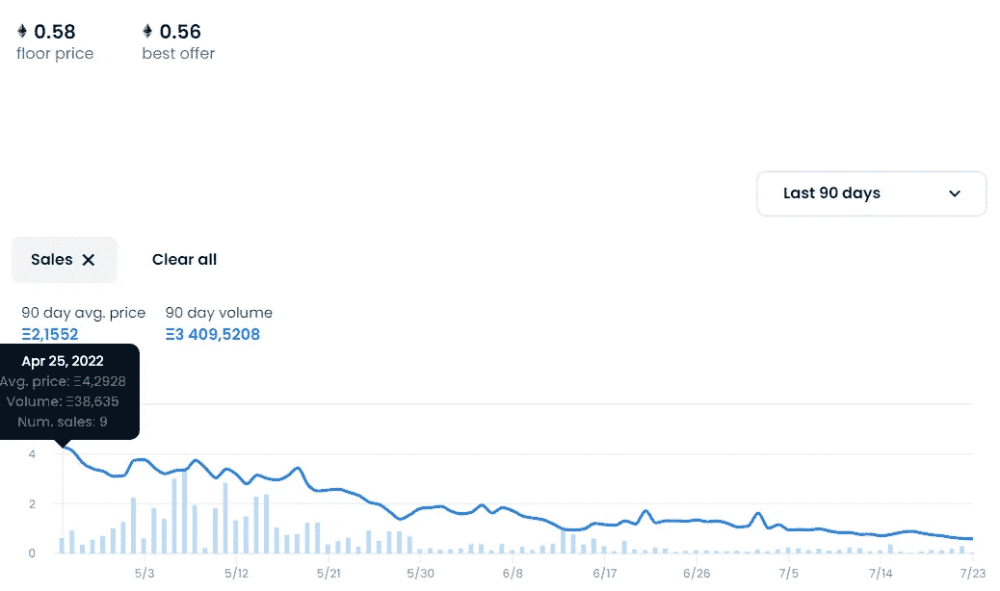*

***nano pass 有什么优势？***

1.  *早期阿尔法进入纳米元宇宙。*
2.  *这些土地每周都会生成“**”黑箱，其中可能包含 NFT 的合作项目、有价值的实物商品、元宇宙本身的物品、受欢迎的 NFT 或慈善捐款。是不是很酷？每个星期，持有者都会收到不同的奖金，我想每个持有者早就用这些盒子还清了这个收藏的钱了。***

***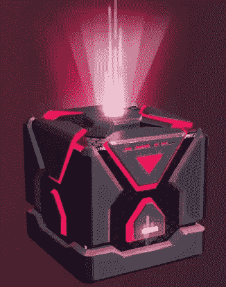***

***3.项目有一个公共金库，是针对项目的发展，顺便说一下“**黑箱**的融资也是从那里来的。财政部从二次销售中获得 75%的版税，也就是说，这些家伙实际上是为了他们的面包而离开的，其余的钱被用于项目的开发，这是值得称赞的。(虽然该团队不久前搬迁到巴厘岛，但我敢肯定这不是用财政部的钱，你可以呼气)***

***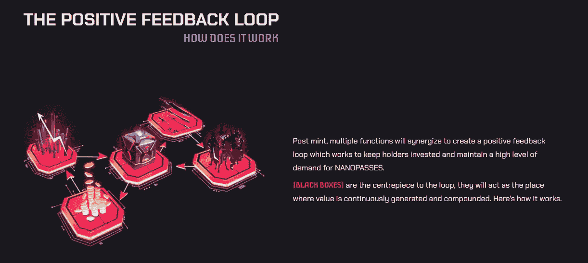***

***4.由于该项目的创始人是 NFT 领域的老狼，他们已经确定了几个他们认为最顶级的阿尔法小组，nanopass 的所有者将有权访问这些小组，以及他们将合作的后续顶级 NFT 项目。***

***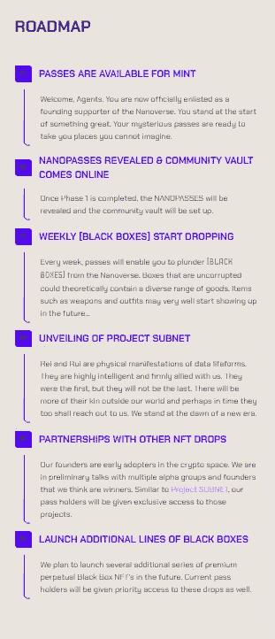***

******总的来说，第一阶段路线图已经完成了 90%,团队已经证明它是可信的。******

*****让我们进入第二阶段:*****

***开发者自己称之为**项目子网**。很自然，通行证持有者会自动收到 WL，但我们对路线图和第二阶段的总体内容感兴趣。***

***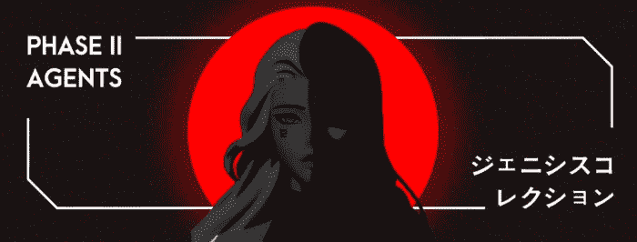***

***伙计们，我读了第二期的[**liteper**](https://projectnanopass.medium.com/phase-ii-litepaper-2fc4fd9f806)就死了……然后他又复活了，因为我不能错过这个，我们来搞清楚。
它也将是一个 NFT 系列，但这里我们将有“纳米宇宙的代理人”，saplay 还不知道，mint price 也知道，但这并不重要，重要的是这些代理人是什么。
特工会在《元宇宙》和《IRL》中成为你的助手，但不是简单的，而是带有人工智能，就像《钢铁侠》中的“**贾维斯**”。***

***代理将生成 **$BITZ** 代币，这将是元宇宙的主要货币，你可以用代币为你的助手购买衣服或购买 nanopasses 的资产。
你的代理将被嵌入到你的电脑中，就在桌面上，但他不像 Siri 或 Alexa，而是更多的东西，你甚至可以亲自接触他，亲自感受他的智能，这太神奇了，而我们生活在 **2022** ，雷和他的团队已经在 **3033** 生活了很长时间，他们在那里打网络高尔夫。***

***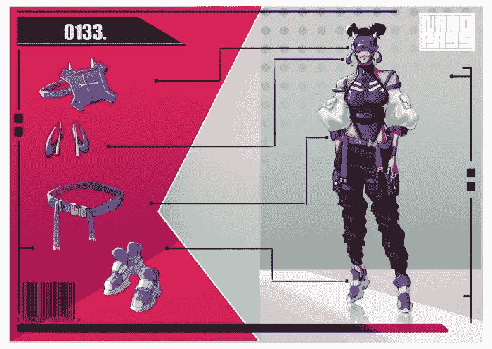***

***人们还没有为此做好准备，这是我个人的看法，但这显然是一个突破。最酷的是这个集合的真正用处，Rei 认为我们生活在一个越来越多的人在家工作的时代，他们只是需要一个像“贾维斯”一样的私人助理，是的，他不会像钢铁侠的朋友那样酷，但该死的是，他将能够给你做笔记，回复电子邮件，并执行一些简单的任务(这是目前的)
此外，你的 AI 可以在其他 metaverses 中帮助你，但团队不担保它在那里的表现。***

***当然，这一切都在开发中，团队表示，在开始时，他们将是一个简单的模型，用处不大，起初他们会胡说八道，但在未来，随着元宇宙的开发，助手也将开发，新的功能将被添加，顺便说一句，他们也将与社区协商功能和解锁这些额外的功能，你将需要使用每周收到的黑盒中损坏的片段。***

***顺便说一下，我们这里有第一个像样的元宇宙的直接申请，我真诚地希望 **NANOVERSE HQ** 给**宇迦实验室**嘴巴，不是因为我不喜欢**宇迦实验室**，而是因为我想有人与 **BAYC** 、**宇迦**也在准备一个强大的元宇宙，但是 **Nanoverse 在技术和实用性方面更强**，所以这里是主要的竞争者***

***由于熊市，这一系列的造币厂被无限期推迟，这对开发商来说是一个足够的解决方案，这样的项目需要大量的投资，他们反过来认为，即使以目前的价格出售，他们也没有足够的资金用于项目的后续建设，我真的不希望这样的项目被冻结或褪色，因为他们不再继续为项目工作。
所以从我个人来说，整个**+代表**团队，对你的产品负责***

***总的来说，元宇宙是一种趋势，但未来，现在是提前了，首先，人们还没有准备好，其次，他们还没有做一个像样的元宇宙，所以大多数人认为他们是狗屎，但相信我，在 5-10 年内，我们都会在那里，在元宇宙，咳咳-咳咳在**纳米宇宙**，我道歉。***

# ***在 NANOVERSE 总部建设过程中形成的独立项目。***

***正如我们已经了解到的，纳米宇宙是一个构建整个元的多阶段计划。为了取得成功，他们的整个品牌和知识产权必须联合成一个生态系统，当整个“**拼图**”组装好后，我们将得到一个坚实、强大的元宇宙。
**PXN**和 **BF Party** 项目是一个生动的例子，展示了来自 **NANOVERSE 总部**的独立项目是如何诞生的，是的——这些项目是独立的，但你将能够在 NANOVERSE 中看到它们。蜘蛛侠也是一个独立的角色，但是他出现在《复仇者联盟》里你明白我的意思吗？***

## ***[**项目 PXN**](https://www.phantom.sh/)***

******

***[**项目 PXN**](https://www.phantom.sh/) ，当时闹得沸沸扬扬，现在 [**FP 是~0.2 ETH**](https://opensea.io/collection/pxnghostdivision) ，但是我监测了场外市场，那里有架空线的疯狂报价，人们以**3-6k $**的价格购买，即使有这样的价格标签，他们也出来加，因为在高峰期收集成本 [**8 ETH**](https://opensea.io/collection/pxnghostdivision/activity) ，但是***

***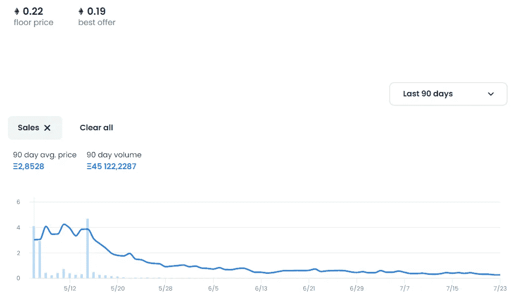***

***PXN 是一个独立的项目和组织。这两个由 Rei、Pants、Dex 和 X4 创建的项目(PXN & NANOPASS)共享一个共同的宇宙和 IP，这意味着世界之间的边界可以模糊和重叠，从而在两个项目之间产生协同效应。
在这个项目中，Rei 再次展示了他和他的团队是天才，在这里，他通过创建一个在 web3.0 中成功工作的工具，体现了他对 web 3.0 可能性的愿景，他将有用的实用程序连接到一个单一的网络中，在一个平台上，PXN 和 NANOPASS 持有者可以访问它并在 web 3.0 中获得提升，这很酷，但只是对那些已经了解 web 3.0 的前景并等待其 100%实现的人来说，我已经说过许多人还没有为此做好准备。
这似乎已经足够了，但 PXN 用各种空投、代币和架空线路的分配来取悦持有者。
就我个人而言，我认为雷将建立两个巨大的生态系统，我们都会感到震惊，然后他会把它们合并成一个完整的元宇宙，然后每个认为 metaverses 是狗屎的人都会说，“**妈妈，我想住在那里**，”嗯，这些只是我结合 PXN 和纳米的梦想。***

## ***[**BF 党**](https://www.bfparty.io/)***

***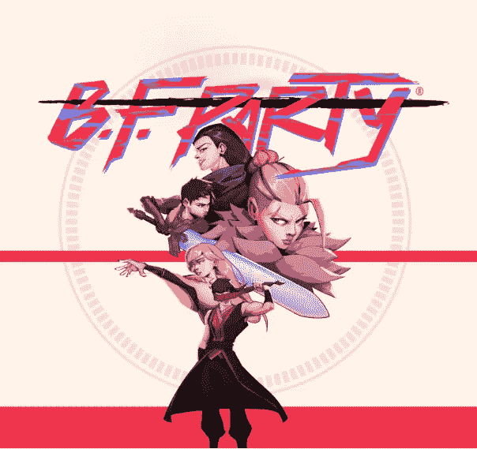***

***哦，这是什么？游戏！
[**BF Party**](https://twitter.com/B_F_Party)是 **Nanoverse** 的创意，也是一个独立的项目，由团队**武士道**的一名成员创立和构思，他之前从事游戏开发，据他说，他的灵魂一直为此而存在，他在团队的支持下开始了 BF Party 的工作。
BF Party 是一系列以娱乐为主的迷你游戏。
随着路线图的发展， **BF 党**将被整合到 **Nanoverse** 中，这将进一步增加 **PROJECT NANOPASS** 及相关项目的价值。
BF 党的理念是打造一系列以娱乐为主的迷你游戏。将 NFT 技术应用于游戏内资产的原因是允许交易和拥有游戏内资产。这个玩具本身将是一个“最后的幸存者”类型的游戏，采用 Web3“玩赚”(P2E)的格式，其中 60-100 名玩家进入一个被封锁的地图，并尽可能长时间地试图生存下去。最后 5 名左右活着的玩家将获胜并获得游戏币。这可以换成用于纳米宇宙的 NFT·艾特姆斯。***

***该系列的供应本应是 **8888** ，但在销售失败后，决定将 saplay 减少到 **4444** 并让 mint 免费，顺便告诉你，我监测了场外市场， **BFP** 架空线的价格是**$ 1000–2000**，人们购买了它。 让我们记住好人…
卖不成功，我从二级买的正好是 **0.04** ，我在等 **FP 至少 0.3** ，但是我们连 **0.1** 、 [**都没突破，现在 FP 是~0.015 ETH**](https://opensea.io/collection/bfreeparty) **。*****

***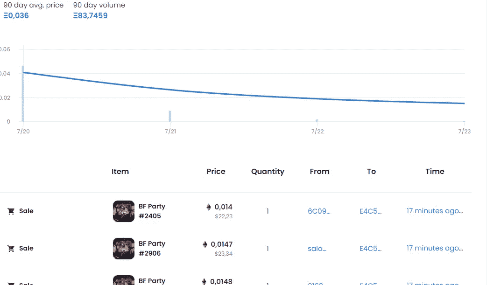***

***但这不是那么重要，现在市场不是在最好的条件下，说得好听点，所以我看好这个项目，以及整个元宇宙，网站上有游戏的试玩版，不是说它是直哇，但纯粹是为了和朋友玩得开心，卸下最大的负担，我相信从长远来看 BF 党会让自己感受到。***

***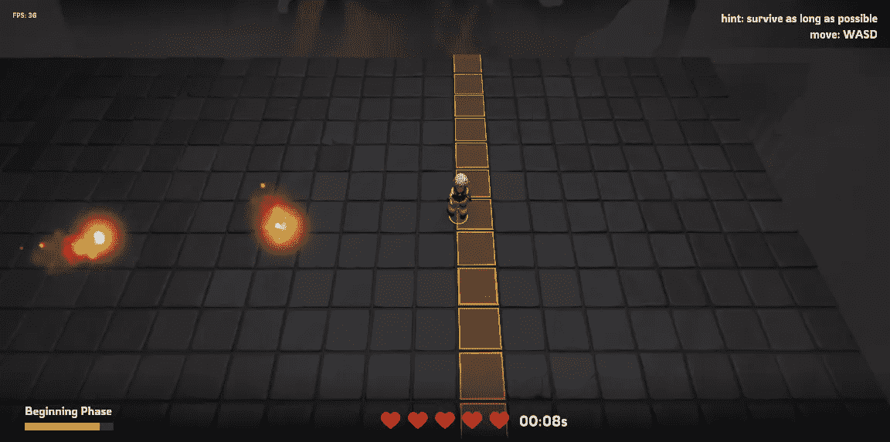***

***[**巴尼兔子**](https://twitter.com/banii_wrld)***

***巴尼兔是一个时尚的模仿兔子男孩的品牌，关于这个项目的信息很少，只有他们的模型，这些兔子将被整合到第二个纳米阶段和 PXN 项目中，我个人认为这些可能是我们需要照顾的宠物，就像在邪教“电子鸡”中一样，也许它们也会在 meta 中帮助我们，这些只是我的猜测，如何会是这样，我还不知道。***

***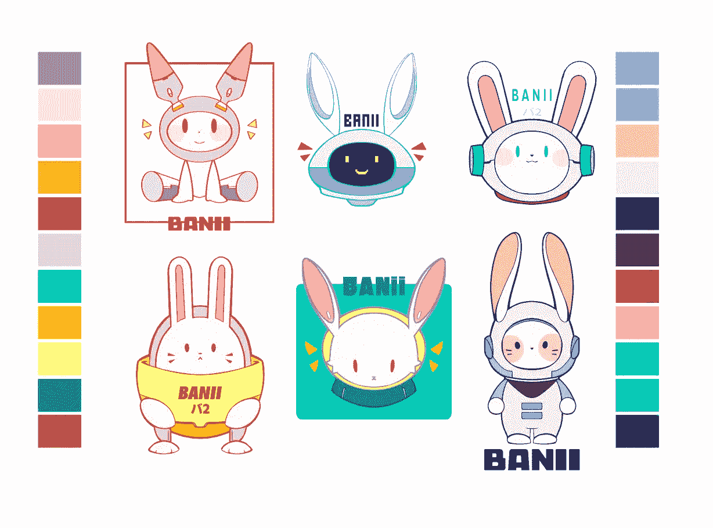***

***[**0xygen Labs**](https://www.0xygenlabs.io/)***

***这是我们的 **Launchpad** ，对于我上面提到的所有项目，以及其他项目的创始人都可以联系 0xgen Labs 寻求帮助。它是由我已经深爱的雷和他的退化者们(他自己写的)创建的，他们为建设 NFT 项目和他们的推广提供各种服务，用他们的项目他们已经证明了他们能够建设成功的项目。因此，他们生态系统中的每个项目都有自己现成的发射台。***

***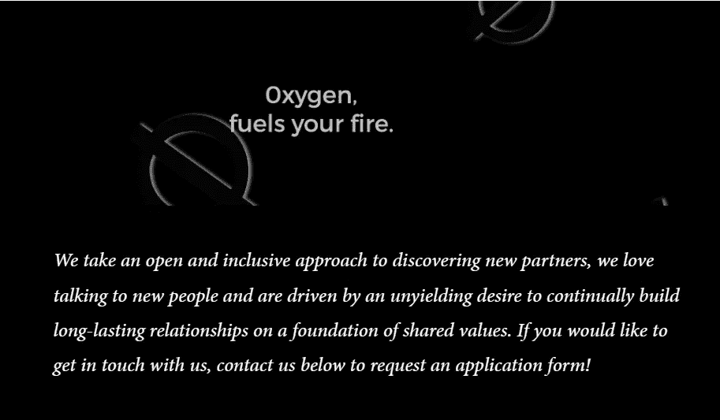***

# ***该死的团队天才***

1.  ***[**纳米雷伊**](https://twitter.com/reicannon) 是该项目的创始人。***

> ***他是 0。他是中心，是开始，也是结束。他是一个永无止境的圆圈，永远包含着虚无和一切。除了 Nanoverse，他还是一个涵盖快速消费品、酒店和服务的公司集团的创始人和董事总经理，在这些公司中，他的领导素质得到了发展。他是早期的加密投资者和 NFT 投资者。***
> 
> *****志向**:能够管理和控制瑞***

***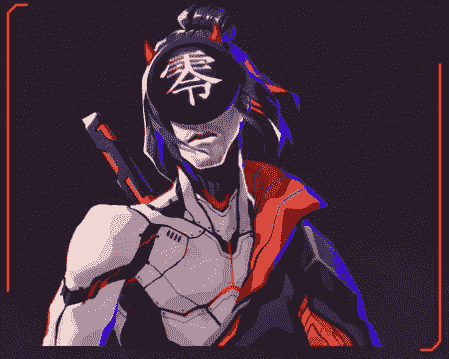***

*****2。** [**纳瑞**](https://twitter.com/REEEEEruiiiii) 是该项目的联合创始人和艺人。***

> ***仅次于雷，她是他的得力助手。尽管笨拙而平衡，她看起来比雷更快更强壮。在宇宙之外，她是万物审美的无畏领袖和艺术总监。她的艺术天赋和导演受到了团队的高度赞赏——对细节的关注前所未有。但说实话，没有背后的艺人群体，瑞什么都不是。***
> 
> *****野心:**推翻尤里·辛普斯的军队***

***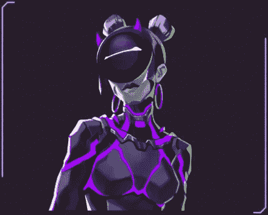***

*****3。** [**纳米尤里**](https://twitter.com/Yuri_ramen) —首席社区经理***

> ***法达·尤里女王，辛普森一家的领袖。她计划和她的拉面爱好者大军一起统治纳米世界。作为社区领袖，她与所有人交流，分发免费拉面，并滥用职权分发白名单。她是一家金融服务集团的首席营销官，也是首批实施 NFT 加密的人之一。她的策略？先是猴子，然后你就明白了。***
> 
> *****野心:**夺取全世界的权力，给每个人拉面
> 人类<———10>机器人***

***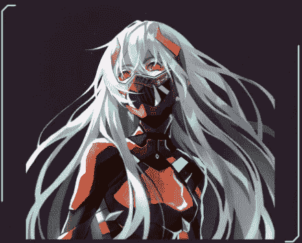***

*****4。** [**纳米开发**](https://twitter.com/projectNANOPASS) —技术总监***

> ***大脑，肌肉，纳米通道的隐藏基础。他在开发区块链软件方面有超过 10 年的经验，只阅读代码。
> **野心:**与区块链
> 同化人类<———4—————猿***

***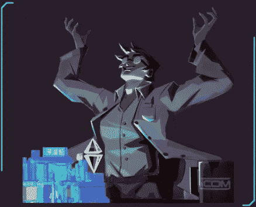***

*****5。** [**纳米苦艾酒**](https://twitter.com/iamabsinthe) —营销与合作经理***

> ***一个预算为 0 美元的领先营销人员正在尝试做不可能的事情。她经常向雷抱怨营销预算是多么有限。她是一名基金管理分析师，也是 LoL 和 Valorant 的前员工。我花了一年的大部分时间准备 CFA，直到 3 个月的隔离发生，考试不复存在。她现在在 NFT 报社做全职工作。***
> 
> ***雄心:在造币厂
> 人类<————10>猿之前得到一些营销预算***

******

*****6。****—首席律师兼项目财务经理*****

> *****德勤(Deloitte)的一名前顾问，现在是一家 SEO 子公司的财务经理，已经变成了一名专业的不和说话者。Shartypants 是一名特许会计师，也是一名大律师和高等法院律师。她用自己的法律术语为头脑冷静的团队服务，并就秘密税收问题为我们提供建议。*****
> 
> *****抱负:用铅笔写下元宇宙人的基本教义
> 人类<———7—→猿*****

**********

*******7。** [**纳米武士道**](https://twitter.com/AgentJHC) —迷因之王、社群管理者*****

> *****一个连续股票和初始投资者开设了一个频谱区，让他可以真正地嗅出赢家…这就是他如何找到 NANOPASS 团队的。武士道是迷因的主谋，因为没有人比他更堕落，更搞笑。*****
> 
> *******野心:**猿
> 人<———10>猿*****

*****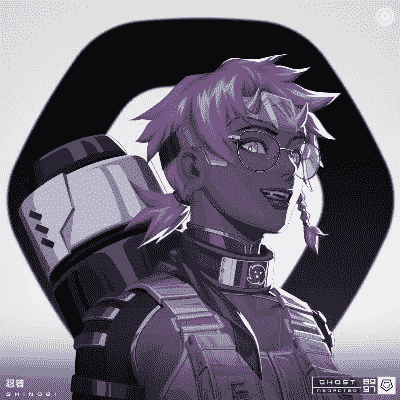*****

*******8。**[**NANO tentones**](https://twitter.com/LiamNancarrow)—服务器管理器不协调*****

> *****乐队里的秘密天才，显然会演奏 7 种不同的乐器。他控制所有的机器人，是不和谐的总工程师。关于分歧的任何问题，请联系他，因为团队的所有其他成员都是婴儿潮一代。*****
> 
> *****野心:在你的第一个 NFT 项目中幸存下来而不被解雇
> 人类<—2———>猴子*****

**********

*****是的，我只是从他们的不和谐中复制了团队信息，那又怎样？
就因为我不会做的比这个描述更好。我们有什么？团队由 **70%** 猿、 **10%** 机器人(bot，one)和 **20%** 被雷和芮拿走。撇开所有的笑话不谈，这个团队非常强大，每个人在 IRL 和加密领域都有巨大的背景，这是我见过的最强大的团队。*****

*****这些人用幽默来描述他们的团队，这很有处置力，立刻会有一种感觉，你已经认识这些人很长时间了，真的很想和他们聚在一起喝杯啤酒。
总的来说，项目团队有 **50 多**人，我 **100%** 确定，这些都是一样强的 WEB 3.0 硬工，他们不收傻子进这样的团队，除了武士道(对不起老弟)。*****

# *****让我们总结一下*****

*****首先我要说的是，我是个**傻逼**。不，说真的，由于缺乏经验，我错过了这个项目，并忙于其他等待崩溃(rekt)或地毯的人，尽管 NANOVERSE 总部及其整个团队欠我的，因为我进入的每个项目都注定失败，我照顾了他们的元宇宙，并通过给他生命的权利成功跳过了他们的项目。所以 NANOVERSE 总部，联系我。
***好吧，这都是玩笑。********

*****我真的很恼火，因为我没有一个 **Nanopass** 和一个幻影，我现在可以买断它们，因为 **FP** 非常甜蜜，但熊市超过了我，我当然知道像“多样化”和“风险管理”这样的词，但我从来没有把它们用于它们的预期目的，所以我喜欢每个自尊的加密家伙乞丐。*****

*****说到 **FP** ，我不同意他的观点。NANOVERSE 总部和它所有的项目都被低估了，这就是事实。我敦促每一个有机会买断的人，然后说谢谢，但是为什么呢？*****

*****这是一个领先于时代的趋势，Metaverses 已经做了很多项目，甚至有成功的项目(你好沙盒)，但我要说的是，没有一个项目揭示了 metaverses 的全部潜力，现在我们只看到未完成的狗屎(没有负面性)，人们没有看到有价值的 metaverses， 他们还没有为有价值的作品做好准备(这是我的观点)，但雷的团队正准备展示第一个你想居住的真正的元宇宙，相信我，当这种情况发生时，你不会离开那里，如果有疑问，那么就再看看他们的团队和他们的收藏质量，他们如何一丝不苟地对待他们的 meta 的建设，他们如何尊重他们的社区，他们有什么优势。*****

*****不是 [**宇迦实验室**](https://yuga.com/) 会展示元宇宙应该是什么样子(虽然他们也很棒)，但我认为这更多是为了营销，除了赚钱，我在那里看不到灵魂和真正的用处，即 **NANOVERSE 总部**将为所有 metaverse 设定标准，然后每个人都会张着嘴看，并试图照他们做的去做。*****

*******我尊重** [**宇迦实验室**](https://twitter.com/yugalabs) **，他们有一个强大的团队和一个好的产品，但他们没有竞争对手，所以他们被认为是最好的，但别担心，NANOVERSE 已经很接近了…*******

*****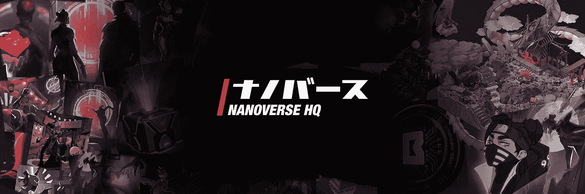*****

*****# nanoversehq # NFT #加密货币# NFTs # nftcollectibles # crypto #元宇宙# nanopass # projectpxn # web3 #区块链*****

*******NANOVERSE HQ 链接:** [**TWITTER**](https://twitter.com/nanoverseHQ)**\**[**不和谐**](http://discord.gg/nanoversehq) **\** [**网站**](http://nanopass.io) **\** [**媒体**](https://projectnanopass.medium.com/)**\**[**OPENSEA**](https://opensea.io/nanoverseHQ?tab=created)*****

*******PXN 链接:** [**推特**](https://twitter.com/projectPXN) **\** [**不和**](http://discord.gg/projectpxn) **\** [**网站**](https://www.phantom.sh/)**\**[**OPENSEA**](https://opensea.io/collection/pxnghostdivision)*****

*******[**【TWITTER】**](https://twitter.com/B_F_Party)**[**【DISCORD】**](http://discord.gg/bfparty)******[**【OPENSEA】**](https://opensea.io/collection/bfreeparty)**[**【GAMELINK】**](https://www.bfparty.io/game)*****************

*****BANII LINKS:** [**TWITTER**](https://twitter.com/banii_wrld)***

*****NO CASH NO CAP 是的类型: 类型: 类型: 类型: 类型: 类型: 类型: 类型: 类型: 类型: 类型: 类型: 类型: 类型: 类型: 类型: 类型: 类型: 类型: 类型: 类型: 类型: 类型: 类型: 类型: 类型: 类型: 类型: 类型: 类型: 类型: 类型: 类型: 类型: 类型: 类型: 类型: 类型: 类型: 类型: 类型: 类型: 类型: 类型: 类型: 类型: 类型: 类型: 类型: 类型:*****

*****My LINKS:** [**TWITTER:**](https://twitter.com/BradWoofy) [**MEDIUM:**](/@DeepsyG)***

# ***СЫНОК , ТЫ ВСЕ ВРЕМЯ ГУЛЯЕШЬ НА ЭТОЙ УЛИЦЕ! ПОШЕЛ БЫ ХОТЬ В НАНОВСЕЛЕННОЙ ПОГУЛЯЛ…***

******欢迎所有吉普车爱好者和孩子们 web3 , 再次联系 NCNCNC 是的它的主要 NFT 是 DeepsyG。(T71)(T71)******

****我马上要说,这篇文章是针对欧盟和独联体共产党的,所以它是用两种语言完成的:英语(我不是很好)和俄语(我也不好),一般来说,我很愚蠢,只能买吉普车。(T73)****

***今天,我们将谈论元宇宙的主题,特别是我们将谈论正在建设的元素 [**NANOVERSE HQ**](https://twitter.com/nanoverseHQ) ,我会告诉你为什么元宇宙是未来的趋势,我会告诉你我的想法,以及为什么 **NANOVERSE HQ - GEM** ,我们不会拉,因为我们已经下降了。***

# ***ЧТО ТАКОЕ МЕТАВСЕЛЕННАЯ?***

> *****元宇宙** — *是 web3.0 中的虚拟空间概念,基于区块链、增强现实 (AR) 和虚拟现实 (VR) 等技术。(T83)****

****没什么好理解的,但很有趣,Web 3.0 到底是什么?
按照秩序和人类的语言被驱逐:****

***虽然这两个概念仍处于起步阶段,但 Web 3.0 和元宇宙并不是一回事。Metavers 是建立在 Web3 内部的虚拟世界。
把元宇宙想象成在数字空间中对真实事物的激动人心的体验。元宇宙将由独立的三维世界组成,包括游戏,时尚,生活方式,社交网络,学习平台等。***

***简单地说,元宇宙就像一个真实的世界,但在计算机中,它是作为现实世界的补充,**MOD**到一个名为**Real Life**的游戏。回想一下你最喜欢的游戏,在那里有一个开放的世界,并想象你扮演的角色是你 - 这是一个隐喻。***

******

## ******关于 Web 3.0******

***我们现在使用的互联网被称为 web2.0,在它之前是 web1.0,世界正在发展,技术每天都在令人惊讶,甚至互联网也需要更新,就像你的 iPhone 5S 一样,所以我们将顺利过渡到 web3.0。***

> ***Web 3.0(T16)是即将到来的第三代互联网,网站和应用程序将能够像人类一样处理信息,使用机器学习(ML),大数据,分布式账本技术等技术。***

***一般来说,Web 3.0 只是一个过度的,分散的,基于区块链的智能互联网和其他酷炫的计算机奇迹,AI 将为您做任何事情。***

***虽然 Web 3.0 和元宇宙是两个不同的概念,但它们在塑造互联网的未来方面是相辅相成的。Web 3.0 的核心愿景是创建一个开放,透明,分散和包容的生态系统,没有任何组织可以控制用户的数据和资产。元宇宙在其设计中也是开放的,包容的和分散的。***

******

*****火!解决了这个问题,走到最有趣的项目,在我看来,在不久的将来会做最好的元。*****

# ***你的 NANOVERSE HQ 是哪款?***

*****NANOVERSE HQ** - 这是一个元宇宙,每个项目和元宇宙都经过深思熟虑,将代表一个使用人工智能的项目生态系统,游戏内货币和货币化的可能性,它由三个阶段(可能更多)组成,1 个阶段的土地实施,2 个阶段的代理实施和 3 个阶段的土地和代理合并成元宇宙,同样在他们的元宇宙的欺诈方式中,**NANOVERSE**,可能会出现独立的项目, 比如[**BF Party**](https://www.bfparty.io/)和[**Project PXN**](https://www.phantom.sh/)。***

******

# *****我们先来了解一下:*****

*****第一阶段**是 NFT 项目[**NANOPASS**](https://www.nanopass.io/),其中包括**5555**定性否定,制作到小动画土地,共有 22 种独特的土地,各种稀有性,稀有性不给任何好处,这个阶段我称之为纳米通用和共生项目的诞生,我这样说**这是巴萨**。***

******

***[**NANOPASSES**](https://www.nanopass.io/) 是一个早期访问通行证,作为 Nanoverse 中的虚拟地球的一部分。
集合点已经过去了,在复活节(地面)高峰上站着[**~4.5 ETH**](https://opensea.io/collection/projectnanopass/activity),在撰写本文时**FP**集合点是[**~0.6 ETH**](https://opensea.io/collection/projectnanopass)。***

******

*****NANOPASS 的优点是什么?(T43 号)*****

1.  ***早期 alpha 访问 NANO 元宇宙。***
2.  ***地球每周都会生成“ [**黑盒子**](https://www.nanopass.io/blackbox/) ”,其中可能包含 WL 在 NFT 合作伙伴项目,有价值的实物商品,最具代表性的偶像,流行的 NFT 或慈善捐款。这不是很酷吗?每周收银员获得不同的奖金,我认为每个收银员早就用这些拳击赢得了这个集合。***

******

***3.该项目有一个公共财政,旨在发展该项目,顺便说一句,“**黑匣子**”的资金也来自那里。
从二次销售中获得 75%的特许权使用费,也就是说,孩子们从字面上留下自己的面包,其余的钱用于项目开发,这是值得称道的。(虽然不久前球队搬到了**巴厘岛**,但我敢肯定,这不是从金库里的钱,你可以呼气)***

******

***4.由于该项目的创始人是 NFT 领域的老狼,他们已经分配了几个他们认为最热门的 alpha 组,纳米贴片的所有者将能够访问这些组,以及随后的顶级 NFT 项目,他们将与之合作。***

******

******总的来说,第一阶段的漫游完成了 90%,团队证明了它是可以信任的。******

*****重定向到第 2 步:*****

***开发者们称之为**Subnet Project(T12)。
当然,Passe Holders 会自动接收 WL,但我们对 roadmap 感兴趣,并且通常会进行第二阶段。*****

******

***伙计们,我读了[**莱特佩尔**](https://projectnanopass.medium.com/phase-ii-litepaper-2fc4fd9f806)第二阶段死了......然后又复活了,因为我不能错过这样的事情,让我们弄清楚。***

***这也将是 NFT 的集合,但在这里我们将有“**新星**代理人”,Stagma 还未知,Mint Price 也是如此,但这并不重要,重要的是这些代理人的本质。***

***代理人将是您在元宇宙和 IRL 中的助手,但不是简单的,而是像钢铁侠中的“Jarvis”一样的互联网。代理商将生成$BITZ 代币,这将成为元宇宙中的主要货币,您可以为您的助手购买衣服或纳米贴纸资产。***

***Ваш агент будет встраиваться в ваш кампутер, прямо на рабочий стол , но он не как сири или алиса , это нечто большее , вы можете поймать с ним даже личный контакт и прочувствовать его интеллект на себе , это поразительно , пока мы живём в 2022 году , Рэй и команда уже давно в 3033 году играют в кибер-гольф.***

******

***人们还没有为此做好准备,这是我个人的看法,但这显然是一个突破。最酷的是这个集合的真正有用性,Ray 认为我们生活在这样一个时代,当越来越多的人在家工作时,他们只需要像“Jarvis”这样的私人助理,它不会像钢铁侠一样酷,但看在上帝的份上,它可以为你做笔记,回复信件,并执行一些简单的任务(现在)
此外,你的 AI 可以帮助你在糟糕的元数据中,但它的工作效率并没有被团队吹嘘。***

***Естественно это все в разработке и команда говорит о том ,что в начале они будут представлять из себя простую модель , которая мало чем будет полезна и вначале говорить они будут чушь , но в дальнейшем вместе с развитием метаверса , будут развиваться и помощники , будут добавляться новые функции , кстати по функциям тоже будут советоваться с коммьюнити , а чтобы разблокировать эти доп. функции вам нужно будет использовать поврежденные фрагменты из черных ящиков , которые вы получаете еженедельно.***

***顺便说一句,我真诚地希望**NANOVERSE HQ**Yuga Labs 的口中,不是因为我不喜欢**Yuga Labs**,而是因为我希望已经有人在竞争**BayC**Yuga 也准备了强大的隐喻,但 Nanoverse 在技术和实用性方面更强,所以这是顶级 1 隐喻的主要竞争者,如果人们肯定会欣赏它。***

***由于熊市,这个系列的收藏被无限期推迟,这是开发商的适当决定,这样的项目需要大量投资,他们反过来认为,即使是以太坊当前课程的士兵,他们根本没有足够的资金来进行下一个项目的竞标,我真的不希望这样的项目被冻结或搁置,因为他们没有继续工作。
因此,我个人,整个团队+rep,对自己的产品负责任的态度***

***Вообще метавселенная — это тренд , но будущий, сейчас он опередил время , во-первых люди к нему не готовы , во-вторых не делали еще достойного метаверса , поэтому большинство посчитало их дерьмом , но поверьте мне ,через 5–10 лет , все мы там будем , в метаверсе , кхм-кхм в НАНОВЕРСЕ извиняюсь.***

# ***在 NANOVERSE HQ 收购过程中形成的独立项目。***

***Как мы уже с вами узнали , Нановселенная — это многоэтапный план по билдингу всей меты. Чтобы это было успешно , весь их бренд и интеллектуальная собственность должны объединиться в одну экосистему, когда весь “пазл” соберется , мы получим цельный , мощный метаверс.***

***PXN 和 BF 派对项目是一个生动的例子,说明 NANOVERSE HQ 的独立项目是如何诞生的,是的 - 这些项目是独立的,但你可以在 NanoPlanet 中看到它们。蜘蛛侠也是一个独立的角色,但他出现在“垃圾桶”中,你明白我的意思吗?***

## ***[**Project PXN**](https://www.phantom.sh/)***

******

***[**Project PXN**](https://twitter.com/projectPXN),在我的时间里发生了很多冲击,我监控了场外交易市场,还有疯狂的空中巴士,人们以**3-6k$**的价格购买了它们,即使有了这样的价格,他们也增加了,因为在高峰期,收藏品的价格是[**8 ETH**](https://opensea.io/collection/pxnghostdivision/activity),但当时价格更高。现在**FP**很有趣,是[~**0.2 ETH**](https://opensea.io/collection/pxnghostdivision)。***

******

***PXN(T22)是一个独立的项目和组织。由 Rei,Pants,Dex 和 X4 创建的这两个项目(PXN&NANOPASS)具有共同的宇宙和 IP,这意味着世界之间的界限可以被擦除和重叠,从而在两个项目之间产生协同效应。***

***在这个项目中,Ray 和他的**天才团队**再次展示了他对 Web 3.0 可能性的愿景,通过创建一个在 Web3.0 中成功运行的工具,他将有用的实用程序连接到一个单一的网络,在一个平台上,主机**PXN**和**NANOPASS**可以访问它并在 Web3.0 中获得爆炸,这很酷,但只有那些已经了解 Web3.0 前景并等待它 100%实现的人,我已经说过许多人还没有准备好。***

***这似乎已经足够了,但 PXN 让钱包,各种空中交通工具,代币和空中交通管制员感到高兴。就我个人而言,我认为 Ray 将建立两个巨大的生态系统,我们都会感到震惊,然后简单地将它们缩小到一个完整的元宇宙,然后每个认为元宇宙的人都会说:“妈妈,我想住在那里”,这只是我将 PXN 和 NANO 结合起来的梦想。***

## ***[**BF PARTY**](https://www.bfparty.io/)***

******

******塔亚克,我们这里有什么?游戏!******

***BF Party 是 Nanoverse 的子公司,它也是一个独立的,独立的项目,由 **BUSHIDO**团队的成员之一创立和构思,他之前一直致力于游戏开发,据他说,他的灵魂一直在那里,他在团队的支持下开始了 [**BF Party**](https://twitter.com/B_F_Party) 的工作。***

*****BF 派对**是一系列小游戏,主要用于**娱乐**。
随着 Roadmap **的开发,BF Party 将被整合到 Nanoverse** 中,这将进一步提升 Project NANOPASS 及其相关项目的价值。***

***BF Party 的想法是创建一个迷你游戏系列,重点是**分解**。将 NFT 技术应用于游戏内资产的原因是允许交易和拥有游戏内资产。***

***玩具本身将是一个类似于 Web3 生存者游戏和赚钱(P2E)的游戏,其中 60-100 名玩家在锁定的卡上,并试图尽可能长时间地生存。幸存的最后 5 名玩家将赢得并获得游戏内货币。这可以交换为用于新生代的 NFT items。***

*****盐**集合应该是**8888**,但在盐水的起源失败之后,决定将盐水减少到**4444**并使明特**免费**,顺便说一句,我会告诉你,我监控了场外交易市场,在架空线上 BFP 的价格是 1000-2000 美元,人们买了这个,记住了好人......**盐水**失败了,我立即从次要的**0.04**买了它。 我等待**FP 至少 0.3**,但我们甚至没有超过**0.1**和现在**[**FP〜0.015 ETH**](https://opensea.io/collection/bfreeparty) **。 (T49 )*******

**********

*****但是,这不是那么重要,现在市场温和地说不是最好的空调,所以我设置了这个项目的 bullish,就像整个 metaver 一样,在网站上提供的游戏演示版本,不要说这是直接的你,但纯粹是喜欢的朋友和卸载的东西,我相信,从长远来看**BF 派对**会让自己知道。*****

**********

## *****[**Banii Rabbits**](https://twitter.com/banii_wrld)*****

*****[**BANII**](https://twitter.com/banii_wrld)是时尚迷你品牌的男孩买家,关于这个项目的信息很少,只有他们的模型,这些兔子将被整合到第二个**纳米相**和**PXN**项目中,我个人猜想可能是我们的宠物,他们将被视为一个邪教的“Tamagochi”,也许他们也会帮助我们在梅塔,这只是我的猜测,它将如何,直到我不知道。*****

**********

*****[**0xygen Labs**](https://www.0xygenlabs.io/)*****

*****对于我上面提到的所有项目,这是我们**Lunchpad**,其他项目的支持者可以联系 0xgen Labs 寻求帮助。*****

*****它是由我已经心爱的雷与他的天才创立的(他自己写道),他们为 NFT 项目及其推广提供各种服务,通过他们的项目,他们已经证明他们能够建立成功的项目。
因此,他们的生态系统中的每个项目都有一个现成的月底。*****

**********

# *****КОМАНДА ЕБАНЫХ ГЕНИЕВ*****

1.  *****[**NANO REI**](https://twitter.com/reicannon) **—**项目推广者*****

> *****他是 0。它是中心,开始和结束。它是一个永无止境的循环,永远笼罩着一切。除了 Nanoverse 之外,他还是 FMCG、酒店和服务行业的创始人和董事总经理,他的领导能力在这些领域得到了发展。他是早期的加密投资者和 NFT 投资者。*****
> 
> *******抱负:** 能够控制和控制瑞伊*****

**********

*****(T29)2。[**NANO Rui**](https://twitter.com/REEEEEruiiiii) **粉丝和项目艺术家*******

> *******雷的第二个,她是他的右手。尽管她笨拙而平衡,但她比雷更快,更强壮。在宇宙之外,她是无畏的领导者和艺术总监**all things aesthetic。**她的艺术技巧和导演受到团队的高度赞赏,对细节的关注是前所未有的。但说实话,Rui,没有一群艺术家站在她身后,什么都不是。*******
> 
> *******野心:** 推翻尤里辛普斯的军队*****

**********

*****(T4)3。[**NANO Yuri**](https://twitter.com/Yuri_ramen) **—** 公司总经理*****

> *****法达女王尤里,辛波夫的领袖。她计划用她的拉曼爱好者军队统治新生。作为社区领袖,她与所有人沟通,分发免费的拉姆,并滥用其传播白名单的权力。她是金融服务集团的首席营销官,也是最早实施 NFT&Crypto 的公司之一。她的战略?先是猴子,然后你就会明白。*****
> 
> *******野心:** 夺取世界的权力,给所有喇嘛*****
> 
> *******男人 < ─────────────────────────────────────────────────────────────────────────────────────────────────────────────────────────────────────────────────────────────────────────────────────────────*******

**********

*****(T16)4。[**NANO DEV**](https://twitter.com/projectNANOPASS) **—**技术总监*****

> *****大脑,肌肉,NANOPASS 隐藏的基础。他拥有超过 10 年的区块链软件开发经验,只读代码。*****
> 
> *******野心:**与区块链同化*****
> 
> *******人<————————————————猴子*******

**********

*****(T28) 5。[**NANO IAMABSINTHE**](https://twitter.com/iamabsinthe) **—**行销与门格尔专栏*****

> *****一个预算为 0 美元的顶级营销人员正在尝试做不可能的事情。她经常抱怨雷伊的营销预算有限。她是基金管理分析师,也是 LoL 和 Valorant 的前员工。她花了一年的大部分时间为 CFA 做准备,直到 3 个月的隔离发生,考试不复存在。现在她在 NFT aper 全职工作。*****
> 
> *******野心:**在铸币厂之前获得一些营销预算*****
> 
> *****人(T51)人(T51)人(T52)人(T39)*****

**********

*****(T40)6。[**NANO ShartyPants**](https://twitter.com/Popopopboom)**—**首席法律顾问兼项目财务经理*****

> *****德勤的前顾问,现在是 SEO 子公司的财务经理,已经成为一个专业的无序话语者。Shartypants 是一名特许会计师,也是高等法院的律师和律师。她为 Smooth Brained 团队使用她的法律术语,并就密码学家的问题向我们提供建议。*****
> 
> *******野心:**用铅笔写出元宇宙的基本教义*****
> 
> *******人(T34)————————7————猴子(T3)*******

**********

*****(T4)7。[**NANO 武士道**](https://twitter.com/AgentJHC) **模因之王和公社经理*******

> *******一位连续交易所和初创投资者打开了一个频谱部分,让他从字面上闻到胜利者的气味......这就是他找到 NANOPASS 团队的方式。布希多是模因的启发者,因为没有人像他那样退化和滑稽。*******
> 
> *******T12 野心:T13 猴子*******
> 
> *********人<————————————10>猴子*********

**********

*****(T16)8。[**NANO TenToness**](https://twitter.com/LiamNancarrow) **—**服务器调度盘*****

> *****一个秘密的天才在乐队,显然,演奏 7 种不同的乐器。他控制着所有的机器人,是首席无序工程师。关于分歧的任何问题,请联系他,因为团队的其他成员都是反派。*****
> 
> *******抱负:**在不被解雇的情况下完成你的第一个 NFT 项目*****
> 
> *****(T26) 人(T37) 2 - - - - - - (T38) 猴子(T27)*****

**********

********是的,我只是从他们的磁盘中复制了有关团队的信息,然后呢?********

*****只是因为比这个描述更好,我不会这样做。我们有什么?该团队由 70%的猴子,10%的机器人(机器人,一个)和 20%的雷和鲁伊。
如果你放弃所有的笑话,那么这个团队非常强大,每个人的背后都有一个巨大的后卫,无论是在 IRL 还是在加密空间,这真的是我见过的最强的队伍。男孩们带着幽默来描述他们的团队,这非常有条不紊,马上就有一种感觉,你知道这些家伙很长一段时间,非常想和他们一起喝一杯啤酒。*****

*****总的来说,项目团队有超过 50 人,我 100%肯定,这是同样强大的 WEB 3.0 工人,傻瓜不会采取这样的团队,除了武士道(对不起,兄弟)。*****

# *****ПОДВЕДЕМ ИТОГ*****

*******第一个**我要说的就是我疯了。不,严重的是,由于缺乏经验,我错过了这个项目,并被其他人所占据,他们正在等待崩溃(rect)或地毯,尽管 NANOVERSE HQ 和他的整个团队欠我,因为我想要的每个项目都注定要失败,我照顾了他们的隐喻,并通过赋予他生命的权利成功地剥离了他们的项目。**所以 NANOVERSE HQ,请联系我**。
***好吧,这只是个玩笑。********

*****我真的很抱歉,我没有拥有纳帕斯和其中一个幻影,我现在可以买他们,因为 **FP** 非常甜,但我遇到了熊市,当然我知道“多元化”和“风险管理”这样的词,但我从来没有使用过它们,所以我就像每个自尊的加密货币 **NED**一样。*****

*****顺便说一下**FP**,我不同意。**NANOVERSE HQ**及其所有项目都被低估了,这是事实的语言。我呼吁每个人谁有机会买回来,然后说谢谢,但为什么呢?*****

*******元宇宙**是超越时间的趋势,已经有许多项目已经实现了元宇宙,甚至取得了成功(沙盒你好),但我会说,没有一个项目没有透露元宇宙的全部潜力,现在我们只看到未充足的废话(没有负面),人们还没有看到站在隐喻,他们还没有准备好站在(这是我的看法),Ray 的团队正处于展示第一个真正的元宇宙的道路上。 并且相信,当它发生时,你不会从那里飞出来,如果你有疑问,那么只需再次看看团队和他们的收藏品的质量,他们如何坚定地建立自己的铜,他们如何尊重他们的共用以及他们给他们的好处。*****

*****不是[**Yuga Labs**](https://yuga.com/)将展示元宇宙应该是什么样子(虽然它们也很年轻),但我认为这更多是为了营销,除了赚钱之外,我没有看到任何灵魂和真正的实用性,即**NANOVERSE HQ**将为所有元宇宙设定标准,接下来每个人都会张开嘴巴看,并尝试像他们一样。*****

*******我尊重**[**Yuga Labs**](https://twitter.com/yugalabs)**他们有强大的团队和好产品,但他们没有竞争对手,所以他们被认为是最好的,但不要担心,NANOVERSE 已经接近了......*******

**********

*****)(我)(们)(都)(不)(知)(道)(,)(我)(们)(还)(不)(知)(道)(,)(我)(们)(还)(不)(知)(道)(,)(我)(们)(还)(不)(知)(道)(,)(我)(们)(还)(不)(知)(道)(,)(我)(们)(还)(不)(知)(道)(,)(我)(们)(还)(不)(知)(道)(,)(我)(们)(还)(不)(知)(道)(,)(我)(们)(还)(不)(知)(道)(。*****

*****)(我)(们)(都)(没)(想)(到)(这)(些)(事)(,)(我)(们)(都)(没)(想)(到)(这)(些)(事)(,)(我)(们)(还)(没)(想)(到)(这)(些)(事)(,)(我)(们)(就)(没)(想)(到)(。*****

*****)(我)(们)(都)(没)(想)(到)(这)(样)(,)(我)(们)(还)(没)(想)(到)(这)(样)(,)(我)(们)(就)(没)(想)(到)(这)(样)(了)(,)(我)(们)(就)(没)(想)(到)(这)(样)(。*****

*******班比林克斯:** [**推特:**](https://twitter.com/banii_wrld)*****

*******无现金无上限🚫🧢链接:** [**推特**](https://twitter.com/NoCashNoCap) **\** [**不和**](https://discord.gg/RrM5N3QN) **\** [**导航仪**](https://t.me/NoCashNavigator)*****

*******我的链接:** [**推特**](https://twitter.com/BradWoofy) **\** [**中**](/@DeepsyG)*****

> *****交易新手？尝试[加密交易机器人](/coinmonks/crypto-trading-bot-c2ffce8acb2a)或[复制交易](/coinmonks/top-10-crypto-copy-trading-platforms-for-beginners-d0c37c7d698c)*****