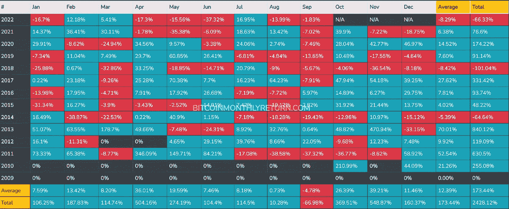
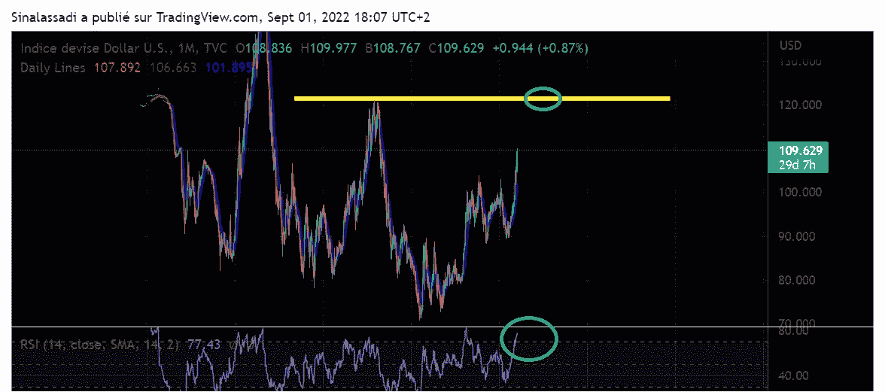
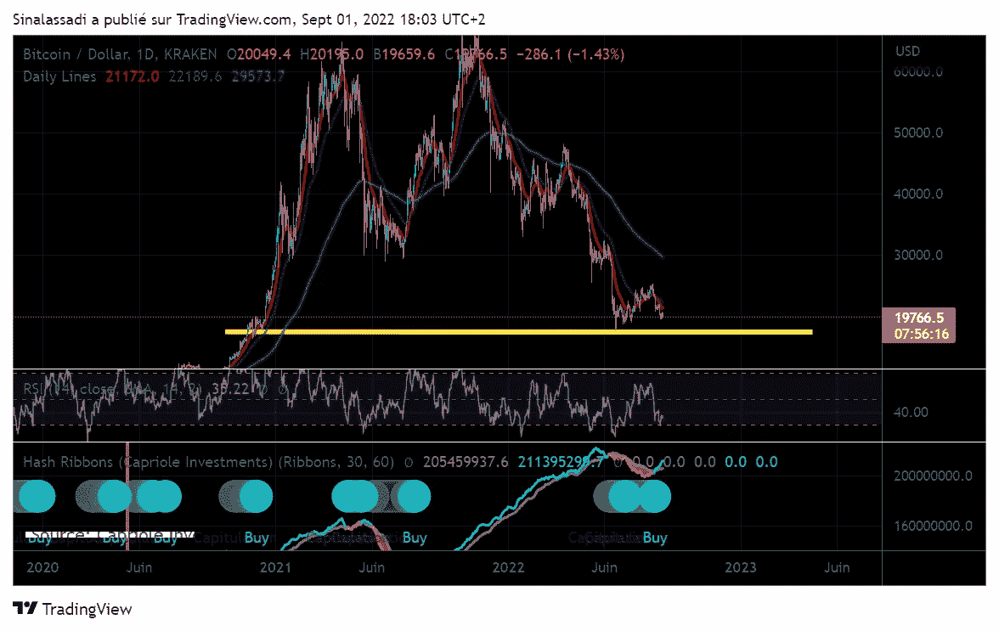
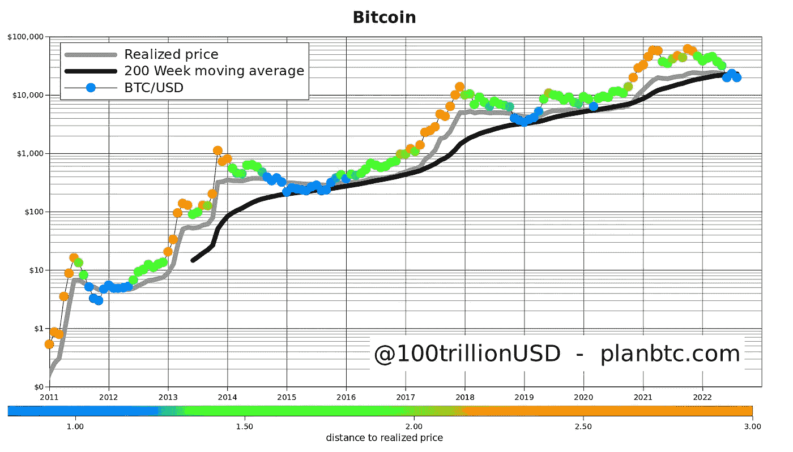
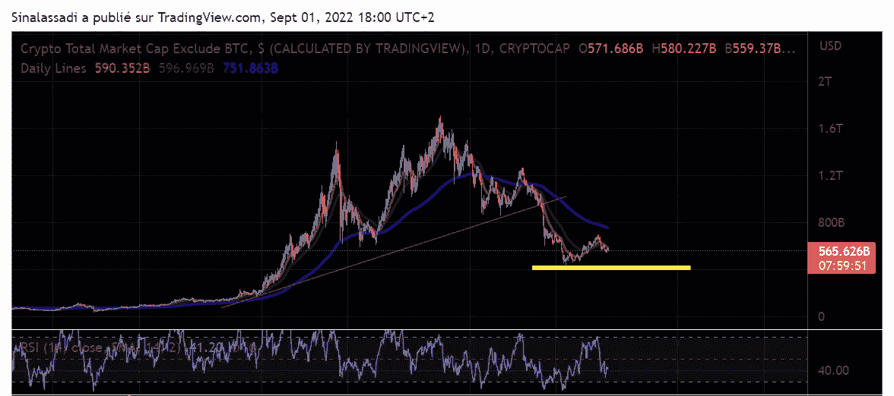

# 很快就该投资了！

> 原文：<https://medium.com/coinmonks/soon-time-to-invest-66c79d976a6b?source=collection_archive---------24----------------------->

Photo by [Hans Eiskonen](https://unsplash.com/@eiskonen?utm_source=unsplash&utm_medium=referral&utm_content=creditCopyText) on [Unsplash](https://unsplash.com/s/photos/bull?utm_source=unsplash&utm_medium=referral&utm_content=creditCopyText)

我们目前处于极端水平。下面我将展示确认*二次探底的指标。继续整合前的情景，然后是长期上升阶段。*

**但是*，我们还不会涨*** *，我在等比特币的市场价格先降下来，还有山寨币市场。*

# 比特币的月度表现

在比特币的月度业绩回顾上，我们看到 2017 年以来，9 月总是红色的！

[https://bitcoinmonthlyreturn.com/](https://bitcoinmonthlyreturn.com/)

# 美元指数

美元指数**正在绘制双顶**。如果继续上涨，可能会导致市场下跌。然后，随着美元指数的下跌，市场将恢复上涨。这将完成它的双顶模式。

在图中，我们可以看到，图表正在成为抛物线，美元在 RSI 上超买！这不可能永远持续下去。

# *让我们看看看涨信号。*

# 哈希丝带

在日线图上用蓝点表示买入信号**。**

最近几次这个信号出现，结果证明是正确的！

**例如:**2020 年 7 月价格 9140 美元，然后 2020 年 11 月 19600 美元。

然后我们到了 65000 美元，形成了 ATH。

2021 年 8 月，这个信号再次激活。经过春季的大幅调整，价格约为 29435 美元。

然后我们到了 69k 美元，形成了比特币的最后一个 ATH。

这将支持比特币 17.5 千的已知底部。我们不能再低了。对我来说，17.5k 的双底情景越来越强烈。

# 股票 2 流量模型

博主 B 计划最喜欢的指标也显示了低水平。在重建看涨形态之前，我们通常不会停留太久。

[From tweeter’s PlanB](https://twitter.com/100trillionUSD/status/1565356365711028225/photo/1)

在我的设想中，让当前的反弹结束吧。

然后，重新进入购买比特币的 18.5k 水平和替代币的 4350 亿资本化。

让我们也等待**《合并》**的发布。定于 9 月 15 日。

通常，当一项新技术在一个强有力的声明后问世，其资产价格就会下跌。

记得做你自己的研究，管理你的风险。

就是这条路！

> 交易新手？尝试[加密交易机器人](/coinmonks/crypto-trading-bot-c2ffce8acb2a)或[复制交易](/coinmonks/top-10-crypto-copy-trading-platforms-for-beginners-d0c37c7d698c)