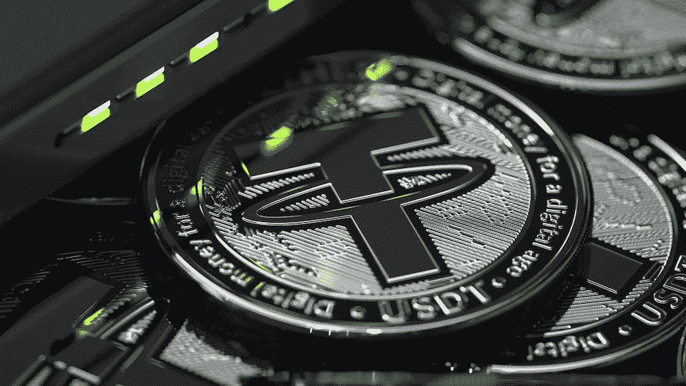

# 整理$USDT 周围的 FUD

> 原文：<https://medium.com/coinmonks/sorting-out-the-fud-around-usdt-bf062fd0f97d?source=collection_archive---------17----------------------->

嘿，伙计们，如果你关注了我的其他文章，你就会知道，在过去，我曾围绕不同的稳定资本、交易所和最近的[收益节点](/coinmonks/sorting-out-the-fud-around-yield-nodes-fc0adb32fc2f)深入研究过 FUD。到目前为止，我一直在犹豫是否要深入研究 Tether，因为有太多的信息要涵盖，而且只是因为我没有时间。出于同样的原因，我不打算整理 FUD 多年的价值…