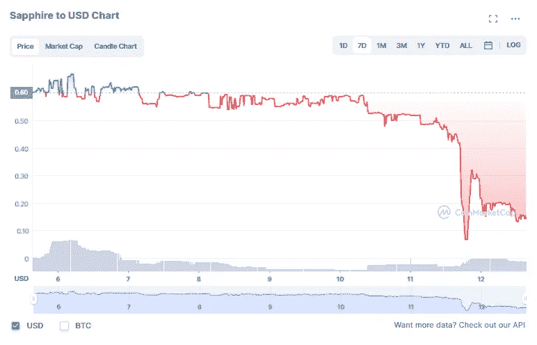
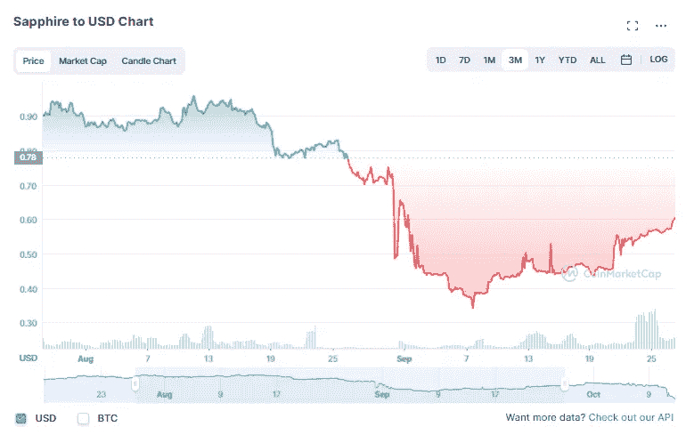
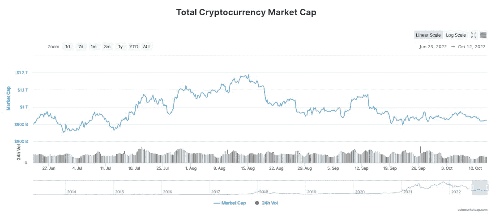

# 整理收益率节点周围的 FUD

> 原文：<https://medium.com/coinmonks/sorting-out-the-fud-around-yield-nodes-fc0adb32fc2f?source=collection_archive---------2----------------------->

嘿，伙计们，这里最重要的是完全透明——我在收益率节点上有资金，我已经用了大约 8 个月了。我以前写过关于他们最新的所谓“审计”报告的文章，但过去一周发生了很多事情，让很多人(包括我自己)非常担心收益率节点及其资金到底发生了什么。以下是我对所发生的事情的看法…

# 被交易所拒之门外

10 月 8 日，Yield Nodes 向用户发送了一封电子邮件，通知他们:

> **币安刚刚因为合规锁定了很大一部分资金。他们可能会在今天晚些时候解锁，但我们不能指望这个。作为一个项目，我们也不应该依赖他人的命令，任由我们无法控制的力量摆布**

还有一个[随后发布的视频](https://www.youtube.com/watch?v=Lycy-t-i2F4)，显示他们的账户上有大约 306 美元 BTC(约 610 万欧元)被锁定，无法提取。尽管电子邮件表明这个问题“可能”会在当天晚些时候得到解决，但在后来他们于 10 月 11 日发出的电子邮件中，他们表示他们在币安的资金仍被冻结，除了币安，他们在 Changelly 上也被冻结。

如果你也关注这条 reddit 帖子,看起来他们的问题不仅仅局限于币安或 Changelly，几周前，FTX 和北海巨妖也发出了欺诈警报并关闭了账户——另外两个顶级加密交易所。

# $SAPP 掉下悬崖

就在昨天(10 月 11 日)，收益率节点/Decenemy 的旗舰令牌$SAPP 的价格在不到一小时内下跌了近 85%:

这种下降的原因？如果你同步时间，我相信一个起作用的因素是基于一封电子邮件的绝对无能，这封邮件是在下跌发生前 10 分钟发出的(稍后将在这封电子邮件中详细介绍)。你可以说我是阴谋论者，但实际上这封邮件是在世界标准时间下午 4:46 左右发出的，然后在世界标准时间下午 4:55 左右，价格完全暴跌。

**其他攻击:**现在，如果我们稍微缩小一下$SAPP 的象征性价格，这种情况可能从 9 月份就开始了，因为价格在短短几周内从大约 0.90 美元涨到了大约 0.39 美元:

詹姆斯·佩尔顿在推特上简要描述了价格下跌的原因:

我不知道这些“攻击”的具体细节是什么，但我的最佳猜测是，拥有大量流动性的人能够通过买入/卖出压力造成大规模的价格混乱，从而对$SAPP 的价格造成重大影响，类似于点燃 Terra 死亡螺旋的情况。当我第一次阅读詹姆斯的推文时，我没有过多地关注它，但我不明白“他们如何致力于对袭击者采取法律行动”，除非这些袭击涉及非法行动。我肯定不是律师，但我无法理解鲸鱼袭击在技术上是非法的，尤其是在一个高度不受监管的市场——如果有什么不同的话，我认为这是所有低市值硬币面临的风险。无论如何，我能找到的关于这些攻击的唯一官方声明是在他们 10 月 11 日的电子邮件中，声明“我们的硬币不断受到攻击。”

看看$SAPP 的总市值，coinmarketcap 和 coingecko 都没有超过 2022 年 6 月的数据(这可能是另一个危险信号)，但在 6 月初的 0.72 美元，SAPP 的总市值超过 4 亿美元左右，这意味着以目前的象征性价格(假设所有其他因素都相同)，$SAPP 目前的总市值可能只有 6000 万美元左右。

# **很多借口都没有什么意义(也就是说，Urs 不应该再写官方声明了)**

这是关于 10 月 11 日的电子邮件，但你也可以在他们的[主网站](https://yieldnodes.com/)上查看该公告的副本。在这份声明中，他们列举了几个原因来解释为什么他们决定非常艰难地转向实物资产/NFT 模式来提供收入，包括:

1.  隐秘的冬天
2.  乌克兰战争
3.  高通货膨胀
4.  高能源价格
5.  欧元疲软
6.  封锁交易所

所有这些因素通常都是有意义的，但考虑到它们仅在 3 个月前接受了“审计”(或者更准确地说，可能提供了合规证明)，现在所有这些因素都达到了顶点似乎有点不诚实，尤其是因为加密市场的总市值并没有改变，实际上自那以后发生了很大变化:

此外，这些因素中的许多都发生在“审计”发生之前很久，最显著的是乌克兰战争(始于 2022 年 2 月下旬)和 cryptowinter，后者可能随着 Terra 的崩溃而在 5 月份创下最大低点(至少到目前为止)。仅从这封邮件中，我的 BS-radar(正如我想象的许多其他人的一样)就以最大音量响起。

尽管如此，我认为对我来说最有意义的最佳实际解释是首席执行官 Stefan Hoermann 在他的最新视频[中给出的，他解释说，所有体面代币的所有市场行为都停止了——这意味着无论代币的价格如何，都没有办法卸载流动性。如果没有流动性可以释放，那么投资者就没有回头路了。这种困境对我来说是有意义的，但我认为，如果知道这可能是早期失败的一个痛点会有所帮助，这样至少，潜在投资者在投入资金之前可以更好地了解他们将陷入什么样的境地。在这个解释之前，给出的唯一的另一个要点是$BTC 必须降到$8000。](https://www.youtube.com/watch?v=ysEBK8ZpsGY)

在我看来，Urs 的邮件写得很糟糕，让像我这样的投资者问了一大堆问题，更糟糕的是，他们觉得我们根本没有选择。据我所知，这是第一次引入术语“Yield Nodes Pro ”,也是第一次提到利用基于订阅的 NFTs——从第一印象的角度来看，我认为这两件事并没有给很多人留下好印象。如果 Yield Nodes Pro 真的可以盈利，我认为更早地分享更多信息是有意义的——或者比你停止提款的那天更早。我明白，有时候真的没有办法承受坏消息，但老实说，很多坏消息本可以说得更清楚，更不突兀。

# 澄清一些问题

回到首席执行官最近的视频，我总结了一些要点，这些要点确实提供了一些说明:

1.  提款(和存款)将被无限期搁置，直到他们能够整理出更多的收益节点 Pro。也就是说，当尘埃落定时，听起来他们可能会考虑让人们获得有标记的紧急提款的可能性。
2.  必须完成向 Yield Nodes Pro 的艰难转型，因为他们只有 10%的流动性来偿还投资者，尽管 Yield Nodes Pro 模式需要更长的时间，但这是他们让客户完整的计划。
3.  如果市场复苏，他们可以重新打开水龙头，重新整合他们的主导模式来创造收入。他们甚至主动向 doxx 提供他们在 SAPP 的地址，以表明他们没有试图欺骗顾客。

我的看法:不管你是否相信 Stefan Hoermann 在视频中所说的话，我很欣赏他们讲述了发生的事情的步骤，以及为什么必须进行转移。情绪高涨，在过去的 48 小时里发生了很多事情，如果他们没有发布这段视频，我想负面情绪只会增长得更多。

# 结论/我对未来的担忧:

Decenemy/Yield Nodes 团队要赢得投资者的心，还有一场艰苦的战斗。在过去的一年中，如此多的散户投资者经历了所有的骗局和骗局，这就解释了为什么社区中有如此多的刻薄情绪，尤其是在没有很多明确沟通的情况下。我真心希望 Yield Nodes Pro 是可行的，这是一条让人完整的道路。也就是说，我确实有几个大问题，它们是:

1.  我不知道任何真实世界的资产升值如此之快，尤其是在熊市当中。我知道他们的预测一直到 2024 年，但我担心这可能需要更长的时间。
2.  从现在到那时，如果他们没有恢复社区信任，一旦他们恢复提款能力，他们可能会经历一次流动性紧缩。这意味着，他们将不得不以一种让流动性慢慢流出的方式来安排事情，导致人们需要更长的时间才能恢复健康。
3.  鉴于我们所看到的目前与 Celsius 有关的法律后果，我已经看到数十人对 Yield Nodes 发出法律威胁，我想知道 Yield Nodes 将不得不经历哪些法律障碍，以及这可能如何显著延迟该过程。Celsius 在近 4 个月前冻结了他们的提款，如果有的话，事情似乎变得更糟了。
4.  我不确定他们有多少 AUM，但我也担心这对整个加密市场会有什么更大的影响，会有什么后果。这会是另一次秘密市场下跌的催化剂吗？这会促使监管者拧紧螺丝吗？

鉴于目前我所读到和看到的，Yield Nodes 似乎不是庞氏骗局或骗局，而是一个失败的项目模型，几乎没有任何警告。这可能不是庞氏骗局或骗局的事实会让我感觉好点吗？不，但这确实意味着资金仍有可能收回，尽管可能需要很长一段时间。为了每个人(包括我的)，我希望 Yield Nodes 团队记住所有这些，并保持动力，使其支持者完整。与此同时，我想我们只能等着看事态发展。

感谢阅读，请一如既往地在 twitter 上关注我，阅读我的最新发现和更新:[https://twitter.com/CryptosWith](https://twitter.com/CryptosWith)

声明:这些信息都不是财务建议，只是我在网上随便找的一个人的推测。请考虑这纯粹是教育和娱乐的目的。像往常一样，请做你自己的研究或联系财务顾问，找到什么投资可能最适合你。

> 交易新手？试试[加密交易机器人](/coinmonks/crypto-trading-bot-c2ffce8acb2a)或者[复制交易](/coinmonks/top-10-crypto-copy-trading-platforms-for-beginners-d0c37c7d698c)