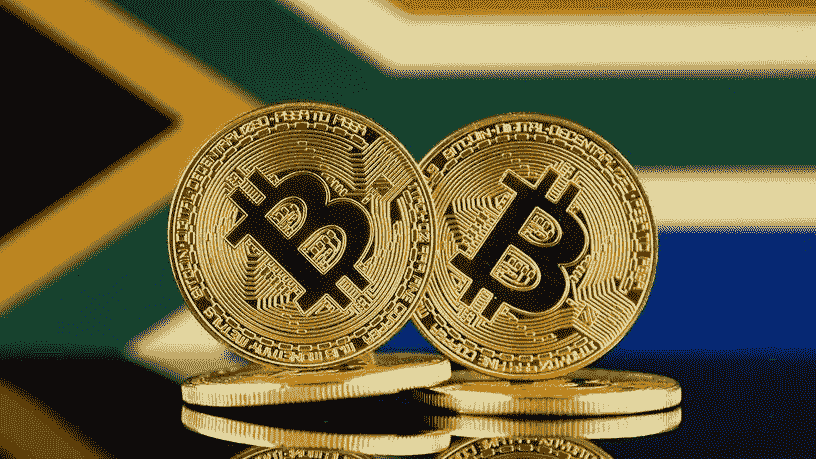

# 南非将密码作为金融资产进行监管

> 原文：<https://medium.com/coinmonks/south-africa-to-regulate-crypto-as-financial-asset-c9629373a044?source=collection_archive---------46----------------------->

南非储备银行(South African Reserve Bank)将于明年出台法规，将加密货币归类并视为金融资产，以平衡投资者保护和创新。

根据 global exchange Luno 的研究，南非的加密货币使用处于健康的空间，估计约有 13%的人口拥有某种形式的加密货币。由于该国有超过 600 万人接触加密货币，对该领域的监管一直是一个话题。

希望提供涉及加密货币的建议或中介服务的公司或个人目前需要被认可为金融服务提供商。这涉及满足一些复选框，以符合金融行动特别工作组制定的全球准则。

2022 年 2 月公布的南非国库预算审查正式引入了将加密货币宣布为金融产品的举措。该国还计划加强对加密货币交易的监测和报告，以遵守该国的外汇法规。

南非储备银行(South African Reserve Bank)副行长库本切蒂(Kuben Chetty)周二在当地投资公司 PSG 主办的在线系列节目中表示，他现在已经确认，新的立法将在未来 12 个月内出台。这将使加密货币属于《金融情报中心法》(FICA)的范围。

> 交易新手？试试[加密交易机器人](/coinmonks/crypto-trading-bot-c2ffce8acb2a)或者[复制交易](/coinmonks/top-10-crypto-copy-trading-platforms-for-beginners-d0c37c7d698c)

这一点非常重要，因为它将允许该行业受到洗钱、逃税和恐怖主义融资的监控，这是加密货币和区块链去中心化性质的一个备受争议的副产品。

Chetty 强调了 SARB 将在未来 12 个月内引入这一新的监管环境。首先，它将宣布加密货币是一种金融产品，允许根据《金融情报中心法》将其列为附表。

此后，将为交易所制定一个监管框架，其中将包括某些了解你的客户(KYC)的要求，以及满足税收和外汇管制法律的需要。预计交易所还将发布“健康警告”，强调亏损风险。

Chetty 指出，在过去十年中，SARB 对该部门的态度发生了显著变化。大约五年前，该机构认为没有必要进行任何监管监督，但将加密货币定义为金融资产的观念逐渐转变，改变了这一立场:

> “根据所有的定义，它(加密货币)不是一种货币，而是一种资产。它是可以交易的东西，是被创造出来的东西。有些人有后台，有些人没有。有些可能有真正的基础，真实的经济活动。”

副总督坚持认为，SARB 不认为加密货币是一种货币形式，因为人们认为加密货币无法用于日常零售，而且具有相关的波动性。

Chetty 同意，对该领域的持续兴趣产生了监管该行业的需要，并促进其与主流金融的融合，“以平衡兴奋和炒作与所需的投资者保护的方式。”

SARB 还继续探索引入中央银行数字货币(CBDC)的可能性，最近于 2022 年 4 月完成了技术概念验证。Khokha 项目的第二阶段涉及使用一个总部设在区块链的系统与一些银行进行清算、交易和结算，这些银行是政府间金融科技工作组(IFWG)的一部分。

点击这里，关注我们的更多故事[。](http://t.me/etellworld)

> 加入 Coinmonks [电报频道](https://t.me/coincodecap)和 [Youtube 频道](https://www.youtube.com/c/coinmonks/videos)了解加密交易和投资

# 另外，阅读

*   [比诺莫评论](https://coincodecap.com/binomo-review) | [斯多葛派 vs 3Commas vs TradeSanta](https://coincodecap.com/stoic-vs-3commas-vs-tradesanta)
*   [Capital.com 评论](https://coincodecap.com/capital-com-review) | [香港的加密借贷平台](https://coincodecap.com/crypto-lending-hong-kong)
*   [如何在 Uniswap 上交换加密？](https://coincodecap.com/swap-crypto-on-uniswap) | [A-Ads 审查](https://coincodecap.com/a-ads-review)
*   [WazirX vs coin dcx vs bit bns](/coinmonks/wazirx-vs-coindcx-vs-bitbns-149f4f19a2f1)|[block fi vs coin loan vs Nexo](/coinmonks/blockfi-vs-coinloan-vs-nexo-cb624635230d)
*   [本地比特币评论](/coinmonks/localbitcoins-review-6cc001c6ed56) | [加密货币储蓄账户](https://coincodecap.com/cryptocurrency-savings-accounts)