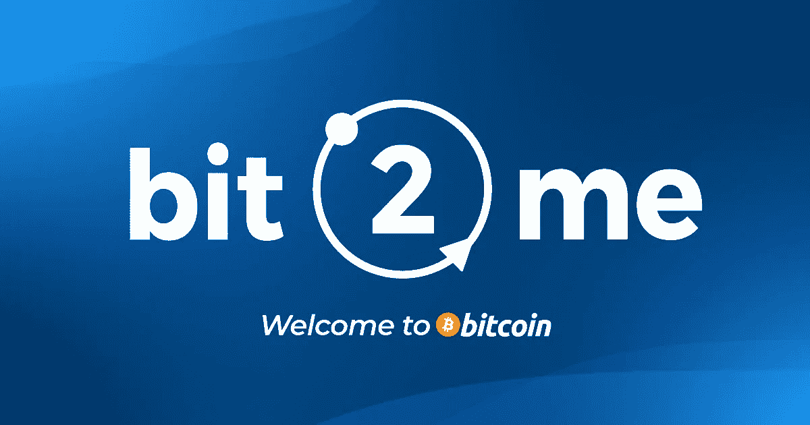

# 西班牙密码交易所 Bit2Me 收购软件开发公司 Dekalabs。

> 原文：<https://medium.com/coinmonks/spanish-crypto-exchange-bit2me-acquires-dekalabs-a-software-development-company-a838def7edbd?source=collection_archive---------50----------------------->

“…我们可以让许多公司融入加密货币行业。”

Bit2Me

[Bit2Me](https://bit2me.com/) 收购了一家加密软件开发公司 Dekalabs。他们在今天早些时候通过其通讯办公室披露了这一消息，但没有说明收购的财务细节。

根据 Bit2Me [新闻发布文件](https://mcusercontent.com/316a1aaebe96b3819d68c79a5/files/8ef709d4-8700-224c-3716-95f31addf4cb/DEKALABS_ENGLISH.01.pdf)，该公司收购了 Dekalabs，以加强新的 Bit2Me 服务产品- Bit2Me 咨询。该服务将帮助公司、机构和政府在比特币和以太坊等加密货币区块链协议上构建 Web3 工具。

**还有什么？**

尽管 100%收购了 Dekalabs，Bit2Me 的首席执行官叶小开·费雷拉说 [Dekalabs](https://dekalabs.com/) 将“继续自主运营，就像过去几年一直做的那样。通过这次收购，我们希望 Dekalabs 充分利用我们在 Bit2Me 每天看到的机会。我认为，与 Dekalabs 一起，我们可以让许多公司融入加密货币行业。”

Dekalabs 的前首席执行官大卫·奥尔特加(David Ortega)已被任命为 Dekalabs 的董事长兼 Bit2Me 的首席创新官。与此同时，Dekalabs 前首席执行官桑德拉·加西亚(Sandra Garcia)接任首席执行官一职。

Dekalabs 的前首席执行官对此次收购有这样的看法:“Dekalabs 在 Bit2Me 中的整合无可辩驳地证明了我们在公司所做的出色工作。由于 Bit2Me 对加密货币世界以及监管和法律合规性的了解，我相信这项工作将会有更大的改进，”

像币安一样，Bit2Me 是一个加密货币平台，提供交易、钱包和赌博服务。西班牙央行首先承认加密货币平台是一家数字资产服务提供商。7 月，Coindesk [报道称](https://www.coindesk.com/business/2022/07/07/spanish-crypto-exchange-bit2me-to-double-headcount-make-three-acquisitions/?utm_medium=referral&utm_source=rss&utm_campaign=headlines)该公司签署了三项收购的谅解备忘录，在拉丁美洲的一个交易平台拥有 90%的股份，并收购了一家金融科技公司和一家软件开发商。

叶小开·费雷拉说，“我们期待在接下来的几个月里与业内其他公司达成新的整合机会。”

> 交易新手？试试[加密交易机器人](/coinmonks/crypto-trading-bot-c2ffce8acb2a)或者[复制交易](/coinmonks/top-10-crypto-copy-trading-platforms-for-beginners-d0c37c7d698c)