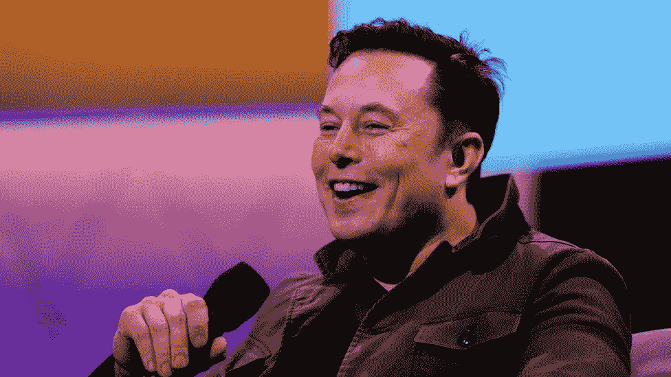
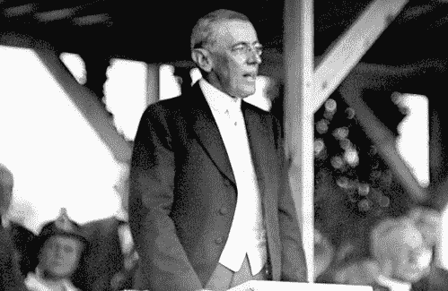
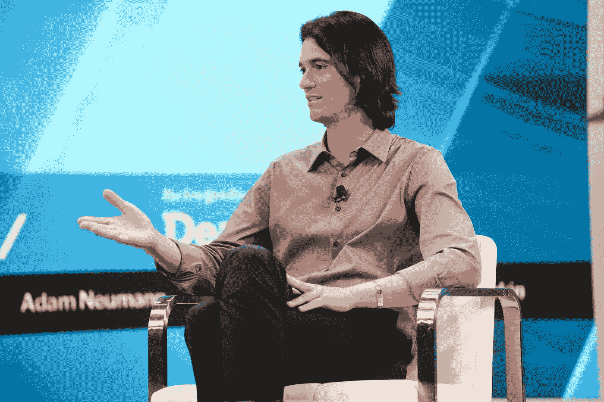
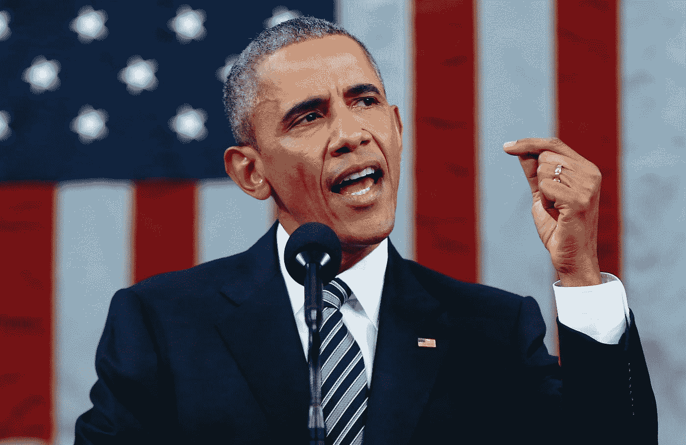

# 在直播电台上讲话比你想象的要难

> 原文：<https://medium.com/coinmonks/speaking-on-live-radio-is-harder-than-you-think-e660c385947e?source=collection_archive---------36----------------------->

Go back and see old footage of Elon speaking live and you will know the definition of awkward.

不久前，我在电台直播节目中发言，学到了宝贵的沟通经验。

为了效果说话和清晰是每个领导者或创始人都应该拥有的神奇工具。

你必须明智地选择你的话，让它们有价值。

你必须坦率地交流，在表达之前首先绝对清楚你想说什么。

哦，孩子，你交流的时间越短，就越难。

不知何故，当你在电台直播时，时间过得飞快。

眨眼整个面试就结束了。

一名内阁成员祝贺伍德罗·威尔逊总统开创了短小演讲的时尚，并询问他准备演讲所花的时间。

May 30, 1914: President Woodrow Wilson’s Memorial Day Address

他说:

“看情况。如果我要讲十分钟，我需要一周的准备时间；

如果十五分钟，三天；

如果半小时，两天；

如果一个小时，我现在准备好了。"

很容易畅所欲言，没有时间限制和约束。

你的想法可以不间断地流动，你可以在前进的过程中修补思路。

不知何故，当你对着永恒说话时，这些文字会在你面前形成一条想象的路径。

但是要简洁，让你的话有影响力，这是一个很难掌握的技能。

The all-new Adam Neumann is a masterclass for speaking and live interviews.

你只有几分钟的时间来抓住注意力，并在你的头脑中播种想法。

你必须学会如何准确地表达和沟通以产生影响。

练习你想说的话，自信地说出来。

慢慢来，否则你会被自己的话绊倒，听起来很业余。

然后还有对你的观众说话的部分，不要超过他们。

了解你的听众和你在跟谁说话，你就会明白是什么让他们动心。

作为一个演讲者，没有什么比不切题和“令人讨厌”更糟糕的了。

记住，大声说话或啰嗦很容易。

在你的交流中，努力做到清晰、明确、有针对性。

Command of language is one thing, delivery for impact and effect is another.

也许这就是摩尔斯电码被发明的原因。

几个简单的点和破折号可以讲一个故事。

没有什么好困惑的，情绪也完全被排除在外了。

它可以跨越海洋传播到太空深处。

它可以扭转战争的趋势，改变历史的进程。

现在，当我看到像埃隆·马斯克和杰夫·贝索斯这样的名人在数百名现场粉丝面前回答问题时，我可以欣赏他们是多么冷静和老练。

所以拜托了，精准交流，疯狂练习。

-

良好的沟通解决了生活和工作中的大部分问题吗？

-

# startups # business # startupx # growth # success # social media # culture # web 3 # strategy # jeffbezos # speaking # communication # radio # liveradio # interview # precision # eth # BTC # crypto

> 交易新手？试试[加密交易机器人](/coinmonks/crypto-trading-bot-c2ffce8acb2a)或者[复制交易](/coinmonks/top-10-crypto-copy-trading-platforms-for-beginners-d0c37c7d698c)