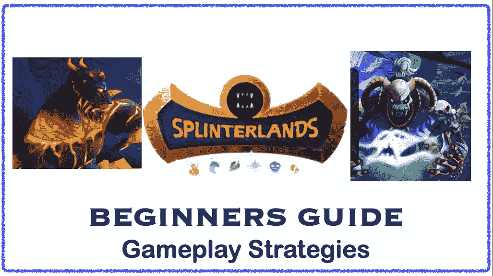

# 夹板地:游戏新手指南

> 原文：<https://medium.com/coinmonks/splinterlands-beginners-guide-to-gameplay-4db1586f513b?source=collection_archive---------41----------------------->

这篇文章是专门针对那些最近开始玩《分裂之地》或者考虑开始玩这款 NFT 游戏的人的。这个游戏实际上是非常直观的，过一会儿你将会根据你的牌的喜好和从游戏中获得的经验来建立先进的策略。对于一个初学者来说，这可能有点让人不知所措，因为有许多卡片参数和游戏性因素…