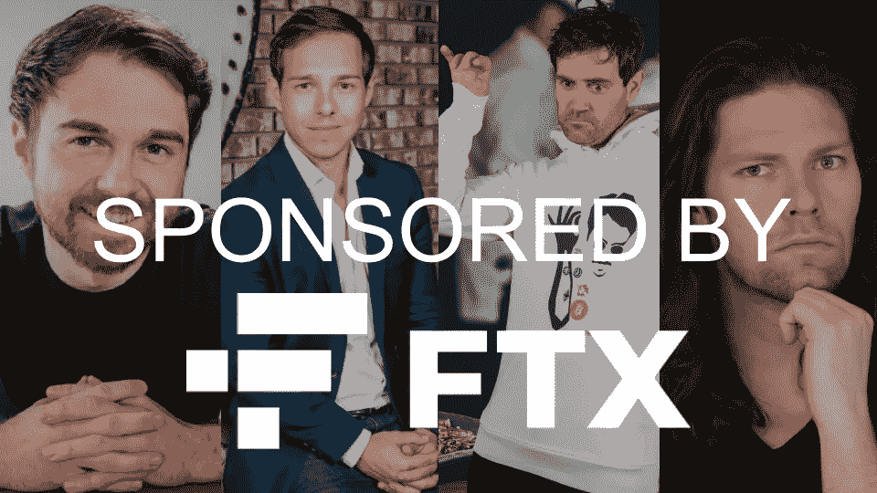

# 由 FTX 赞助——为什么影响者问责制很重要

> 原文：<https://medium.com/coinmonks/sponsored-by-ftx-why-influencer-accountability-matters-68897ad6da18?source=collection_archive---------8----------------------->

以下影响者有什么共同点？

安德烈·吉赫
格拉汉姆·斯蒂芬
硬币局
马克斯·马希尔

所有这些有影响力的人都宣传了 FTX，现在他们的观众已经在加密方面损失了大量资金。

在进入 Web 3 之前，我在影响者营销行业工作了 5 年。我在这个领域学到的一件事是，几乎每个影响者都有一个价格。

当我看着 FTX 的失败结束时，我想知道在观众和影响者之间形成信任感的准社会关系。

这里有一些细微的差别需要分析，所以暂时忍受一下我内心的独白。

这些创作者对宣传 FTX 有没有真正的负罪感？

我看了道歉视频，虽然创作者在镜头中看起来很懊悔，但我不禁认为道歉是为了控制损失，而不是真正的后悔。毕竟，这些有影响力的人在他们的品牌交易中大赚了一笔，并没有受到他们的观众因 FTX 事件而遭受的损失的实质性影响。

与 FTX 合作在道德上有所妥协吗？

虽然后知之明是 20/20，但在接受赞助时，我不认为这些有影响力的人认为与 FTX 这样看似保守的品牌合作有损道德。

尽职调查呢？

影响者很难对 FTX 这样的大公司进行必要的尽职调查，然而，尤其是“金融教育影响者”应该义不容辞地审查他们的赞助商。

也就是说，没人能预测到 FTX 会像现在这样内爆。

真的吗？仅今年一年就有多少加密公司倒闭了？

Terra-Luna 的崩溃带来了 2022 年的隐秘冬天。随着多米诺骨牌开始倒下，像 Celcius 和 Vauld 这样的密码交易所一夜之间内爆。3AC 失宠了，因为它被揭露只不过是一家德根赌注公司。

考虑到 Web 3 领域已经发生的事情，也许有影响力的人应该避开任何他们的观众可以投资 crypto 的机构的赞助。毕竟，崩盘的可能性总是存在的，如果没有足够的消费者保护措施，人们可能会在没有追索权的情况下失去他们一生的积蓄。

影响者问责制很重要，道歉视频无法弥补失去的生活积蓄。

今年，我改变了我的整个职业轨迹，从影响者行业转向 Web 3。看到事情的发展，我现在有些后悔。我曾考虑回到影响者营销的世界，但考虑到这个领域缺乏责任感，我也不确定这是否适合我。

我的想法和所有受这整个情况影响的人一样。照顾好你自己和你的精神健康。生活中有比金钱更多的东西。

我的社交:

 [## wasifmrahman | Twitter、Instagram | Linktree

### 拉面鉴赏家 Web 3 营销@ Gala Games 高级经理

linktr.ee](https://linktr.ee/wasifmrahman) 

> 交易新手？在[最佳密码交易所](/coinmonks/crypto-exchange-dd2f9d6f3769)上尝试[密码交易机器人](/coinmonks/crypto-trading-bot-c2ffce8acb2a)或[复制交易](/coinmonks/top-10-crypto-copy-trading-platforms-for-beginners-d0c37c7d698c)