# 宇宙中的稳定标记

> 原文：<https://medium.com/coinmonks/stable-tokens-in-the-cosmos-76591db5b538?source=collection_archive---------5----------------------->

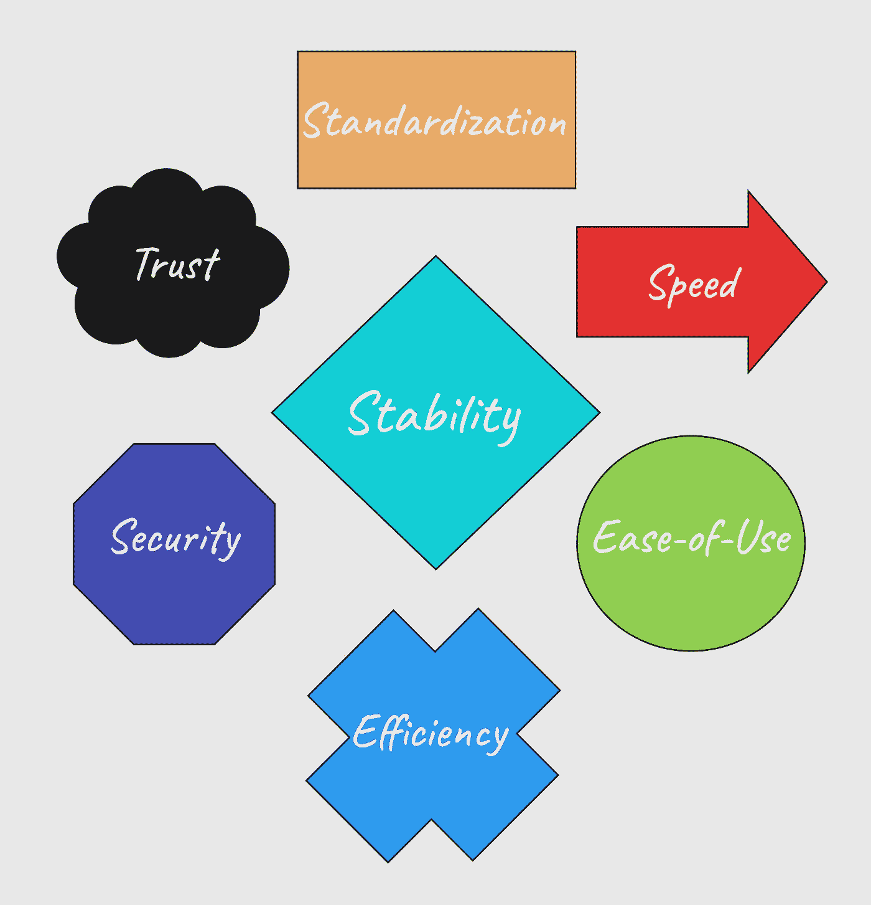

当我第一年深入参与加密货币、区块链技术和代币经济的时候，我开始反思是什么开启了这场惊人的探索之旅。回到去年 8 月，我买了我的第一个代币，一个叫做 ust 的稳定硬币，并把它存入锚协议。这个事件引发了一场发现旋风，让我研究并尝试了数百种协议、dApps 和区块链工具。

## **终究不是那么稳定**

尽管我已经多样化了，并且旅行到了地球生态系统的边界之外，但看到这样一艘巨轮突然抛锚并坠入深海的绝对速度仍然令人震惊。我比其他人更幸运，因为我能够用早先锚定的 UST 收益的利润来弥补损失；然而，整个活动是一次大开眼界的经历。这是令人筋疲力尽的，在五月和六月那些混乱的事件之后，我需要一个喘息的机会，这些事件是由 Terra 生态系统中的脱钩漩涡引发的。我决定远离这些名称不佳且不太稳定的令牌！

## **可预测的公用令牌**

我试了又试，几个星期到将近两个月，学习和使用协议，没有使用一个稳定的令牌。我使用繁忙的区块链的治理代币作为一种货币形式，只是为了避免使用挂钩代币。在燃烧了许多珍贵的 ATOM、JUNO 和 OSMO 令牌后，我终于意识到这不是一个可行的策略，毕竟稳定令牌的用例很吸引人。

原因如下:

*   易变代币需要不断重新定价与它们一起购买的其他数字资产。
*   不断地重新计算你的进场、持有和出场价格是一件痛苦的事情。
*   许多治理令牌在区块链并不流行。
*   从一个区块链生态系统到另一个生态系统所代表的顶级治理令牌，需要支付大量的天然气费用来移动它们。
*   这些治理令牌中的一些是投资质量，将它们用于网络费用或交换费用是非常痛苦的。

我再次得出结论，我们需要具有以下特征的令牌:

*   仅限于价格不波动。
*   可随时从本国货币或首选法定货币中兑换。
*   在生态系统中所有分散的交易所中轻松购买和交易。
*   用于金融和商业结算。
*   起到交易货币的作用(比法定货币快很多倍)。
*   被生态系统中的许多或所有 dApps 接受为交易付款。
*   相对于所有其他代币，用作参考值或标准面额。
*   用作向新用户介绍区块链技术概念的示例。

换句话说，我兜了一圈，意识到我们确实需要被广泛接受的实用稳定令牌！在积极参与宇宙生态系统的过程中，我研究了目前正在流通的和正在开发的东西，以适应这些特征并挑战现有者。

## **目前在宇宙中流通的代币**

以太坊生态系统中稳定的代币巨头们迅速利用了 UST 从一美元跌到几便士后留下的真空。Circle 的产品 USDC 占据了排行榜的首位，成为绝大多数宇航员的稳定选择。Maker 的戴、Tether 的、eMoney 的 eEUR、Kava 的、和 Frax Finance 的排在最后，但在 5 月和 6 月的市场低迷期间，大多数用户都在 USDC 寻求庇护。

在下面的表格中，我从几个方面比较了这些稳定的令牌。这些稳定的硬币发行者的网站链接在本文末尾的来源部分。

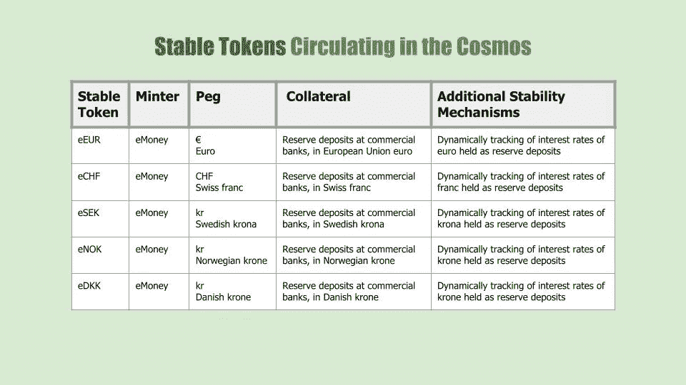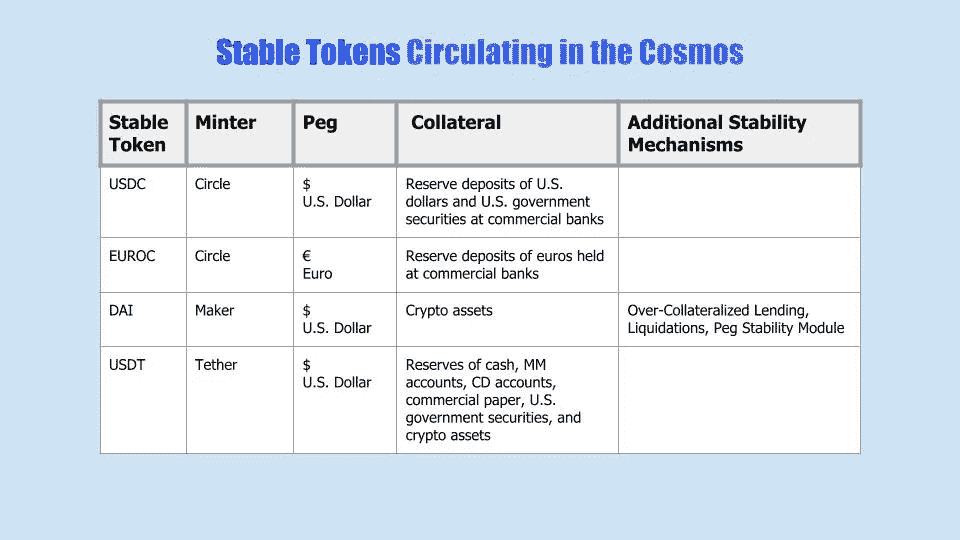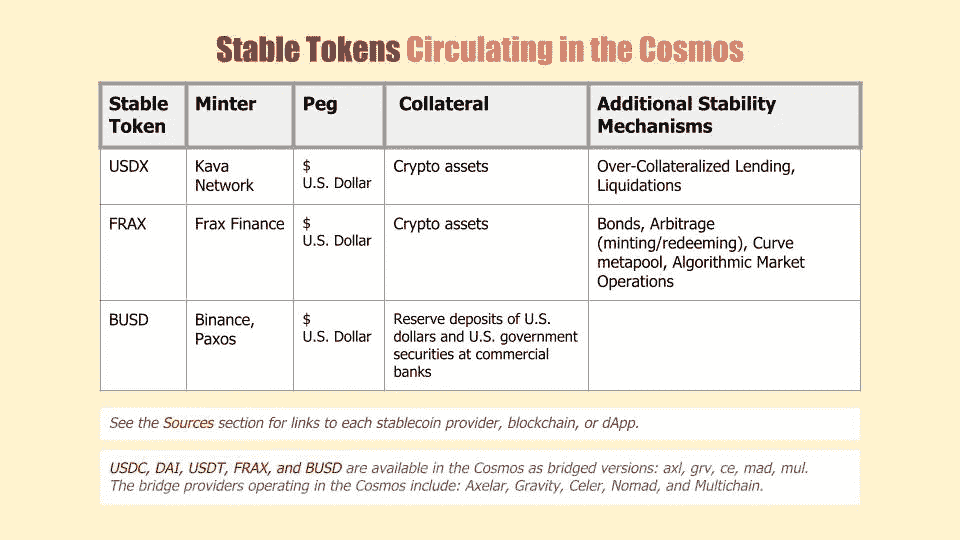

这些稳定的代币可以在分散的交易所和聚合器上交易，包括:

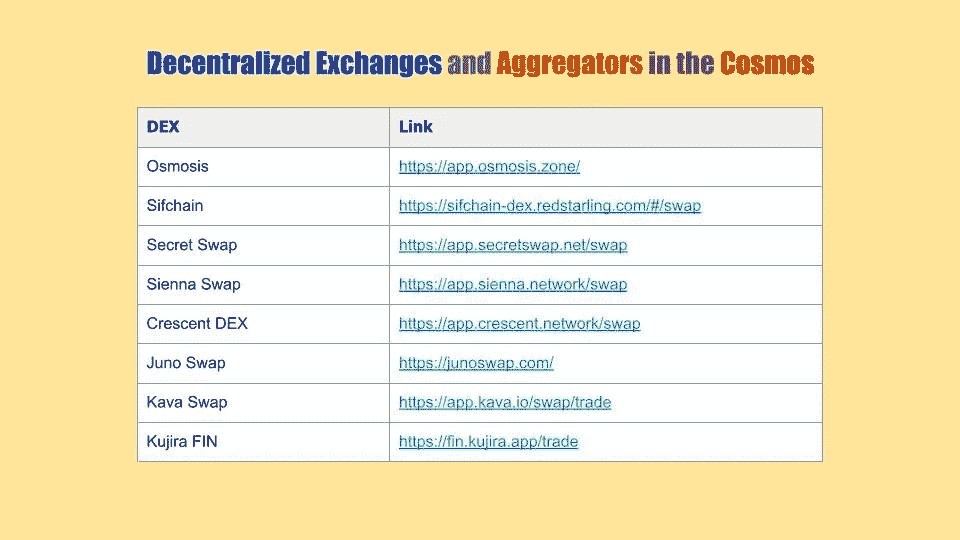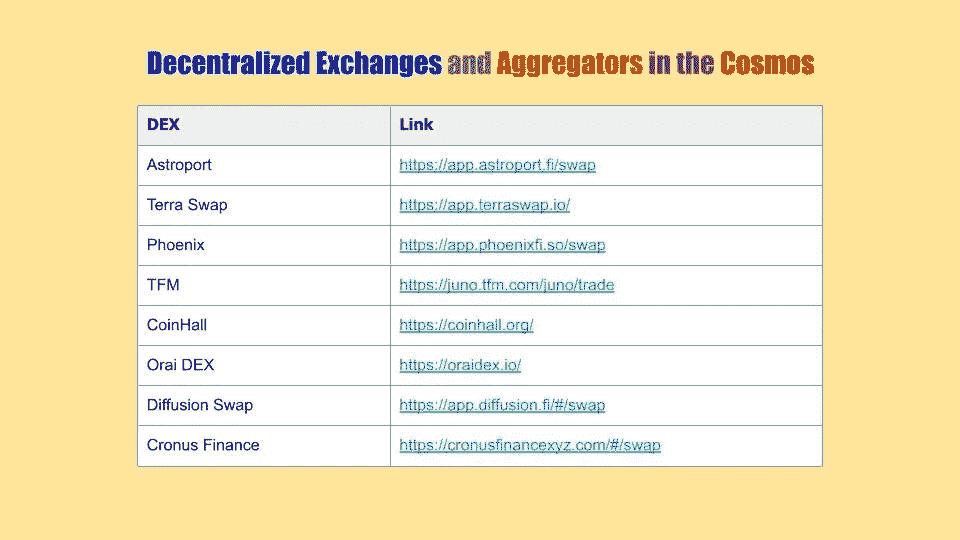

## **宇宙中正在开发的新代币**

三个令人兴奋的本地稳定令牌即将在宇宙中揭开面纱。他们的上市似乎由于 Terra 事件和随后的市场动荡而推迟了。利用过去几个月的事件来微调这些新的稳定令牌的机制是非常明智的。

在下面的表格中，我深入研究了 Inter、Shade 和 Composite 协议为我们准备了什么。我还在资源部分提供了每个项目的网站、博客、几个视频频道和我以前写的文章的链接。

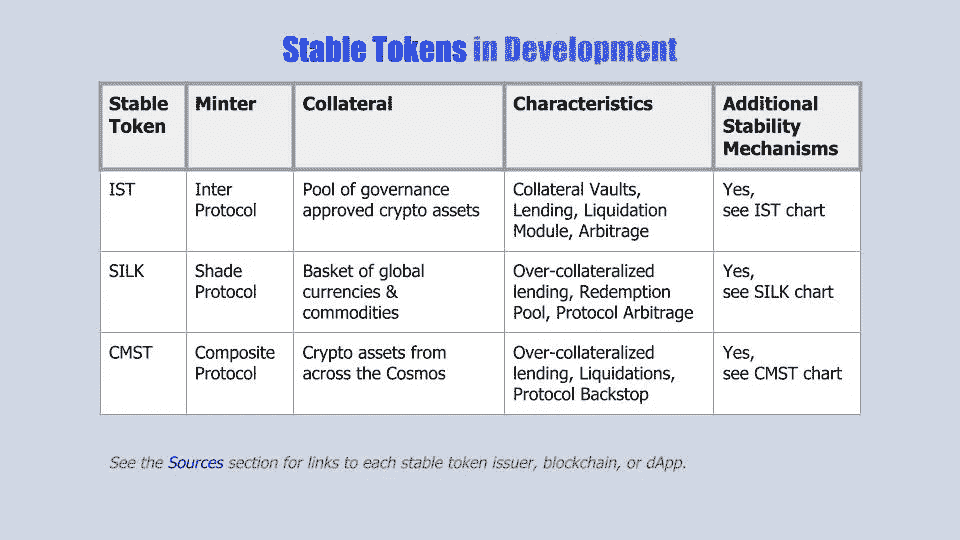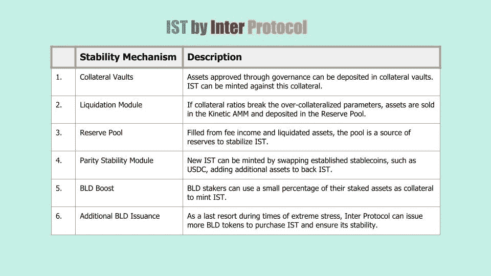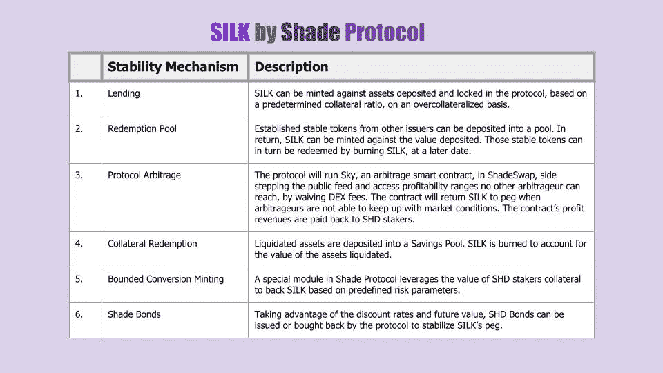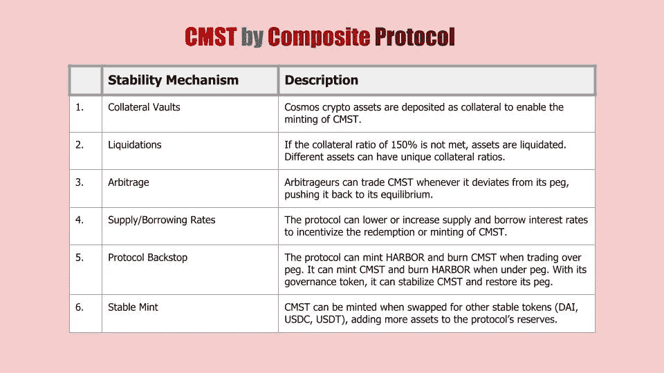

## **实用，但不稳定！**

尽管灾难性的突然结束，Terra 的 UST 令牌作为其生态系统中的公用设施令牌工作得非常好。在 5 月初那个灾难性的周末之前，所有交易都是以等值的一美元计价的。处理速度极快，超级简单，并且在一百多个不同的 dApps 上保持一致。这些代币很容易转让，上船也很快而且便宜。

显然，这个特殊的算法“稳定”令牌被证明像北大西洋的泰坦尼克号一样稳定；然而，公用事业稳定令牌的上述特征和功能正是像宇宙这样充满活力的生态系统所需要的。

## **宇宙中的原生稳定令牌**

有了完全抵押支持和多重稳定机制，像 IST、西尔克和 CMST 这样的新进入者可以实现真正的交易型多用途代币的承诺。一旦流通，我将把这些代币加入我的投资组合，并开始试用它们。我还将继续分散我的稳定代币投资组合，并在以后报告它们的表现以及我的经历。除了这里讨论的令牌，另一个稳定的令牌 ULTRA 正在开发中，预计将在不久的将来在 Juno 网络上发布。目前没有足够的信息对其进行评估；然而，当更多的细节发布时，我会深入研究它。

我谨慎乐观地认为，即将在宇宙中推出的新的分散式稳定令牌将提供能够带来新一波交易效率的实用水平。就我个人而言，我相信妥善管理的稳定令牌将是下一代宇航员登机的关键因素！

他在门口喊——Opa。

## **来源、参考资料和进一步阅读**

https://agoric.com/的 T2

广场推特—@广场

协议间推特—@协议间

Agoric 博客—【https://agoric.com/blog/ 

协议间白皮书草案—[https://agoric . com/WP-content/uploads/2022/05/Draft-Inter-Protocol-white paper-v 0.9-1 . pdf](https://agoric.com/wp-content/uploads/2022/05/Draft-Inter-Protocol-Whitepaper-v0.9-1.pdf)

我第一篇介绍 Agoric 的文章:[https://medium . com/coin monks/the-future-is-build-on-JavaScript-with-Agoric-systems-c 7 FDE CB 876 b 2](/coinmonks/the-future-is-built-on-javascript-with-agoric-systems-c7fdecb876b2)

我的第二篇研究集市经济的文章:[https://medium . com/coin monks/crafting-an-inter-chain-economy-with-Agoric-74b 74 b 3052 c](/coinmonks/crafting-an-inter-chain-economy-with-agoric-74b74b3052c)

遮光帘协议—[https://shadeprotocol.io/](https://shadeprotocol.io/)

树荫推特—@树荫 _ 协议

屌丝推特— @Silk_Stable

阴影白皮书—[https://shadeprotocol.io/pdf/Shade_Protocol_Whitepaper.pdf](https://shadeprotocol.io/pdf/Shade_Protocol_Whitepaper.pdf)

丝绸白皮书—[https://shadeprotocol.io/pdf/Silk_Whitepaper.pdf](https://shadeprotocol.io/pdf/Silk_Whitepaper.pdf)

树荫博客—[https://medium.com/@shadeprotocoldevs](/@shadeprotocoldevs)

荫凉之家 YouTube 频道—[https://www.youtube.com/channel/UCCK9tPCUf7HNFgg7P1lJd3Q](https://www.youtube.com/channel/UCCK9tPCUf7HNFgg7P1lJd3Q)

https://comdex.one/

Comdex Twitter — @ComdexOfficial

复合推特—@复合 _ 金钱

Comdex 博客—【https://blog.comdex.one/ 

Comdex YouTube 频道—[https://www.youtube.com/c/ComdexOfficial/featured](https://www.youtube.com/c/ComdexOfficial/featured)

中型文章“介绍复合材料:IBC 的抵押稳定币”——[https://blog . com dex . one/Introducing-Composite-A-Collateralized-stable coin-for-IBC-BC 76 e 15 fa 2 EC](https://blog.comdex.one/introducing-composite-a-collateralized-stablecoin-for-ibc-bc76e15fa2ec)

电子货币—[https://e-money.com/](https://e-money.com/)

圆圈—[https://www.circle.com/en/usdc](https://www.circle.com/en/usdc)

制造者刀—

系绳—[https://tether.to/en/](https://tether.to/en/)

https://www.binance.com/en 币安

https://paxos.com/stablecoin-and-payments/#

法国—[https://frax.finance/](https://frax.finance/)

## 你可以在这里找到我

推特— @KaasKop_Opa

中等—[https://medium.com/@KaasKop_Opa](/@KaasKop_Opa)

循环—[https://www.loop.markets/user/52879](https://www.loop.markets/user/52879)

利奥金融—[https://leofinance.io/@kaaskop](https://leofinance.io/@kaaskop)

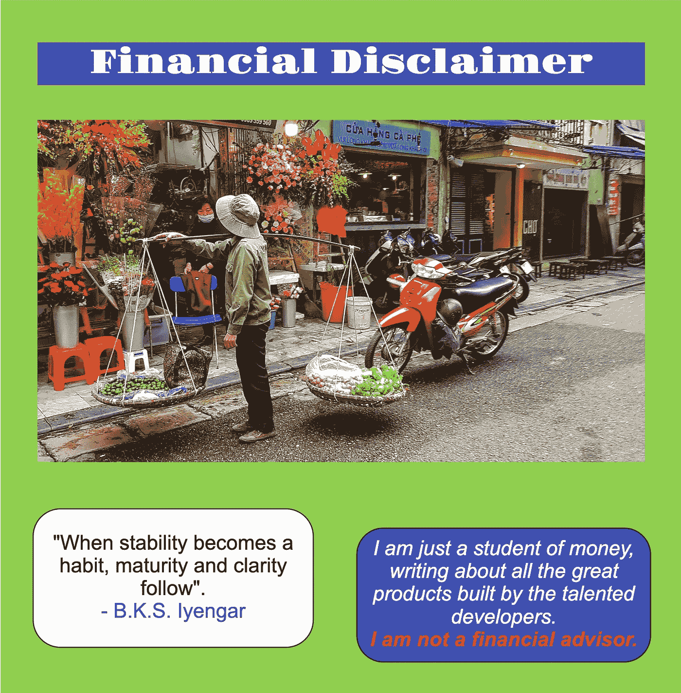

> 交易新手？尝试[加密交易机器人](/coinmonks/crypto-trading-bot-c2ffce8acb2a)或[复制交易](/coinmonks/top-10-crypto-copy-trading-platforms-for-beginners-d0c37c7d698c)