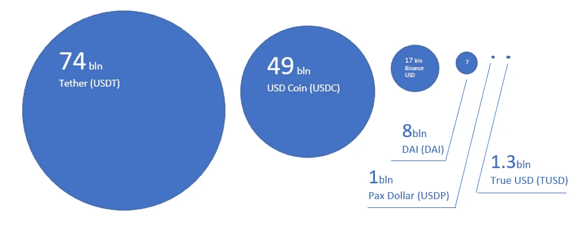
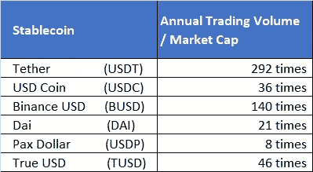
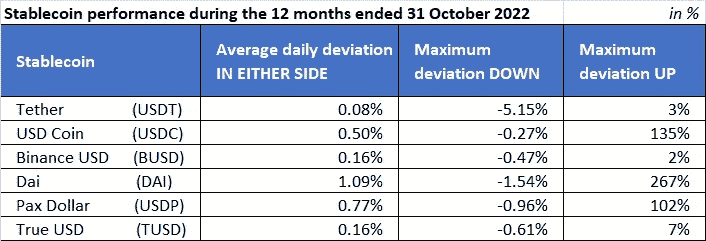
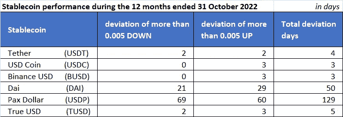
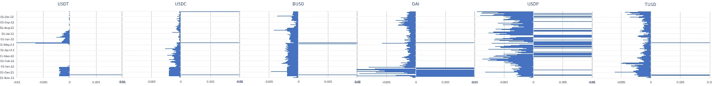
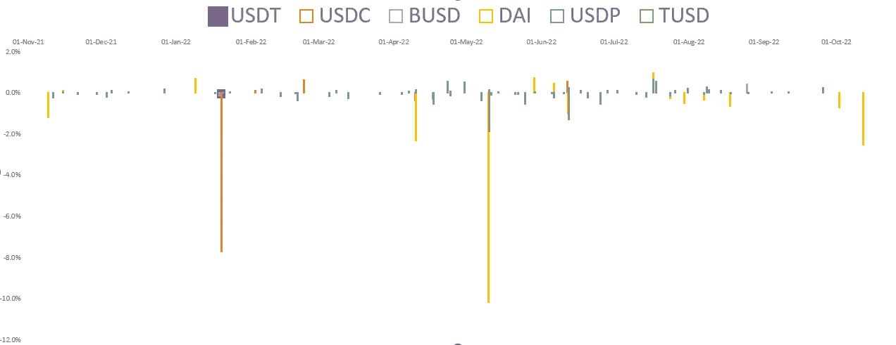
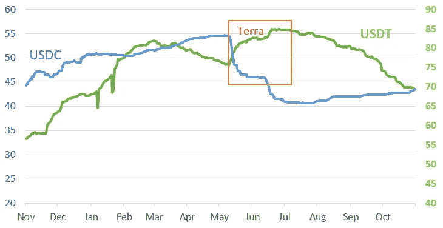

# 放大稳定的图标

> 原文：<https://medium.com/coinmonks/stablecoin-zoom-8b1c89d48e7e?source=collection_archive---------19----------------------->

今年是密码世界多事之秋。特别是，崩溃的特拉和 FTX 危机影响了整个加密市场，并再次吸引了监管机构对加密和稳定的关注。稳定货币的价值在于其技术特征，同时，与某种金融资产或法定货币(通常为 1 美元)保持稳定的挂钩。我们决定检查六个最受欢迎的 stablecoins 在一年中的稳定性，即从 2021 年 11 月 1 日到 2022 年 10 月 31 日。所使用的数据可在 [CoinMarketCap](https://coinmarketcap.com/) 上公开获得。

截至 10 月底，我们按市值选择了六个主要的稳定公司，即:

1.  **系绳(USDT)**
2.  **美元硬币(USDC)，**
3.  **币安美元(BUSD)**
4.  **戴(戴)**
5.  **帕克斯美元(USDP)，以及**
6.  **真实美元(TUSD)** 。

我们评估了这些稳定公司过去业绩的以下参数:

**波动性** —即使稳定的存款与其储备资产挂钩，也存在被认为是可接受的轻微偏差。我们已经量化和可视化了这些。

**极端情况** —一些事件导致稳定点偏离钉住点的幅度比平时更大。

**赢并运行** —定义为重大交易或外部事件导致硬币资本化增加或减少的天数。

重要的是，首先要提到的是，即使是排名前六的资产，其规模也大不相同，评估是针对不同权重类别的资产进行的。

此外，相对于市值(衡量流通速度的指标)的销售量对于所选硬币也是不同的:

正如我们所看到的，在这个图表中，Tether 是绝对的领导者，显示了它的效用优势，其次是币安美元，它受益于其发行人在加密交易所市场的主导地位。

**波动**

平均偏差，计算为任一侧每日最大值的平均值，系缆最低，戴缆最高。然而，在 2022 年 5 月 20 日月球/地球崩溃日，系绳达到了最低点。

**极端情况**我们将这一参数定义为硬币价格偏离其挂钩价格超过 0.5%的天数，无论在哪一边。由于我们样本中的所有硬币都与一美元挂钩，这基本上意味着这些硬币的价格低于 0.995 美元或高于 1.005 美元的天数)

正如我们从上面的图表中看到的，托管稳定硬币有很少的极端情况，而算法 DAI 和 Pax Dollar 允许这种情况。

总的来说，全年硬币看起来如下:

**赢和跑，**我们将它们定义为交易量超过正常日交易量 100% (2 倍)的日子，这导致了硬币资本化的增加或减少。我们还观察了一些不利事件后市值的显著下降或上升，例如 Luna/Terra 崩溃。

符合我们标准的日赢很少:在这样的日子里，硬币的市值不超过 1%。然而，在 Luna/Terra 崩溃后的两周内，USD coin 赢得了约 8%(40 亿美元)的市值。

Tether (USDT)只有一项活动符合我们的运行标准，2022 年 1 月 20 日，其市值损失不到 0.1%，约为 5600 万美元。我们无法知道当时发生了什么，但就在那一天，USD Coin (USDC)的市值损失了近 8%，即 40 亿美元。在 Luna/Terra 崩盘期间，戴在一天之内就损失了 10%的市值。

在 Luna/Terra 崩溃后的两周内，Tether 的市值损失了约 10%(85 亿美元)。有趣的是，在 Luna/Terra 坍缩期间，系绳(下图中的绿色)和美元硬币(下图中的蓝色)的体积变化是相反的。

今天，在 FTX 危机中，我们也看到了稳定的趋势。接下来请阅读我们的评论，了解 stablecoins 如何应对 FTX/阿拉米达危机。看来我们将定期观察上述措施。

> 交易新手？试试[密码交易机器人](/coinmonks/crypto-trading-bot-c2ffce8acb2a)或者[复制交易](/coinmonks/top-10-crypto-copy-trading-platforms-for-beginners-d0c37c7d698c)