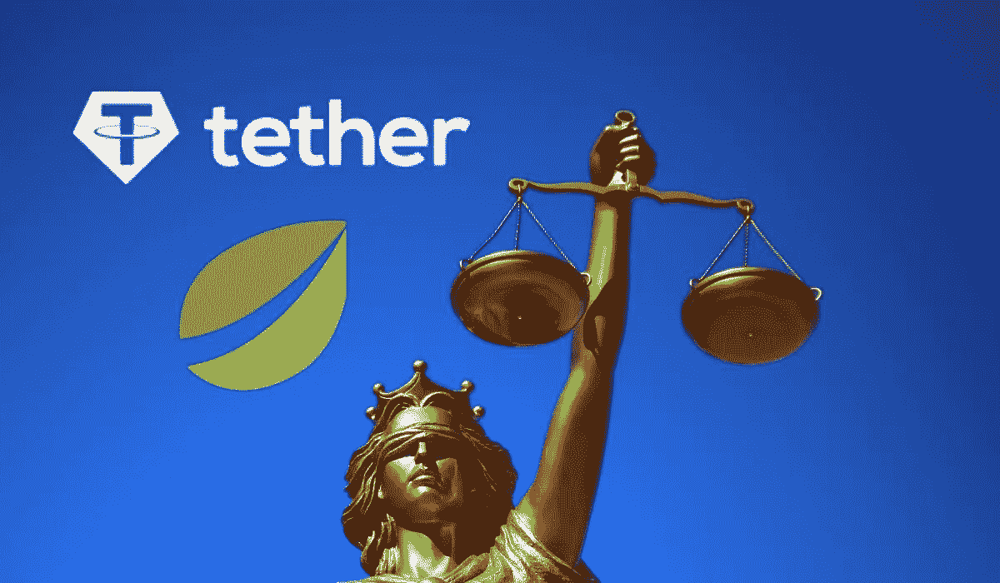
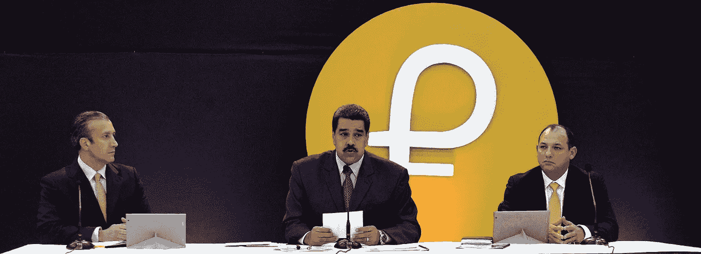
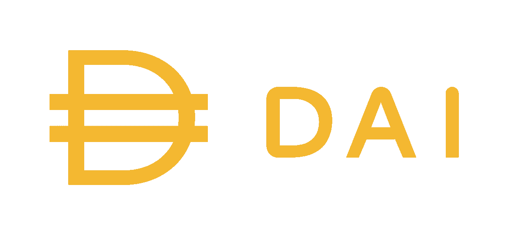
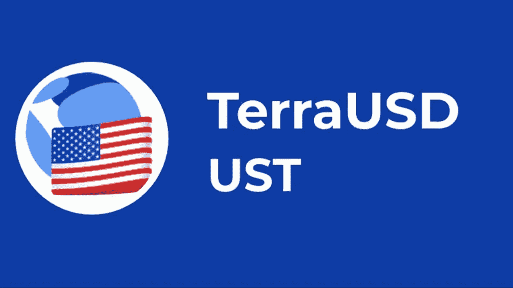
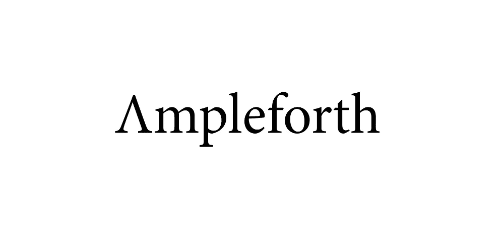
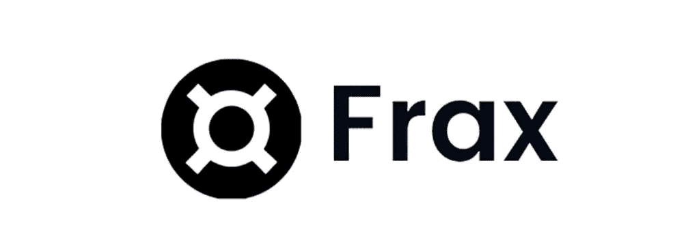

# 稳定的硬币

> 原文：<https://medium.com/coinmonks/stablecoins-624a96075924?source=collection_archive---------27----------------------->

稳定币是一种加密货币，其价值与另一种货币、商品或金融工具挂钩。例如，当系链(Usdt)的价格与美元挂钩时，系链黄金(Xaut)的价格与黄金的盎司价格挂钩。这样，stablecoins 就充当了加密货币和法定货币之间的桥梁。

为什么稳定的积分很重要，我们可以用它们做什么？

稳定的加密货币的价值不会像非挂钩加密货币那样波动。此外，它具有加密货币的一些最强大的功能:

与传统市场不同，你可以全天候交易。

转账费用低，转账速度快。

加密货币市场具有非常高的波动性。也就是说，价格是不可预测的，会剧烈波动。如果投资者预计价格会下跌，他们会将加密货币转换成稳定的货币，从而防止他们的投资组合贬值。

如果你认为你正处于熊市，并且你的钱包里有大量稳定的资金，你可以通过下注等方法从稳定的资金中获得回报。大多数集中式加密货币交易所(如币安、比特币基地)或分散式加密货币交易所(如 uniswap、pancake)提供了稳定的加密货币的可能性，年回报率远高于银行提供的利率。

由于这些优势，stablecoins 允许更多的人在加密货币市场进行交易。这使得更多的流动性进入市场，加密货币市场变得更加高效。

> 交易新手？试试[密码交易机器人](/coinmonks/crypto-trading-bot-c2ffce8acb2a)或者[复制交易](/coinmonks/top-10-crypto-copy-trading-platforms-for-beginners-d0c37c7d698c)

我们可以在 5 个主要标题下检查 stablecoins 如何保持其值的稳定性:

**1。** **菲亚特背靠 stablecoins:**

法定支持的稳定货币有法定货币储备来保证其价值。储备中的每一枚硬币都有等量的法定货币或证券作为抵押品。

但是，人们一直在讨论这些硬币背后的公司的储备。2019 年，一群投资者起诉 Tether 和 Bitfinex 引发了 2017 年的牛市。在诉讼中，有人指控 Bitfinex 通过无偿发射价值数十亿美元的系绳(USDT)进行操纵。以这种方式表明，市场，尤其是比特币，正在崛起。2021 年，泰瑟以支付 1850 万美元罚金为条件，与纽约总检察长办公室达成协议，此案结案。一些人认为这个惩罚证明了 Tether 生产免费硬币。在此协议范围内，公司开始每 3 个月发布一次储备报告。在他们于 2022 年 5 月发布的最后一份报告中，该公司宣布在商业票据、现金、美国债券和其他投资中拥有总计 824 亿美元的储备。这份报告公布时，Tether 的市值为 740 亿美元，因此报告显示该公司有额外的储备。与 Tether 的情况一样，stablecoins 背后的公司通常不会保持 100%的现金储备，可能会以不同的方式管理它们。然而，由于这些东西不能很快变成现金，有人认为这是我们这个时代的一个严重问题。

USDC 稳定币背后的公司 Circle 分享了一篇博客文章，解释说 2021 年它持有 22.9%的现金储备和 77.1%的美国证券。此外，Circle 公司每月透明地披露其储备明细。它支持美国政府授权和批准的交易。

由世界上最常用的交易所之一币安创建的 BUSD，几乎所有的储备都存在美国的银行里，并有记录。

**2。** **商品支持稳定账户:**

这些稳定的硬币类似于法定支持的硬币，但在这种类型中，其他类型的可交换资产和产品被用作抵押品，而不是法定货币。这些包括贵金属、矿物，如金、银、钻石；石油和天然气等商品；独有的属性和更多。一个很好的例子是委内瑞拉基于石油的加密货币 Petromoneda 或 Petro (PTR)。

3.**加密货币支持 stablecoins:**

稳定货币也可以与加密货币挂钩。这意味着它们由其他加密货币支持，而不是法定货币。这种稳定货币被过度抵押，因为支持稳定货币的加密货币储备也可能倾向于高波动性。这意味着储备中持有的加密货币的价值超过了已发行的稳定货币的价值。例如，为了防止稳定币价格下跌 50%，加密货币的抵押储备可以是稳定币价值的两倍。

密码支持的 stablecoin 之一是 MakerDAO 的 DAI stablecoin。戴与美元挂钩。此外，它由以太币和其他加密货币支持，这些货币相当于戴稳定货币总供应量的 150%。

4.**算法稳定积分:**

算法稳定币(stablecoin)旨在通过根据供求平衡主动平衡流通货币供应量来维持价格稳定。这些货币不与美元等储备资产挂钩。换句话说，算法 stablecoins 使用一种算法，可以在价格上涨时发行更多硬币，然后在价格下跌时购买并烧掉它们。这里要注意的一点是，最简单的算法 stablecoins 是完全不安全的。因此它们不受任何外部实体的支持。他们使用带有特定指令或规则的算法，必须遵循这些指令或规则才能获得结果。这些计算机算法旨在鼓励市场用户根据供求平衡交易稳定的货币。这一行动将操纵流通供应量，以保持任何硬币的价格稳定。因此，稳定的硬币交易者预计加密货币是安全的，而不用担心价格波动。

**什么是算法稳定币，它是如何工作的？**

算法稳定货币的主要类型被称为**铸币税**和**重定基数**。

最著名的铸币税稳定区之一是 UST，人们最近损失了大量的钱。

TerraUSD (UST)是 Terra 区块链的算法稳定核心。这是一种有利可图、可升级的硬币，旨在将其价值与美元挂钩。Terra 的区块链加密货币 LUNA 用于稳定 UST 稳定币的价格。LUNA 是一种易变的加密货币，也充当网络的治理令牌。泰拉的稳定币，UST，是以露娜为原型的。LUNA 是一个弹性令牌，它通过扩大和收缩其总供给来维持稳定的 coins。

如果你想购买 UST 稳定币，你需要用月神币支付来发行 UST。这个协议燃烧提到的月神令牌。它收缩了总供给，并导致 LUNA 价格小幅上涨。要发行露娜，你需要转换 UST 稳定硬币。因此，UST 的价格也略高。还有，这个系统支持套利。例如，如果 UST 跌至 0.95 美元，交易者可以在这个价格买入很多。然后，他可以以 1 美元的价格出售他购买的东西。结果，UST 的供应量减少，价格再次上涨。然而，当 TerraUSD (UST)在 2022 年 5 月脱离稳定状态并进入死亡螺旋时，它成为了全球新闻。创始人试图通过出售部分储备资产来维持稳定。但是算法对它们起了反作用。随着投资者开始发行代币，LUNA 的总供应量达到了 6.5 万亿。结果月神令牌的价值下降了 99.99%。UST 的价值也跌至 0.10 美元左右。

Rebase stablecoins 通常被称为弹性令牌，其供应量不断变化，以保持其稳定值。最著名的 Rebase stablecoins 是安普尔福思(AMPL)。

那些钱包里有 AMPL 的人拥有总流通 AMPL 供应量的固定百分比，而不是固定数量的安培数。总供给基于当前的代币价格收缩或扩张。如果 AMPL 价格高于 1 美元，协议会增加流通供给。它将投入流通的新代币分发给现有代币持有者。然而，当 AMPL 价格跌破 1 美元时，AMPL 代币的供应量就会减少。所有 Ampleforth 钱包都受到这些变化的影响。钱包余额按比例调整。不管这种变化，AMPL 持有者按比例保持相同的代币供应量。这意味着，即使你在重定基数前拥有 1%的 AMPL 代币，重定基数后你仍将拥有总供应量的相同百分比。这种供应变化被称为 rebase，每天发生一次。该系统的总体目的是激励交易者将 AMPL 的市场价格推回到 1 美元。

5.**抵押和算法稳定账户:**

这种稳定硬币的唯一例子是 Frax 硬币。它也可以被归类为分数算法稳定币。Frax 协议是一个双令牌系统，包括稳定硬币 Frax (FRAX)和治理硬币 Frax Shares (FXS)。该协议也有一个与 USDC 抵押品池协议。可以通过治理来添加或删除池。协议中的边际速率刷新功能可以由任何用户每小时使用一次。如果 FRAX 的交易价格高于 1 美元，该协议将降低利润率。如果 FRAX 的交易价格低于 1 美元，该协议将提高利润率。Frax mint 和赎回机制是确保 Frax 货币与 USDC 挂钩的关键。FRAX 可以由任何用户铸造，不仅提供抵押品硬币(USDC)，还提供治理硬币(FXS)。每个代币的百分比利率由 Frax 担保利率(CR)给出。例如，50%的利润率意味着可以通过提供 0.50 USDC 和 0.50 美元的 FXS 来铸造 1 美元的 FRAX。当用户选择将他们的 FRAX 用于他们最初提供的 USDC 和 FXS 时，该机制反向工作。在这种情况下，同样有 50%的抵押品，用户提供的每个 FRAX 稳定币可获得 0.50 USDC 和 0.50 美元 FXS。

当新 FRAX 铸造时，FXS 按照未担保金额的比例被烧毁。如果我们使用上例中 50%的保证金率，每铸造一枚 FRAX 代币就要消耗 0.5 美元的 FXS。这意味着，通过印刷更多的 FRAX，流通中的 FXS 数量减少，FXS 价值增加。

正如您所看到的，有许多类型的 stablecoins 可用。随着人们开始使用加密货币市场，stablecoins 的使用率将会增加。也许 stablecoins 会把人们引入加密货币市场。由于在 UST、卢娜危机或泰瑟案件中发生的事情，各州也将在不久的将来对马厩进行监管。人们认为，美国证券监管机构 SEC 将对稳定债券采取严厉措施。我认为，这些规定在短期内将对加密货币市场产生负面影响，但从长远来看，它们将为市场提供信心，并促使人们使用更多的加密货币。