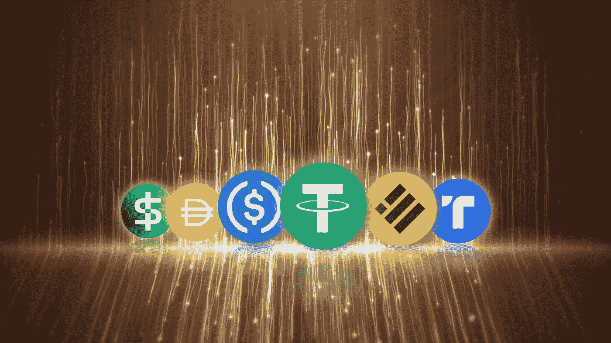
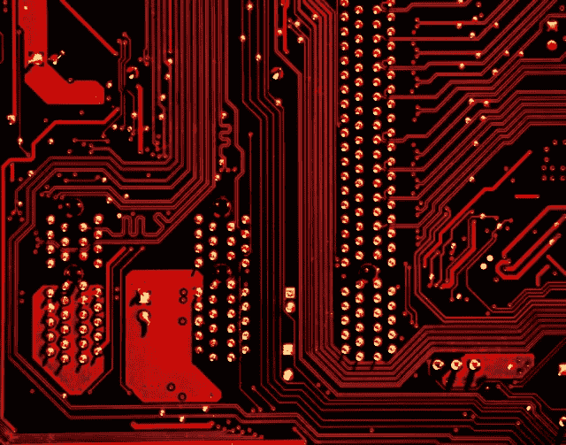

# 稳定币和替代币？

> 原文：<https://medium.com/coinmonks/stablecoins-and-altcoins-dff8dc31a84f?source=collection_archive---------46----------------------->

在加密货币市场中，有必要了解许多术语，以帮助我们始终处于技术解释和统计的上下文中，在本文中，我们带来了一些基本术语，以继续在这个广阔的世界中做出贡献。

[CoinWire Japan](https://unsplash.com/es/@coinwire?utm_source=unsplash&utm_medium=referral&utm_content=creditCopyText) [Unsplash](https://unsplash.com/es/s/fotos/stablecoin?utm_source=unsplash&utm_medium=referral&utm_content=creditCopyText)

# 什么是 stablecoins？

它们是锚定于法定货币的加密货币，法定货币可以是美元、欧元或黄金、白银、石油或房地产等实物，也有与另一种货币相关联的情况。创造稳定货币的主要动机是试图在动荡时期给投资者带来稳定。

Foto de [Markus Spiske](https://unsplash.com/es/@markusspiske?utm_source=unsplash&utm_medium=referral&utm_content=creditCopyText) en [Unsplash](https://unsplash.com/es/s/fotos/stability?utm_source=unsplash&utm_medium=referral&utm_content=creditCopyText)

## 稳定圈按组区分:

**第一组**
**抵押或支持**，它们与另一种外部证券相关联，这些证券可能以**法定**货币表示，可以是美元、欧元或任何其他国际货币。

如:泰斯()，双子星元()，美元币()，真美元()，戴(马克道)等。

**以另一种货币或资产为担保**:基本上这种类型的货币被杠杆化为另一种货币，这种货币的价值以担保集团为担保，因此要获得这种货币，你不是直接购买稳定货币，而是担保货币，用户必须留下超过必要的存款，通常是 1:2 的比例，即两倍。这种机制被称为“超额抵押”，意味着留下超额存款来换取某种类型的融资以降低风险。通过这种方式，用户可以“对冲”这种加密货币价值可能下跌的风险。

如:戴，其价值得到了瑞士联邦理工学院、的支持

**以其他资产**(黄金、房地产等)为后盾。):
在这些模型中，加密货币通过“锚定”资产价格来保持其价值稳定。

比如: [AABBG](https://aabbgoldtoken.com/aabb-gold-token/?utm_source=cryptomundo&utm_medium=sponsoredpost&utm_campaign=september) ，Pax Gold (PAXG)，CACHE gold (CGT)

**第二组:**

**算法控制的**
他们是那些只用算法来避免价格波动的。在这些模型中，区块链本身通过算法控制硬币的波动性，这些算法通过智能合约以分散的方式工作，它们的基本目标是通过控制美元的稳定性来保持与美元挂钩的令牌，它们根据供求关系工作，增加或减少区块链的货币供应。

比如:特拉(露娜)，安普尔福思(AMPL)

Foto de [Michael Dziedzic](https://unsplash.com/@lazycreekimages?utm_source=unsplash&utm_medium=referral&utm_content=creditCopyText) en [Unsplash](https://unsplash.com/es/s/fotos/algoritmos?utm_source=unsplash&utm_medium=referral&utm_content=creditCopyText)

**公共和私人马厩编号**

私人债券是由商业公司发行的，公共债券是由中央银行发行的。

迄今为止，私营公司一直是发展稳定资本的先锋。这是因为寻求提供数字法定货币的央行面临障碍。用户将能够使用一个应用程序将他们的法定存款转换成 MUFG 硬币。然后，它们可以用来在商店和餐馆付款，并可以转移到其他用户的账户上。在私人领域发展稳定硬币的一个例子是发行美元稳定硬币。这是一家由高盛支持的支付公司，得到了比特币基地的支持。Circle USDC 在区块链以太坊运行，旨在供客户在加密货币领域进行支付和交易。

稳定加密货币，也称为稳定币和稳定代币，是控制价格突然变化的解决方案。当加密货币的价格处于下跌阶段时，它们可以让用户保护自己。与法定货币建立平价，目的是建立一种机制，在加密货币中提供稳定性。每一种都寻求自己的机制，有些由法定货币支持，有些由加密货币支持，有些由大宗商品支持，还有一些只是算法。

都有积极和消极的方面。那些由法定货币和商品支持的交易迫使我们信任和依赖第三方的诚信。另一方面，我们有基于加密货币和算法的，消除了对第三方信任和第三方诚信的部分。尤其是那些基于法定货币和大宗商品的银行，我们将不得不观察它们如何应对来自监管机构的攻击和 CBDCs 的出现。

# **什么是山寨币？**

与第一个加密世界货币比特币(BTC)不同，术语 AltCoins 意味着替代货币，并最终成为除此之外的任何加密货币。有许多可供选择的货币，我敢说几乎每周都有无数的代币被创造出来为不同的项目提供资金，这就产生了一个非常动态的列表。

# **替代加密货币或替代硬币提供什么？**

创新，效用，分权，透明。

# altcoins 给比特币生态系统带来了什么？

所有这些项目都有不同的方法，但它们给母货币带来了多样性和增长。因为它们中的大多数都与之相关或相互作用。
创新是在竞争中实现的。如果没有人质疑一个产品或一个模型，它就被认为是最好的或所能提供的最好的，并且不打算改进它。事实上，有这么多的加密货币和这么多的项目除了相互受益之外什么也没做。我们必须记住，有许多代码并没有增加价值，它们只是代码和思想的简单复制，应用了一些修饰性的元素。这是替代币对比特币和加密生态系统的最大贡献所在。

Foto de [Mufid Majnun](https://unsplash.com/@mufidpwt?utm_source=unsplash&utm_medium=referral&utm_content=creditCopyText) en [Unsplash](https://unsplash.com/es/s/fotos/proyectos?utm_source=unsplash&utm_medium=referral&utm_content=creditCopyText)

**代用币的负点数**

*   推测。
*   由于没有统一的开发团队或社区，生命周期短。
*   表里不一:有许多项目几乎和其他项目一样，只是稍作修饰，唯一的目的是成为投机工具和快速致富的工具。

# 一些我个人觉得有意思的 altcoins 和项目列表。

1.  **以太(ETH)** :以太是 Etherium 的货币，一个去中心化的计算平台。这个计算平台允许在这个分布式网络上运行应用程序，事务由以太网支持，并管理智能合同。
2.  **索拉纳(SOL):** 和任何其他区块链一样，索拉纳拥有一种名为 SOL 的本地加密货币，其功能相当于公用事业令牌。SOL 令牌是支付交易费用以及部署智能合约并与之交互所必需的。
3.  **币安币(BNB)** :它是币安加密交易所的官方加密货币。这种硬币的诞生是为了支持同一平台内的交易。事实上，你可以购买这枚硬币来支付购买其他加密货币所产生的佣金，并获得很大的折扣。币安开发者试图通过与区块链相关的项目来增加他们的令牌的重要性，这些项目可以由用户自己用币安硬币资助。
4.  **Cardano (ADA)** : Cardano 是所谓第三代区块链的代表，试图解决 Etherium 等第二代区块链的可扩展性问题。
5.  USDT:这是一枚稳定的硬币。这意味着所有流通中的此类货币都由等量的传统法定货币支持，如美元或欧元。它旨在建立法定货币和加密货币之间的桥梁，并为用户提供稳定性、透明度和最低交易费用。
6.  Polkadot (DOT) :我们可以把它定义为一个区块链协议，试图把不同的现有区块链连接到一个通用的区块链。
7.  **Ripple (XRP)** : Ripple 的主要目标是连接银行、支付提供商和数字资产交易所，实现更快、更具成本效益的全球支付。与比特币一样，Ripple 是一个完全安全的加密系统，其交易信息是公开的，但支付信息不是公开的。这是一个保密系统，发送者和接收者是唯一拥有信息和解密代码的人。
8.  **UNI WAP(UNI)**:这是一个复杂的软件，运行在以太坊区块链上，允许去中心化的“互换”(交换)。它在独角兽的帮助下工作。在 Uniswap 中，交易者可以交换以太币代币，而无需将自己的资金委托给任何人。
9.  **莱特币(LTC)** :是比特币的替代品。它的上限高于比特币，目前约有 6000 万莱特币在流通。
10.  **Chainlink(链接):** Chainlink 已经成为加密货币领域应用最广泛的项目之一。它是一个分散的 oracle 服务，能够向以太坊智能合约提供外部数据。换句话说，它连接了区块链和现实世界。

> 交易新手？试试[密码交易机器人](/coinmonks/crypto-trading-bot-c2ffce8acb2a)或[复制交易](/coinmonks/top-10-crypto-copy-trading-platforms-for-beginners-d0c37c7d698c)